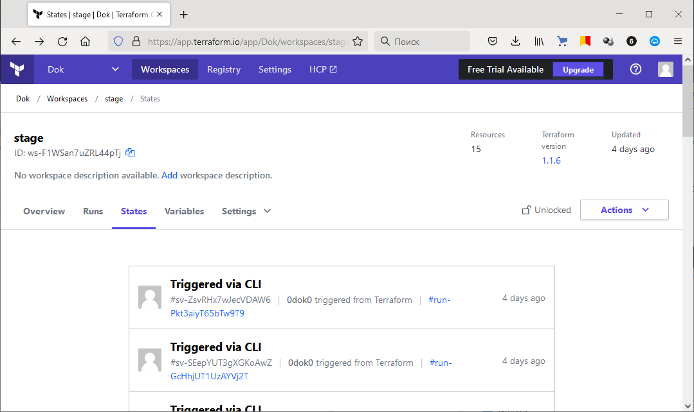
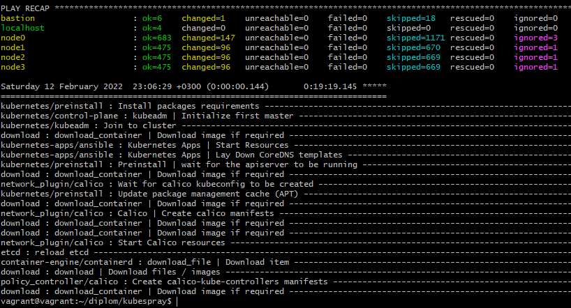
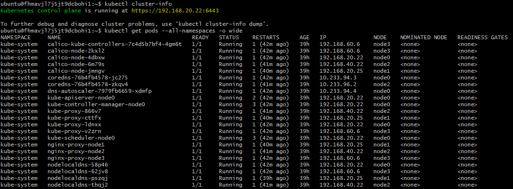
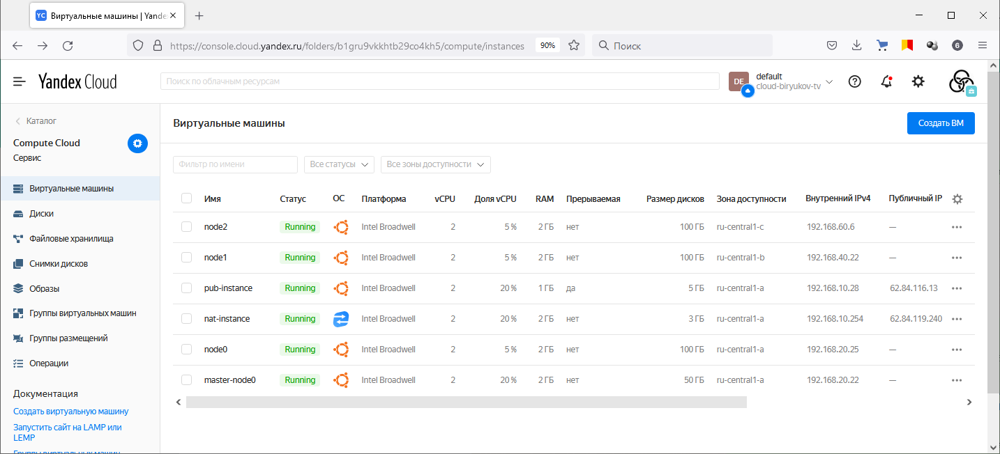
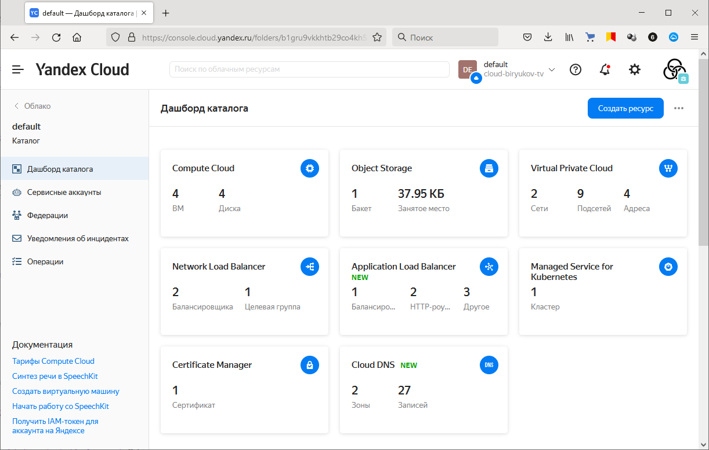
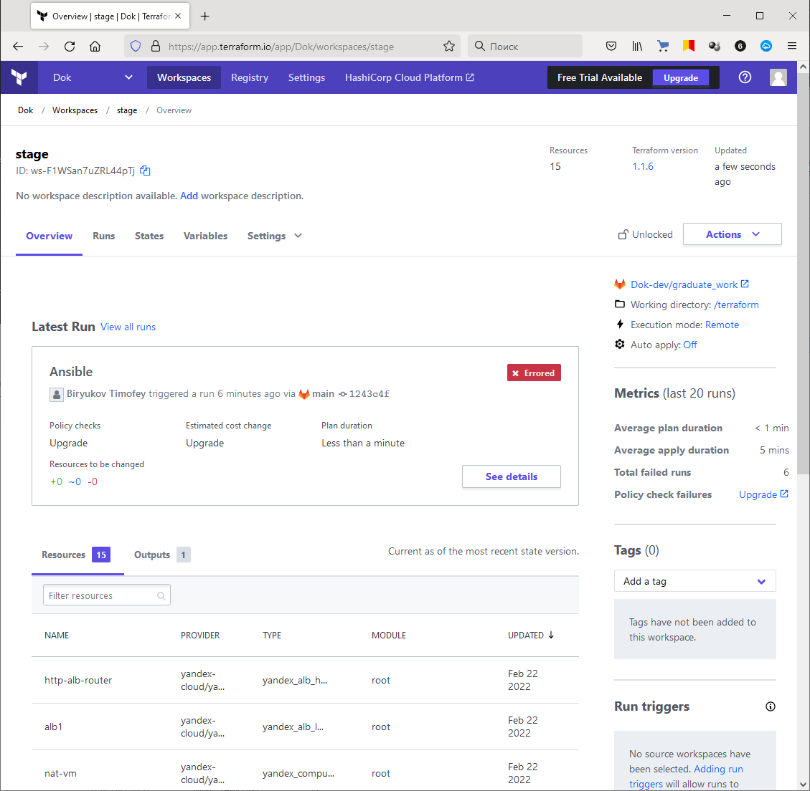
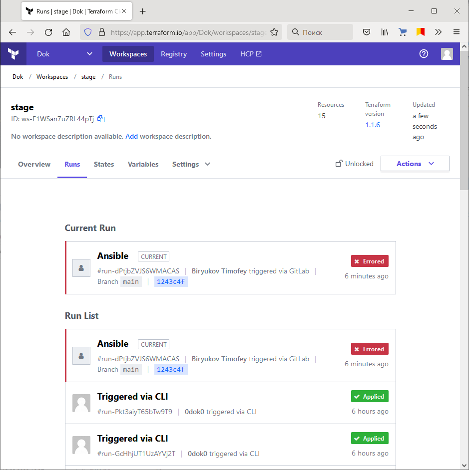
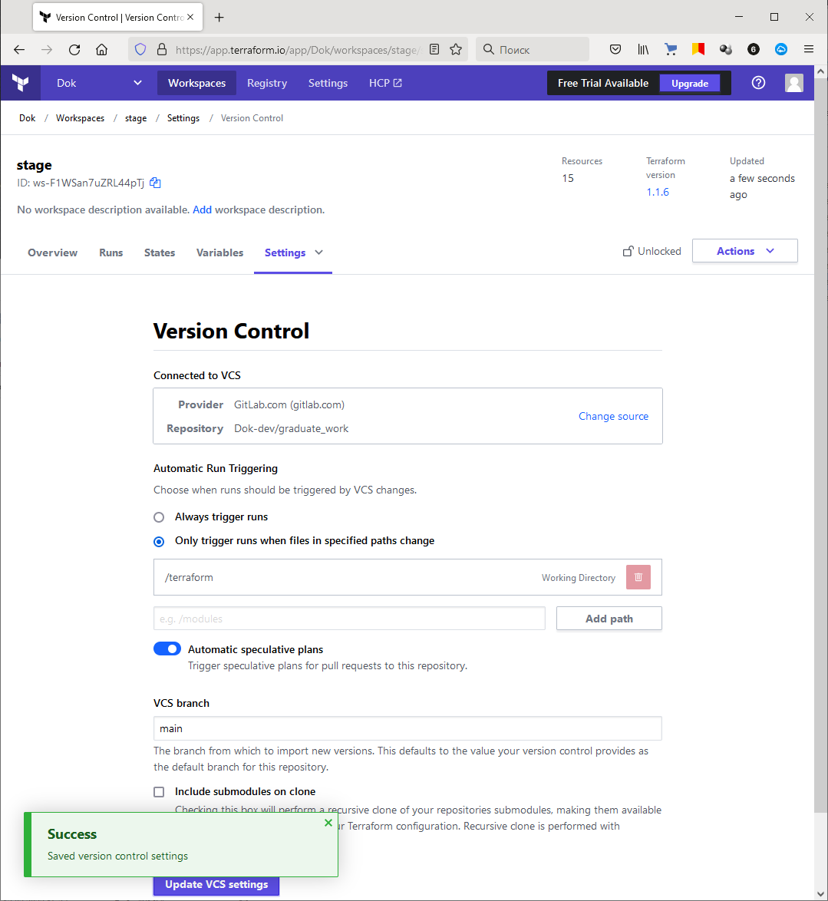

# Дипломный практикум в Яндекс.Облако
  * [Цели:](#цели)
  * [Этапы выполнения:](#этапы-выполнения)
     * [Создание облачной инфраструктуры](#создание-облачной-инфраструктуры)
     * [Создание Kubernetes кластера](#создание-kubernetes-кластера)
     * [Создание тестового приложения](#создание-тестового-приложения)
     * [Подготовка cистемы мониторинга и деплой приложения](#подготовка-cистемы-мониторинга-и-деплой-приложения)
     * [Установка и настройка CI/CD](#установка-и-настройка-cicd)
  * [Что необходимо для сдачи задания?](#что-необходимо-для-сдачи-задания)
  * [Как правильно задавать вопросы дипломному руководителю?](#как-правильно-задавать-вопросы-дипломному-руководителю)

---
## Цели:

1. Подготовить облачную инфраструктуру на базе облачного провайдера Яндекс.Облако.
2. Запустить и сконфигурировать Kubernetes кластер.
3. Установить и настроить систему мониторинга.
4. Настроить и автоматизировать сборку тестового приложения с использованием Docker-контейнеров.
5. Настроить CI для автоматической сборки и тестирования.
6. Настроить CD для автоматического развёртывания приложения.

---
## Этапы выполнения:


### Создание облачной инфраструктуры

Для начала необходимо подготовить облачную инфраструктуру в ЯО при помощи [Terraform](https://www.terraform.io/).

Особенности выполнения:

- Бюджет купона ограничен, что следует иметь в виду при проектировании инфраструктуры и использовании ресурсов;
- Следует использовать последнюю стабильную версию [Terraform](https://www.terraform.io/).

Предварительная подготовка к установке и запуску Kubernetes кластера.

1. Создайте сервисный аккаунт, который будет в дальнейшем использоваться Terraform для работы с инфраструктурой с необходимыми и достаточными правами. Не стоит использовать права суперпользователя
2. Подготовьте [backend](https://www.terraform.io/docs/language/settings/backends/index.html) для Terraform:  
   а. Рекомендуемый вариант: [Terraform Cloud](https://app.terraform.io/)  
   б. Альтернативный вариант: S3 bucket в созданном ЯО аккаунте
3. Настройте [workspaces](https://www.terraform.io/docs/language/state/workspaces.html)  
   а. Рекомендуемый вариант: создайте два workspace: *stage* и *prod*. В случае выбора этого варианта все последующие шаги должны учитывать факт существования нескольких workspace.  
   б. Альтернативный вариант: используйте один workspace, назвав его *stage*. Пожалуйста, не используйте workspace, создаваемый Terraform-ом по-умолчанию (*default*).
4. Создайте VPC с подсетями в разных зонах доступности.
5. Убедитесь, что теперь вы можете выполнить команды `terraform destroy` и `terraform apply` без дополнительных ручных действий.
6. В случае использования [Terraform Cloud](https://app.terraform.io/) в качестве [backend](https://www.terraform.io/docs/language/settings/backends/index.html) убедитесь, что применение изменений успешно проходит, используя web-интерфейс Terraform cloud.

Ожидаемые результаты:

1. Terraform сконфигурирован и создание инфраструктуры посредством Terraform возможно без дополнительных ручных действий.
2. Полученная конфигурация инфраструктуры является предварительной, поэтому в ходе дальнейшего выполнения задания возможны изменения.

> **Выполнение:**    
> 
> Т.к. на момент выполнения Terraform Cloud был несколько дней не доступен в РФ, был создан вариант с S3 bucket в ЯО.    
> [Конфигурация Terraform для бакета в ЯО](https://gitlab.com/Dok-dev/graduate_work/-/tree/main/terraform/bucket)    
> 
> Позже, после возобновления работы TF Cloud, была создана среда и в нем тоже:    
> 

---
### Создание Kubernetes кластера

На этом этапе необходимо создать [Kubernetes](https://kubernetes.io/ru/docs/concepts/overview/what-is-kubernetes/) кластер на базе предварительно созданной инфраструктуры.  Требуется обеспечить доступ к ресурсам из Интернета.

Это можно сделать двумя способами:

1. Рекомендуемый вариант: самостоятельная установка Kubernetes кластера.  
   а. При помощи Terraform подготовить как минимум 3 виртуальных машины Compute Cloud для создания Kubernetes-кластера. Тип виртуальной машины следует выбрать самостоятельно с учётом требовании к производительности и стоимости. Если в дальнейшем поймете, что необходимо сменить тип инстанса, используйте Terraform для внесения изменений.  
   б. Подготовить [ansible](https://www.ansible.com/) конфигурации, можно воспользоваться, например [Kubespray](https://kubernetes.io/docs/setup/production-environment/tools/kubespray/)  
   в. Задеплоить Kubernetes на подготовленные ранее инстансы, в случае нехватки каких-либо ресурсов вы всегда можете создать их при помощи Terraform.
2. Альтернативный вариант: воспользуйтесь сервисом [Yandex Managed Service for Kubernetes](https://cloud.yandex.ru/services/managed-kubernetes)  
  а. С помощью terraform resource для [kubernetes](https://registry.terraform.io/providers/yandex-cloud/yandex/latest/docs/resources/kubernetes_cluster) создать региональный мастер kubernetes с размещением нод в разных 3 подсетях      
  б. С помощью terraform resource для [kubernetes node group](https://registry.terraform.io/providers/yandex-cloud/yandex/latest/docs/resources/kubernetes_node_group)
  
Ожидаемый результат:

1. Работоспособный Kubernetes кластер.
2. В файле `~/.kube/config` находятся данные для доступа к кластеру.
3. Команда `kubectl get pods --all-namespaces` отрабатывает без ошибок.

> **Выполнение:**    
>
> Клонируем репозиторий Kybespray:    
> ```bash
> git clone https://github.com/kubernetes-sigs/kubespray.git
> ```
> 
> Установка зависимостей для работы Kybespray (вместе с ansible):
> ```bash
> cd kubespray
> sudo pip3 install -r requirements.txt
> ```
> 
> Создаем файл нашего инвентори из примера в репозитории:
> ```bash
> cp -rfp inventory/sample inventory/prod_cluster
> ```
>
> Отредактируем `inventory\prod_cluster\inventory.ini` под наши ноды согласно ТЗ:
> ```console
> ~/kubespray$ cat inventory/prod_cluster/inventory.ini
> [all]
> node0 ansible_host=192.168.20.8
> node1 ansible_host=192.168.20.23
> node2 ansible_host=192.168.40.34
> node3 ansible_host=192.168.60.5
> 
> # configure a bastion host if your nodes are not directly reachable
> [bastion]
> bastion ansible_host=62.84.116.33 ansible_user=some_user
> 
> [kube_control_plane]
> node0
> # node2
> # node3
> 
> [etcd]
> node0
> # node2
> # node3
> 
> [kube_node]
> node1
> node2
> node3
> 
> [calico_rr]
> 
> [k8s_cluster:children]
> kube_control_plane
> kube_node
> calico_rr
> ```
>
> Для использования containerd в качестве CRI меняем слудующие параметры в файлах:    
> #### k8s-cluster.yml
> 
> ```yaml
> container_manager: containerd
> ```
> 
> #### etcd.yml
> 
> ```yaml
> etcd_deployment_type: host
> ```
> 
> #### containerd.yml config
> 
> ```yaml
> containerd_registries:
>   "docker.io":
>     - "https://hub.docker.com"
>#     - "https://registry-1.docker.io"
>     - "https://k8s.gcr.io"
>#     - "https://mirror.gcr.io"
> ```
>
> Запускаем развертывание кластера:
> ```bash
> ansible-playbook -i inventory/prod_cluster/inventory.ini cluster.yml -b -v -e ansible_user=ubuntu
> ```
> 
> [Конфигурация Terraform Вариант 1 (Ansible + Kubespray)](https://gitlab.com/Dok-dev/graduate_work/-/tree/main/terraform)    
> [Конфигурация Terraform Вариант 2 (Yandex Managed Service for Kubernetes)](https://gitlab.com/Dok-dev/graduate_work/-/tree/main/terraform2)    
> Выполнены и работоспособны оба.
> 
> ```bash
> kubectl create namespace prod
> kubectl create namespace stage
> ```

---

### Создание тестового приложения

Для перехода к следующему этапу необходимо подготовить тестовое приложение, эмулирующее основное приложение разрабатываемое вашей компанией.

Способ подготовки:

1. Рекомендуемый вариант:  
   а. Создайте отдельный git репозиторий с простым nginx конфигом, который будет отдавать статические данные.  
   б. Подготовьте Dockerfile для создания образа приложения.  
2. Альтернативный вариант:  
   а. Используйте любой другой код, главное, чтобы был самостоятельно создан Dockerfile.

Ожидаемый результат:

1. Git репозиторий с тестовым приложением и Dockerfile.
2. Регистр с собранным docker image. В качестве регистра может быть DockerHub или [Yandex Container Registry](https://cloud.yandex.ru/services/container-registry), созданный также с помощью terraform.

> **Выполнение:**    
>
> [Подготовленная кофигурация для сборки "приложения"](https://gitlab.com/Dok-dev/graduate_work/-/tree/main/app).    
> Зальем первую версию в "приложения" в репозиторий вручную:    
> ```bash
> docker build -t 0dok0/painting:v1.0_nginx .
> docker push 0dok0/paintings:v1.0_nginx
> ```

---
### Подготовка cистемы мониторинга и деплой приложения

Уже должны быть готовы конфигурации для автоматического создания облачной инфраструктуры и поднятия Kubernetes кластера.  
Теперь необходимо подготовить конфигурационные файлы для настройки нашего Kubernetes кластера.

Цель:
1. Задеплоить в кластер [prometheus](https://prometheus.io/), [grafana](https://grafana.com/), [alertmanager](https://github.com/prometheus/alertmanager), [экспортер](https://github.com/prometheus/node_exporter) основных метрик Kubernetes.
2. Задеплоить тестовое приложение, например, [nginx](https://www.nginx.com/) сервер отдающий статическую страницу.

Рекомендуемый способ выполнения:
1. Воспользовать пакетом [kube-prometheus](https://github.com/prometheus-operator/kube-prometheus), который уже включает в себя [Kubernetes оператор](https://operatorhub.io/) для [grafana](https://grafana.com/), [prometheus](https://prometheus.io/), [alertmanager](https://github.com/prometheus/alertmanager) и [node_exporter](https://github.com/prometheus/node_exporter). При желании можете собрать все эти приложения отдельно.
2. Для организации конфигурации использовать [qbec](https://qbec.io/), основанный на [jsonnet](https://jsonnet.org/). Обратите внимание на имеющиеся функции для интеграции helm конфигов и [helm charts](https://helm.sh/)
3. Если на первом этапе вы не воспользовались [Terraform Cloud](https://app.terraform.io/), то задеплойте в кластер [atlantis](https://www.runatlantis.io/) для отслеживания изменений инфраструктуры.

Альтернативный вариант:
1. Для организации конфигурации можно использовать [helm charts](https://helm.sh/)

Ожидаемый результат:
1. Git репозиторий с конфигурационными файлами для настройки Kubernetes.
2. Http доступ к web интерфейсу grafana.
3. Дашборды в grafana отображающие состояние Kubernetes кластера.
4. Http доступ к тестовому приложению.

> **Выполнение:**    
>
> Установим Ingress-контроллер в кластер. Он понадобится позже, для подключения к сервисам.
> ```bash
> wget https://get.helm.sh/helm-v3.8.0-linux-amd64.tar.gz
> tar -zxvf helm-v3.8.0-linux-amd64.tar.gz
> sudo mv linux-amd64/helm /usr/local/bin/helm
> 
> helm repo add ingress-nginx https://kubernetes.github.io/ingress-nginx
> helm repo update
> 
> helm install ingress-nginx ingress-nginx/ingress-nginx
> ```
>
> Развернем систему мониторинга кластера Kubernetis на основе пакета kube-prometheus:
> ```bash
> git clone https://github.com/prometheus-operator/kube-prometheus
> cd kube-prometheus
> kubectl apply --server-side -f manifests/setup
> until kubectl get servicemonitors --all-namespaces ; do date; sleep 1; echo ""; done
> kubectl apply -f manifests/
> ```
>
> Установим Qbec:
> ```bash
> wget https://github.com/splunk/qbec/releases/download/v0.15.1/qbec-linux-amd64.tar.gz
> mkdir qbec
> tar -C ~/qbec -xzf qbec-linux-amd64.tar.gz
> sudo mv qbec /usr/local
> export PATH=$PATH:/usr/local/qbec
> qbec completion | sudo tee /etc/bash_completion.d/qbec
> ```
>
> Создадим структуру файлов и папок для деполоя приложения с помощью Qbec:
> ```bash
> qbec init deployment --with-example
> ```
> [Конфигурация Qbec](https://gitlab.com/Dok-dev/graduate_work/-/tree/main/deployment) для деплоя приложения.    
> 
> Проверяем, деплоим первый раз вручную:
> ```bash
> qbec fmt
> qbec validate stage --vm:ext-str image_tag=v1.0_nginx
> qbec apply stage --vm:ext-str image_tag=v1.0_nginx
> ```

---
### Установка и настройка CI/CD

Осталось настроить ci/cd систему для автоматической сборки docker image и деплоя приложения при изменении кода.

Цель:

1. Автоматическая сборка docker образа при коммите в репозиторий с тестовым приложением.
2. Автоматический деплой нового docker образа.

Можно использовать [teamcity](https://www.jetbrains.com/ru-ru/teamcity/), [jenkins](https://www.jenkins.io/) либо [gitlab ci](https://about.gitlab.com/stages-devops-lifecycle/continuous-integration/)

Ожидаемый результат:

1. Интерфейс ci/cd сервиса доступен по http.
2. При любом коммите в репозиторие с тестовым приложением происходит сборка и отправка в регистр Docker образа.
3. При создании тега (например, v1.0.0) происходит сборка и отправка с соответствующим label в регистр, а также деплой соответствующего Docker образа в кластер Kubernetes.

> **Выполнение:**    
>
> Т.к. был выбран GitLab CI/CD для деплоя понадобится еще один [образ с инструментарием](https://gitlab.com/Dok-dev/graduate_work/-/blob/main/deployment/qbec-alpine_image/Dockerfile). И данные для подключения к YC сервисным аккаунтом.
> ```bash
> yc iam key create --service-account-name  k8s-admin --output key.json #ключ сервисного аккаунта для переменной в CI/CD
> docker build -t 0dok0/qbec-alpine .
> docker push 0dok0/qbec-alpine:latest
> ```
>
> [Подготовленый репозиторий GitLab CI/CD](https://gitlab.com/Dok-dev/graduate_work/-/blob/main/.gitlab-ci.yml).

---
## Что необходимо для сдачи задания?

1. Репозиторий с конфигурационными файлами Terraform и готовность продемонстрировать создание всех ресурсов с нуля.    
> Т.к. на момент выполнения Terraform Cloud был несколько дней не доступен в РФ, был создан вариант с S3 bucket в ЯО.    
> [Конфигурация Terraform Вариант 1 (Ansible + Kubespray)](https://gitlab.com/Dok-dev/graduate_work/-/tree/main/terraform)   
> Отработка Ansible:     
>     
> Поды полученного кластера в YC:    
>     
> 
>
> [Конфигурация Terraform Вариант 2 (Yandex Managed Service for Kubernetes)](https://gitlab.com/Dok-dev/graduate_work/-/tree/main/terraform2)    
> Выполнены и работоспособны оба.   
> Дашборд всех ресурсов после сборки:    
> 

2. Пример pull request с комментариями созданными atlantis'ом или снимки экрана из Terraform Cloud.    
>     
>     
>     
>     

3. Репозиторий с конфигурацией ansible, если был выбран способ создания Kubernetes кластера при помощи ansible.    
> [Изменные файлы репозитория Kubespray](https://gitlab.com/Dok-dev/graduate_work/-/tree/main/kubespray)

4. [Репозиторий с Dockerfile тестового приложения](https://gitlab.com/Dok-dev/graduate_work/-/tree/main/app) и ссылка на собранный [docker image](https://hub.docker.com/repository/docker/0dok0/paintings).
> https://gitlab.com/Dok-dev/graduate_work/-/tree/main/app    
> https://hub.docker.com/repository/docker/0dok0/paintings

5. [Репозиторий с конфигурацией](https://gitlab.com/Dok-dev/graduate_work/-/tree/main/deployment) Kubernetes кластера.    
> https://gitlab.com/Dok-dev/graduate_work/-/tree/main/deployment

6. Ссылка на тестовое приложение и веб интерфейс Grafana с данными доступа.    
> https://travel-pt.ru/    
> https://monitor.travel-pt.ru:3000    
> login:viewer password:gaDft251f2

---

Денис Альмухаметов (преподаватель)
3 марта 2022 15:27

Все отлично! Спасибо за качественно выполенную работу. 
Успехов!

