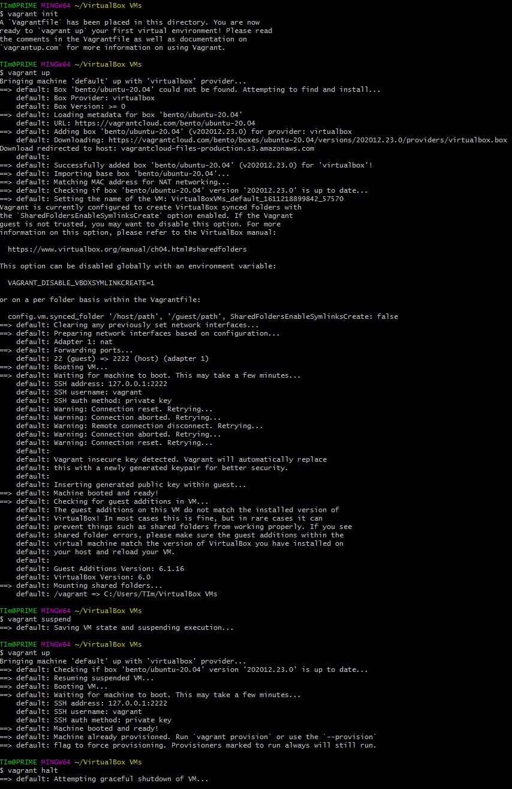
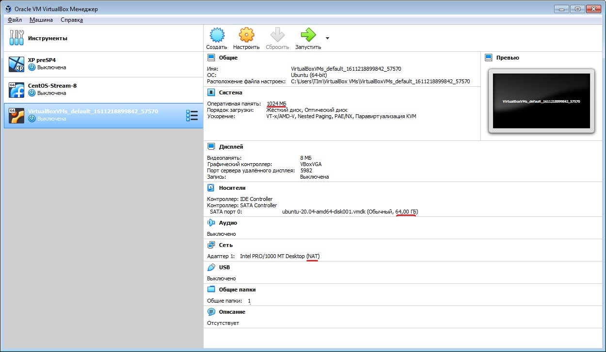
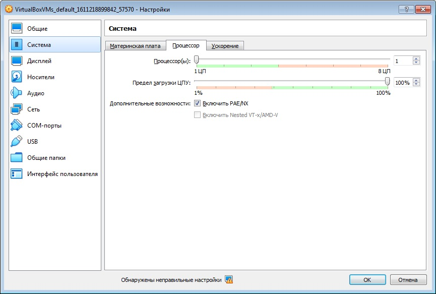
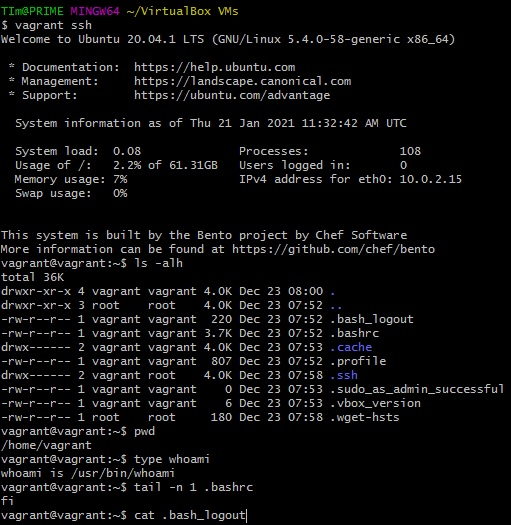

# Домашнее задание «3.1. Работа в терминале, лекция 1»

**1..4,14 - задание.**




**5 - задание.**



  
  
**6 - задание.**

```ruby
Vagrant.configure("2") do |config|
  config.vm.box = "bento/ubuntu-20.04"
   config.vm.provider "virtualbox" do |vub|
     vub.memory = 2048
     vub.cpus = 2
   end
end 
```

**7 - задание.**



**8 - задание.**
HISTSIZE - 

```bash
 man bash | grep -n -A2 'HISTSIZE'
```
или
```bash
 man bash
  /HISTSIZE
```
Строки 517, 518.

Директива `ignoreboth` это объединение параметров `ignoredups` и `ignorespace`, отвечающих за отключение записи дубликатов строк в историю и отключение записи строк начанающихся с пробела.

**9 - задание.**
{} - вариант списка выполняемого в среде текущего командного интерпретатора.
Сторока man bash 173:


**10 - задание.**
```bash
touch {1..100000}
```

```bash
touch {1..300000}
-bash: /usr/bin/touch: Argument list too long
```
Превышает максимальную длину аргументов среды. Столько файлов нельзя создать одной коммандой.
```bash
getconf ARG_MAX
2097152
```
Домашнее задание «3.1. Работа в терминале, лекция 1»

**1..4,14 - задание.**


**5 - задание.**


  
  
**6 - задание.**

```ruby
Vagrant.configure("2") do |config|
  config.vm.box = "bento/ubuntu-20.04"
   config.vm.provider "virtualbox" do |vub|
     vub.memory = 2048
     vub.cpus = 2
   end
end 
```

**7 - задание.**


**8 - задание.**
```bash
 man bash | grep -n -A2 'HISTSIZE'
```
Строки 517, 518.

Директива `ignoreboth` это объединение параметров `ignoredups` и `ignorespace`, отвечающих за отключение записи дубликатов строк в историю и отключение записи строк начанающихся с пробела.

**9 - задание.**
{} - вариант списка выполняемого в среде текущего командного интерпретатора.
Сторока man bash 173:


**10 - задание.**
```bash
touch {1..100000}
```

```bash
touch {1..300000}
-bash: /usr/bin/touch: Argument list too long
```
Превышает максимальную длину аргументов среды. Столько файлов нельзя создать одной коммандой.
```bash
getconf ARG_MAX
2097152
```

**11 - задание.**
Конструкция [[ -d /tmp ]] проверяет существование каталога, вернет ноль если файл существует и является каталогом.

