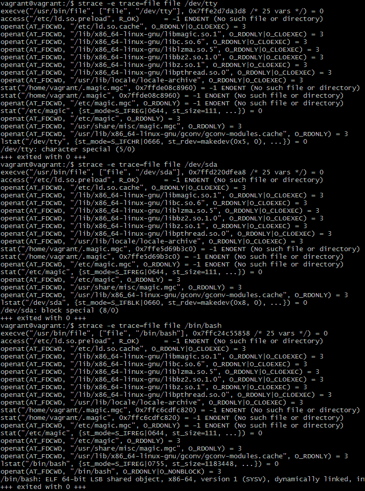
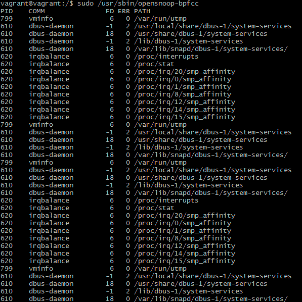

# Домашнее задание «3.3. Операционные системы (лекция 1)»

**1 - задание.**

```bash
strace /bin/bash -c 'cd /tmp'
...
stat("/tmp", {st_mode=S_IFDIR|S_ISVTX|0777, st_size=4096, ...}) = 0
chdir("/tmp") 
...
```


**2 - задание.**



/usr/share/misc/magic.mgc


  
**3 - задание.**

```bash
:~$  ps aux | grep 'имя_процесса'                        # найдем PID процесса нашего приложения
:~$ sudo lsof -p 'PID' | grep deleted                    # найдем файловый дескриптор удаленного файла
:~$ cat /dev/null > /proc/'PID'/fd/'файловый_дескриптор' # очищаем содержимое файла
```
systemd


**4 - задание.**    

Зомби-процессы не занимают памяти и не нагружают процессор (как процессы-сироты), но расходуют записи PID в таблице процессов процессов и небесконечные дескрипторы процессов.


**5 - задание.**




**6 - задание.**

`man 2 uname`    
`/proc`:
```text
NOTES 

       This is a system call, and the operating system presumably knows
       its name, release and version.  It also knows what hardware it
       runs on.  So, four of the fields of the struct are meaningful.
       On the other hand, the field nodename is meaningless: it gives
       the name of the present machine in some undefined network, but
       typically machines are in more than one network and have several
       names.  Moreover, the kernel has no way of knowing about such
       things, so it has to be told what to answer here.  The same holds
       for the additional domainname field.
       ...
       Part of the utsname information is also accessible via
       /proc/sys/kernel/{ostype, hostname, osrelease, version,
       domainname}.
```


**7 - задание.**

`;` - позволяет последовательно выполнить команды, независимо от результата их выполнения.    
`&&` - при использовании каждая следующая команда выполняется только при успешном выполнении предыдущей (exit code 0), `||` - наоборот, выполнится при exit code > 0.    
`set -e` - приведет к немедленному завершению работы сценария bash при сбое команды. При этом использование `&&` все-равно не утратит свою актуальность т.к. оно не вызывает завершение сценария в целом при возврате ошибки одной из комманд.

К примеру:
```bash
:~$  set -e ; test ; echo "Hello"
```
сразу завершит сессию bash в терминале, но `test && echo "Hello"` - всего лишь вернет ошибку.


**8 - задание.**

Режим bash `set -euxo pipefail` состоит из следующих опций:    

`-e` - немедленное завершению работы сценария при первом возврате ошибки одной из команд.    
`-o pipefail` - добавляет опцию приводящую к изменения поведения `set -e`. В этом варианте интерпретатор смотрит на результат выполнения последней команды в цепочке.   
`-u` - оболочка bash обрабатывает неустановленные переменные как ошибку и немедленно завершает работу. Неустановленные переменные являются распространенной причиной ошибок в скриптах оболочки, поэтому наличие неустановленных переменных, вызывающих немедленный выход, часто является весьма желательным поведением.    
`-x` - выводит каждую команду, с подставленными значениями переменных, перед ее выполнением. Что удобно для отладки.

В целом эти режимы позволяют приблизиться к тому, что бы наши скрипты вели себя как языки более высокого уровня.


**9 - задание.**

```bash
vagrant@vagrant:~$ ps -eo stat                   # больше всего со статусом I и S
vagrant@vagrant:~$ ps -eo stat | grep S | wc -c
139
vagrant@vagrant:~$ ps -eo stat | grep I | wc -c
136
```
Больше процессов со статусом "S".

`man ps`    
`/PROCESS STATE CODES`:
```text
PROCESS STATE CODES
       Here are the different values that the s, stat and state output specifiers (header "STAT" or "S") will display to describe the state of a process:

               D    uninterruptible sleep (usually IO)
               I    Idle kernel thread
               R    running or runnable (on run queue)
               S    interruptible sleep (waiting for an event to complete)
               T    stopped by job control signal
               t    stopped by debugger during the tracing
               W    paging (not valid since the 2.6.xx kernel)
               X    dead (should never be seen)
               Z    defunct ("zombie") process, terminated but not reaped by its parent

       For BSD formats and when the stat keyword is used, additional characters may be displayed:

               <    high-priority (not nice to other users)
               N    low-priority (nice to other users)
               L    has pages locked into memory (for real-time and custom IO)
               s    is a session leader
               l    is multi-threaded (using CLONE_THREAD, like NPTL pthreads do)
               +    is in the foreground process group
```


