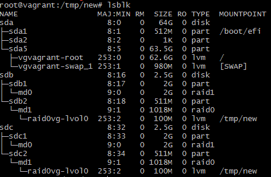
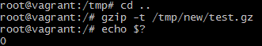
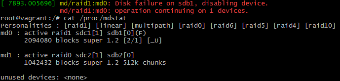

# Домашнее задание «3.5. Файловые системы»

**1 - задание.**


**Ответ**    
Pазреженные файлы (sparse files) это такие файлы, которые занимают меньше дискового пространства, чем их собственный размер. 
Это один из способов экономии дискового пространства и ресурса диска.
Никакого сжатия данных не осуществляется. Вместо этого, в файле высвобождаются области, которые должны быть заняты нулями, т.е. последовательности нулевых байтов заменены на информацию об этих последовательностях.
Приложение, читающее разреженный файл, дойдя до области с нулями, прочитает нули, но реального чтения с диска не произойдёт.    

---

**2 - задание.**


**Ответ**    
Не могут. Т.к. это один и тот же файл, а жесткие ссылки всего лишь его имена.

---
  
**3 - задание.**


**Ответ**    
```txt
$ vagrant destroy
    default: Are you sure you want to destroy the 'default' VM? [y/N] y
==> default: Forcing shutdown of VM...
==> default: Destroying VM and associated drives...

$ vagrant up #после настройки Vagrantfile
```

Результат:
```bash
vagrant@vagrant:~$ lsblk
NAME                 MAJ:MIN RM  SIZE RO TYPE MOUNTPOINT
sda                    8:0    0   64G  0 disk
├─sda1                 8:1    0  512M  0 part /boot/efi
├─sda2                 8:2    0    1K  0 part
└─sda5                 8:5    0 63.5G  0 part
  ├─vgvagrant-root   253:0    0 62.6G  0 lvm  /
  └─vgvagrant-swap_1 253:1    0  980M  0 lvm  [SWAP]
sdb                    8:16   0  2.5G  0 disk
sdc                    8:32   0  2.5G  0 disk
```

---

**4 - задание.**


**Ответ**    
```bash
vagrant@vagrant:~$ sudo fdisk /dev/sdb

Welcome to fdisk (util-linux 2.34).
Changes will remain in memory only, until you decide to write them.
Be careful before using the write command.


Command (m for help): n
Partition type
   p   primary (0 primary, 0 extended, 4 free)
   e   extended (container for logical partitions)
Select (default p): p
Partition number (1-4, default 1):
First sector (2048-5242879, default 2048):
Last sector, +/-sectors or +/-size{K,M,G,T,P} (2048-5242879, default 5242879): +2G

Created a new partition 1 of type 'Linux' and of size 2 GiB.
Partition #1 contains a linux_raid_member signature.

Do you want to remove the signature? [Y]es/[N]o: y

The signature will be removed by a write command.

Command (m for help): n
Partition type
   p   primary (1 primary, 0 extended, 3 free)
   e   extended (container for logical partitions)
Select (default p): p
Partition number (2-4, default 2):
First sector (4196352-5242879, default 4196352):
Last sector, +/-sectors or +/-size{K,M,G,T,P} (4196352-5242879, default 5242879):

Created a new partition 2 of type 'Linux' and of size 511 MiB.

Command (m for help): w
The partition table has been altered.
Calling ioctl() to re-read partition table.
Syncing disks.

vagrant@vagrant:~$ lsblk
NAME                 MAJ:MIN RM  SIZE RO TYPE MOUNTPOINT
sda                    8:0    0   64G  0 disk
├─sda1                 8:1    0  512M  0 part /boot/efi
├─sda2                 8:2    0    1K  0 part
└─sda5                 8:5    0 63.5G  0 part
  ├─vgvagrant-root   253:0    0 62.6G  0 lvm  /
  └─vgvagrant-swap_1 253:1    0  980M  0 lvm  [SWAP]
sdb                    8:16   0  2.5G  0 disk
├─sdb1                 8:17   0    2G  0 part
└─sdb2                 8:18   0  511M  0 part
sdc                    8:32   0  2.5G  0 disk
```

---

**5 - задание.**

```bash
vagrant@vagrant:~$ sudo sfdisk -d /dev/sdb | sudo sfdisk /dev/sdc
Checking that no-one is using this disk right now ... OK

Disk /dev/sdc: 2.51 GiB, 2684354560 bytes, 5242880 sectors
Disk model: VBOX HARDDISK
Units: sectors of 1 * 512 = 512 bytes
Sector size (logical/physical): 512 bytes / 512 bytes
I/O size (minimum/optimal): 512 bytes / 512 bytes

>>> Script header accepted.
>>> Script header accepted.
>>> Script header accepted.
>>> Script header accepted.
>>> Created a new DOS disklabel with disk identifier 0xaf66be7e.
/dev/sdc1: Created a new partition 1 of type 'Linux' and of size 2 GiB.
/dev/sdc2: Created a new partition 2 of type 'Linux' and of size 511 MiB.
/dev/sdc3: Done.

New situation:
Disklabel type: dos
Disk identifier: 0xaf66be7e

Device     Boot   Start     End Sectors  Size Id Type
/dev/sdc1          2048 4196351 4194304    2G 83 Linux
/dev/sdc2       4196352 5242879 1046528  511M 83 Linux

The partition table has been altered.
Calling ioctl() to re-read partition table.
Syncing disks.
```
```bash
vagrant@vagrant:~$ lsblk
NAME                 MAJ:MIN RM  SIZE RO TYPE  MOUNTPOINT
sda                    8:0    0   64G  0 disk
├─sda1                 8:1    0  512M  0 part  /boot/efi
├─sda2                 8:2    0    1K  0 part
└─sda5                 8:5    0 63.5G  0 part
  ├─vgvagrant-root   253:0    0 62.6G  0 lvm   /
  └─vgvagrant-swap_1 253:1    0  980M  0 lvm   [SWAP]
sdb                    8:16   0  2.5G  0 disk
├─sdb1                 8:17   0    2G  0 part
└─sdb2                 8:18   0  511M  0 part
sdc                    8:32   0  2.5G  0 disk
├─sdc1                 8:33   0    2G  0 part
└─sdc2                 8:34   0    1K  0 part
```


**6 - задание.**

```bash
vagrant@vagrant:~$ mdadm --create --verbose /dev/md0 --level=1 --raid-devices=2 /dev/sdb1 /dev/sdc1
mdadm: must be super-user to perform this action
vagrant@vagrant:~$ sudo mdadm --create --verbose /dev/md0 --level=1 --raid-devices=2 /dev/sdb1 /dev/sdc1
mdadm: Note: this array has metadata at the start and
    may not be suitable as a boot device.  If you plan to
    store '/boot' on this device please ensure that
    your boot-loader understands md/v1.x metadata, or use
    --metadata=0.90
mdadm: size set to 2094080K
Continue creating array? y
mdadm: Defaulting to version 1.2 metadata
mdadm: array /dev/md0 started.
vagrant@vagrant:~$ cat /proc/mdstat
Personalities : [linear] [multipath] [raid0] [raid1] [raid6] [raid5] [raid4] [raid10]
md0 : active raid1 sdc1[1] sdb1[0]
      2094080 blocks super 1.2 [2/2] [UU]

unused devices: <none>
vagrant@vagrant:~$ lsblk
NAME                 MAJ:MIN RM  SIZE RO TYPE  MOUNTPOINT
sda                    8:0    0   64G  0 disk
├─sda1                 8:1    0  512M  0 part  /boot/efi
├─sda2                 8:2    0    1K  0 part
└─sda5                 8:5    0 63.5G  0 part
  ├─vgvagrant-root   253:0    0 62.6G  0 lvm   /
  └─vgvagrant-swap_1 253:1    0  980M  0 lvm   [SWAP]
sdb                    8:16   0  2.5G  0 disk
├─sdb1                 8:17   0    2G  0 part
│ └─md0                9:0    0    2G  0 raid1
└─sdb2                 8:18   0    1K  0 part
sdc                    8:32   0  2.5G  0 disk
├─sdc1                 8:33   0    2G  0 part
│ └─md0                9:0    0    2G  0 raid1
└─sdc2                 8:34   0    1K  0 part
```


**7 - задание.**

```bash
vagrant@vagrant:~$ sudo mdadm --create --verbose /dev/md1 --level=0 --raid-devices=2 /dev/sdb2 /dev/sdc2
mdadm: chunk size defaults to 512K
mdadm: partition table exists on /dev/sdb2
mdadm: partition table exists on /dev/sdb2 but will be lost or
       meaningless after creating array
mdadm: partition table exists on /dev/sdc2
mdadm: partition table exists on /dev/sdc2 but will be lost or
       meaningless after creating array
Continue creating array? y
mdadm: Defaulting to version 1.2 metadata
mdadm: array /dev/md0 started.
```
```bash
vagrant@vagrant:~$ cat /proc/mdstat
Personalities : [raid1] [linear] [multipath] [raid0] [raid6] [raid5] [raid4] [raid10]
md0 : active raid1 sdc1[1] sdb1[0]
      2094080 blocks super 1.2 [2/2] [UU]
      [=======>.............]  resync = 38.2% (801408/2094080) finish=0.0min speed=267136K/sec

md1 : active raid0 sdc2[1] sdb2[0]
      1042432 blocks super 1.2 512k chunks

unused devices: <none>
vagrant@vagrant:~$ lsblk
NAME                 MAJ:MIN RM  SIZE RO TYPE  MOUNTPOINT
sda                    8:0    0   64G  0 disk
├─sda1                 8:1    0  512M  0 part  /boot/efi
├─sda2                 8:2    0    1K  0 part
└─sda5                 8:5    0 63.5G  0 part
  ├─vgvagrant-root   253:0    0 62.6G  0 lvm   /
  └─vgvagrant-swap_1 253:1    0  980M  0 lvm   [SWAP]
sdb                    8:16   0  2.5G  0 disk
├─sdb1                 8:17   0    2G  0 part
│ └─md0                9:0    0    2G  0 raid1
└─sdb2                 8:18   0  511M  0 part
  └─md1                9:1    0 1018M  0 raid0
sdc                    8:32   0  2.5G  0 disk
├─sdc1                 8:33   0    2G  0 part
│ └─md0                9:0    0    2G  0 raid1
└─sdc2                 8:34   0  511M  0 part
  └─md1                9:1    0 1018M  0 raid0
```
 
 
**8 - задание.**

```bash
vagrant@vagrant:~$ sudo pvcreate /dev/md0
  Physical volume "/dev/md0" successfully created.
vagrant@vagrant:~$ sudo pvcreate /dev/md1
  Physical volume "/dev/md1" successfully created.

vagrant@vagrant:~$ sudo pvs
  PV         VG        Fmt  Attr PSize    PFree
  /dev/md0             lvm2 ---    <2.00g   <2.00g
  /dev/md1             lvm2 ---  1018.00m 1018.00m
  /dev/sda5  vgvagrant lvm2 a--   <63.50g       0
```


**9 - задание.**

```bash
vagrant@vagrant:~$ sudo vgcreate raidvg /dev/md0 /dev/md1
  Volume group "raidvg" successfully created

vagrant@vagrant:~$ sudo pvs
  PV         VG        Fmt  Attr PSize    PFree
  /dev/md0   raidvg    lvm2 a--    <2.00g   <2.00g
  /dev/md1   raidvg    lvm2 a--  1016.00m 1016.00m
  /dev/sda5  vgvagrant lvm2 a--   <63.50g       0

vagrant@vagrant:~$ sudo -i
root@vagrant:~# vgs
  VG        #PV #LV #SN Attr   VSize   VFree
  raidvg      2   0   0 wz--n-  <2.99g <2.99g
  vgvagrant   1   2   0 wz--n- <63.50g     0
```


**10 - задание.**

```bash
root@vagrant:~# vgremove raidvg
  Volume group "raidvg" successfully removed
root@vagrant:~# vgcreate raid0vg /dev/md1
  Volume group "raid0vg" successfully created
root@vagrant:~# lvcreate -L 100M raid0vg
  Logical volume "lvol0" created.
root@vagrant:~# lsblk
NAME                 MAJ:MIN RM  SIZE RO TYPE  MOUNTPOINT
sda                    8:0    0   64G  0 disk
├─sda1                 8:1    0  512M  0 part  /boot/efi
├─sda2                 8:2    0    1K  0 part
└─sda5                 8:5    0 63.5G  0 part
  ├─vgvagrant-root   253:0    0 62.6G  0 lvm   /
  └─vgvagrant-swap_1 253:1    0  980M  0 lvm   [SWAP]
sdb                    8:16   0  2.5G  0 disk
├─sdb1                 8:17   0    2G  0 part
│ └─md0                9:0    0    2G  0 raid1
└─sdb2                 8:18   0  511M  0 part
  └─md1                9:1    0 1018M  0 raid0
    └─raid0vg-lvol0  253:2    0  100M  0 lvm
sdc                    8:32   0  2.5G  0 disk
├─sdc1                 8:33   0    2G  0 part
│ └─md0                9:0    0    2G  0 raid1
└─sdc2                 8:34   0  511M  0 part
  └─md1                9:1    0 1018M  0 raid0
    └─raid0vg-lvol0  253:2    0  100M  0 lvm
```


**11 - задание.**

```bash
root@vagrant:~# mkfs.ext4 /dev/raid0vg/lvol0
mke2fs 1.45.5 (07-Jan-2020)
Creating filesystem with 25600 4k blocks and 25600 inodes

Allocating group tables: done
Writing inode tables: done
Creating journal (1024 blocks): done
Writing superblocks and filesystem accounting information: done
```


**12 - задание.**

```bash
root@vagrant:~# mkdir /tmp/new
root@vagrant:~# mount /dev/raid0vg/lvol0 /tmp/new
root@vagrant:~# df | grep lvol0
/dev/mapper/raid0vg-lvol0      95088        72     87848   1% /tmp/new
```


**13 - задание.**

```bash
root@vagrant:~# cd /tmp/new
root@vagrant:/tmp/new# wget https://mirror.yandex.ru/ubuntu/ls-lR.gz -O /tmp/new/test.gz
--2021-02-19 11:23:19--  https://mirror.yandex.ru/ubuntu/ls-lR.gz
Resolving mirror.yandex.ru (mirror.yandex.ru)... 213.180.204.183, 2a02:6b8::183
Connecting to mirror.yandex.ru (mirror.yandex.ru)|213.180.204.183|:443... connected.
HTTP request sent, awaiting response... 200 OK
Length: 20297894 (19M) [application/octet-stream]
Saving to: ‘/tmp/new/test.gz’

/tmp/new/test.gz               100%[=========>]  19.36M  7.43MB/s    in 2.6s

2021-02-19 11:23:22 (7.43 MB/s) - ‘/tmp/new/test.gz’ saved [20297894/20297894]

root@vagrant:/tmp/new# ls
lost+found  test.gz
```


**14 - задание.**




**15 - задание.**




**16 - задание.**

```bash
root@vagrant:/# vgextend raid0vg /dev/md0
  Volume group "raid0vg" successfully extended
root@vagrant:/# pvmove /dev/md1 /dev/md0
  /dev/md1: Moved: 12.00%
  /dev/md1: Moved: 100.00%

root@vagrant:/# lsblk
NAME                 MAJ:MIN RM  SIZE RO TYPE  MOUNTPOINT
sda                    8:0    0   64G  0 disk
├─sda1                 8:1    0  512M  0 part  /boot/efi
├─sda2                 8:2    0    1K  0 part
└─sda5                 8:5    0 63.5G  0 part
  ├─vgvagrant-root   253:0    0 62.6G  0 lvm   /
  └─vgvagrant-swap_1 253:1    0  980M  0 lvm   [SWAP]
sdb                    8:16   0  2.5G  0 disk
├─sdb1                 8:17   0    2G  0 part
│ └─md0                9:0    0    2G  0 raid1
│   └─raid0vg-lvol0  253:2    0  100M  0 lvm   /tmp/new
└─sdb2                 8:18   0  511M  0 part
  └─md1                9:1    0 1018M  0 raid0
sdc                    8:32   0  2.5G  0 disk
├─sdc1                 8:33   0    2G  0 part
│ └─md0                9:0    0    2G  0 raid1
│   └─raid0vg-lvol0  253:2    0  100M  0 lvm   /tmp/new
└─sdc2                 8:34   0  511M  0 part
  └─md1                9:1    0 1018M  0 raid0
```


**17 - задание.**

```bash
root@vagrant:/# mdadm /dev/md0 --fail /dev/sdb1
mdadm: set /dev/sdb1 faulty in /dev/md0
```


**18 - задание.**




**19 - задание.**


**20 - задание.**

```txt
$ vagrant destroy
    default: Are you sure you want to destroy the 'default' VM? [y/N] y
==> default: Forcing shutdown of VM...
==> default: Destroying VM and associated drives...
```