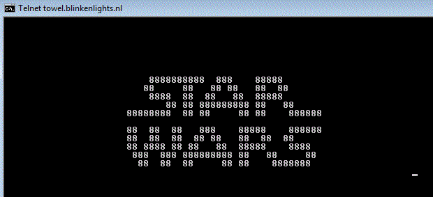
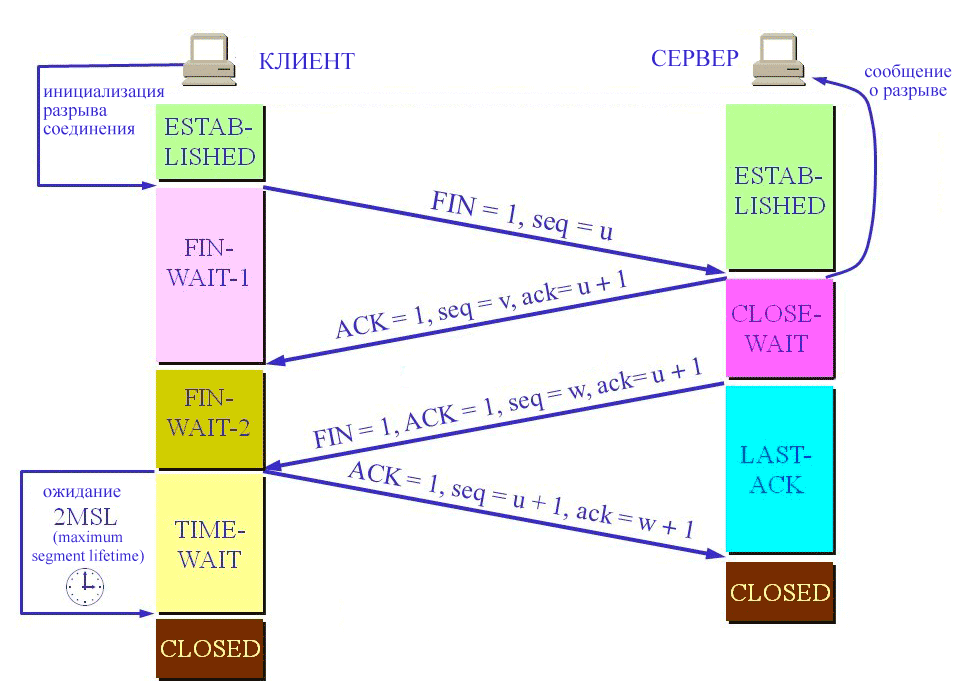
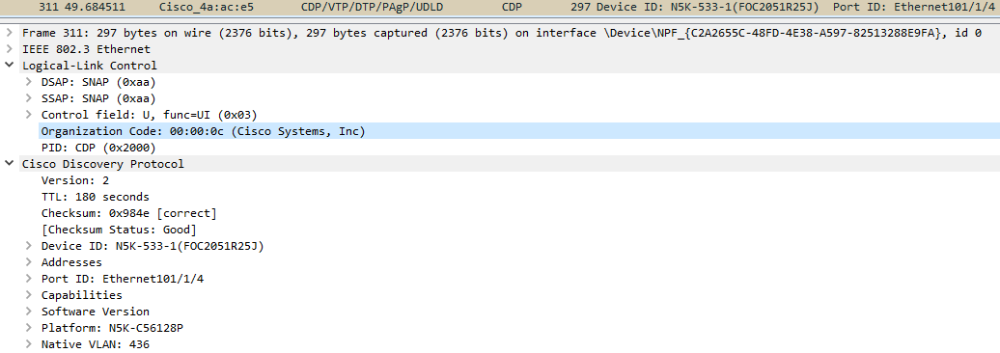

# Домашнее задание «3.6. Компьютерные сети, лекция 1»

**1 - задание.**




**2 - задание.**

На частоте 2.4 ГГц частоте работает 13 каналов шириной от 20 до 40 МГц, есть еще 14ый канал, но он не используется в современных маршрутизаторах.

На 5 ГГц полоса частот с 5150 до 5825 МГц. В России в полосе частот 5 GHz доступны 33 канала. Однако каналы на этом промежутке распределены неравномерно они занимают три сплошных участка: 
UNII-1,2,3. Для WiFi 5GHz частоты каналов распределены следующим образом. На первой полосе расположены каналы 36, 40, 44, 80. 
На второй — 52, 56, 60, 64, 100, 104, … , 136, 140. Третья включает в себя 149, 153, 157, 161.    
Каждый из них соответствует определённой центральной частоте в разрешенном диапазоне 5 ГГц WiFi, которую можно определить по следующей формуле:    
H = 5000 Мгц + (K * 5 Мгц)
где K – номер канала, а H – центральная частота.


  
**3 - задание.**

Apple, Inc


**4 - задание.**

Если Ethernet MTU задан в 9001, а заголовок TCP 32 байта - payload TCP = 8949 (9001 - 20 - 32). 


**5 - задание.**

В обычном поведении TCP флаги SYN и FIN никогда не должны быть установлены в одном пакете.    
Это сочетание требует как установления соединения (через SYN), так и завершения соединения (через FIN).    
Такое сочетание флагов считается некорректным, и различные операционные системы генерируют разные ответы для таких пакетов.


**6 - задание.**

Потому, что запрос идет только для протокола UDP (опция -u). А он, как известно, не поддерживает соединений. Состояние TIME-WAIT же характерно только при закрытии соединения по протоколу TCP.


**7 - задание.**



Пояснение дано в случае инициализации закрытия клиентом, в случае разрыва серврером картинка будет зеркальная.    

Если пассивная сторона готова к закрытию сессии, то ответный FIN может быть получен с одновременным ACK на исходный FIN пакет. В этом случае активная сторона отвечает на него ACKом и переводит соединение в TIME_WAIT, минуя FIN_WAIT_2.    
Возможна ситуация когда стороны одновременно инициировали закрытие. В этом случае обе стороны являются «активными», с обоих сторон соединение переходит в состояние TIME_WAIT.
 
 
 
**8 - задание.**

В случае с одним клиентом теоритическое ограничение в количестве открытых исходящих портов (2^16=65536) будет на стороне клиента, 
при настройках по умолчанию для Linux это - `net.ipv4.ip_local_port_range = 32768 61000`. Т.е. примерно 28232 соединений.    
Этот диапазон выделяемых портов можно увеличить, например: `sysctl net.ipv4.ip_local_port_range="15000 61000"`.

Теоритически количество сеансов на стороне сервера со многими клиентами ограничено только памятью и может увеличиваться по мере поступления новых соединений.
Но на практике существуют ограничения для снижения нагрузки на сервер, например ограничение максимального количества запросов в очереди к сокету прослушивания `net.core.somaxconn`,
по умолчанию имеет значение `128`. Если производительность позволяет можно увеличить это значение - `sysctl net.core.somaxconn=1024`.   
Так же параметр `txqueuelen` сетевой карты тоже имеет значение и еще ряд настроек которые требуется сделать для увеличения количества обрабатываемых соединений.


**9 - задание.**

Действительно может сложиться такая ситуация когда на хосте будет много соединений в состоянии `TIME-WAIT`.
Это говорит о большом количестве открываемых и закрываемых TCP-соединений. 
При очень большом их количестве на клиенте могут закончиться доступные порты для исходящих соединений.
На сервере же это может повлечь за собой исчерпание ресурсов и проблемы с NAT-клиентами. А так же в случае 
малого значения времени карантина порта велика вероятность, что к серверу придёт запрос соединения с того же порта, 
соединение с которым ещё не закрыто (находится в TIME_WAIT), что так же может приводить к замедлению работы и недоступности сервиса для клиента.


**10 - задание.**

Единственная проблема фрагментации в том, что если потеряется один пакет, потеряются оба, и придется все это ретрасмитить. Если один фрагмент датаграммы потерялся, она должна быть целиком повторно передана. Не существует способа повторно передать только один фрагмент датаграммы.     
TCP осуществляет тайм-аут и повторную передачу, UDP - нет. но некоторые UDP приложения осуществляют тайм-аут и повторную передачу самостоятельно.
Когда потерялся фрагмент из TCP сегмента, TCP , в отличие от UDP, отработает тайм-аут и повторно передаст TCP сегмент целиком (IP датаграмма). 
Кроме того может переполняться буфер при сборке датаграмм на принимающем оборудовании и какие то датаграммы будут отброшены. Что вызывет еще большие задержки в передаче.

Учитывая сказанное и то, что протокол UDP часто используется для передачи данных чувствительных к задержкам, таких как голос. 
Фрагментация UDP пакетов может повлечь за собой задержки и неприемлемое качество передачи данных.


**11 - задание.**

Хоть логи и нельзя назвать чувствительной информаций для выполнения основных функций для оборудования или ПО, тем не менее я бы выбрал протокол TCP как транспортный для построения клиент-серверного приложения для сбора текстовой информации. Даже если бы это несколько усложнило разработку.
Но syslog реализован на принципах простоты, поэтому в нем используется протокол UDP (хотя иногда используется 1468 TCP порт). Это упрощает реализацию и меньше нагружает оборудование, но влечет за собой ряд проблем.    
Возможно потерять сообщения из-за перегрузки сети или потери пакетов. Есть некоторые проблемы безопасности. В сообщениях syslog’а нет аутентификации, поэтому один компьютер может выдать себя за другой компьютер и отправить ложные события журнала. Он также подвержен повторным атакам.
Кроме того, Syslog не определяет стандартный способ форматирования содержимого сообщения - и существует столько же способов форматирования сообщения, сколько существует разработчиков.    
Несмотря на это syslog является ценным инструментом сбора информации в условиях ограничений.
 


**12 - задание.**

```bash
vagrant@vagrant:~$ ss -lt | grep LISTEN | wc -l
5
```
```bash
vagrant@vagrant:~$ sudo ss -ltp
State	  Recv-Q	Send-Q			Local Address:Port	    Peer Address:Port           Process
LISTEN		0	     4096		       0.0.0.0:sunrpc           0.0.0.0:*		users:(("rpcbind",pid=599,fd=4),("systemd",pid=1,fd=86))
LISTEN		0	     4096		 127.0.0.53%lo:domain           0.0.0.0:*	  	users:(("systemd-resolve",pid=600,fd=13))
LISTEN		0	     128		       0.0.0.0:ssh              0.0.0.0:*		users:(("sshd",pid=2233,fd=3))
LISTEN		0	     4096		          [::]:sunrpc              [::]:*		users:(("rpcbind",pid=599,fd=6),("systemd",pid=1,fd=88))
LISTEN		0	     128		          [::]:ssh                 [::]:*		users:(("sshd",pid=2233,fd=4))
```


**13 - задание.**

```bash
vagrant@vagrant:~$ sudo tcpdump -i any -nn -v -c 1 -X

tcpdump: listening on any, link-type LINUX_SLL (Linux cooked v1), capture size 262144 bytes
16:12:49.809725 IP (tos 0x10, ttl 64, id 17930, offset 0, flags [DF], proto TCP (6), length 76)
    10.0.2.15.22 > 10.0.2.2.5081: Flags [P.], cksum 0x184f (incorrect -> 0x9265), seq 3906569048:3906569084, ack 6074079, win 62780, length 36
        0x0000:  4510 004c 460a 4000 4006 dc81 0a00 020f  E..LF.@.@.......
        0x0010:  0a00 0202 0016 13d9 e8d9 8358 005c aedf  ...........X.\..
        0x0020:  5018 f53c 184f 0000 eb32 c935 4d03 a5d9  P..<.O...2.5M...
        0x0030:  bffb 768e 0245 3fa2 338b 2bd1 eff5 dea3  ..v..E?.3.+.....
        0x0040:  5876 27bc 3d8a 788d 7e34 de6c            Xv'.=.x.~4.l
```
Ключ для вывода содержимого фремов в текстовом виде -X.
Только в шеснатеричном флаги -x, --xx.


**14 - задание.**

При анализе трафика довольно много флагов IP `DF` при работе по ssh.

Под поле флаги в протоколе IP выделено три бита, этих три бита используются для контроля над фрагментацией пакетов:    
- нулевой бит зарезервирован и должен быть всегда равен нулю;    
- если значение первого бита ноль, то допускается фрагментация пакетов, если единица (бит DF или Do not Fragment), то устройства компьютерной сети не будут выполнять фрагментацию;   
- второй бит служит для того, чтобы конечные узлы понимали, где начинается последовательность фрагментированных пакетов, а где она заканчивается, если значение этого бита равно единице (MF More Fragments), то узел понимает, что этот пакет не последний и нужно ждать еще пакеты, чтобы собрать изначально разделенный пакет.

Стандарт Ethernet, фреймы которого попали в дамп - IEEE 802.3.
 
Как такового 3х байтного поля Organizationally Unique Identifier (OUI) на виртуалке с vagrant увидеть не удалось. Т.к. он требует пакет с инкапсуляцией в формат фрейма 802.3 SNAP, его используют к примеру протоколы семейства STP, протоколах CDP, VTP, DTP. Хотя вендора можно определить и по первой половине MAC-адреса.    
Но на хостовой машине это не вызвало проблем:

