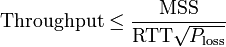

# Домашнее задание «3.7. Компьютерные сети, лекция 2»

**1 - задание.**

Для наполнения потребуется размер окна:    
1 * 1024<small>3</small> * 0,3 / 8 = 40265318,4 Байт = 38,4 Мб

---

**2 - задание.**

Максимальная пропускная способность TCP:    
  
  
где: MSS (Maximum segment size) – максимальный размер сегмента TCP (MSS = MTU – packet headers=1460 bytes),   
MTU — максимальный размер передаваемого блока нижнего уровня OSI (Ethernet MTU = 1500 bytes),   
RTT — время двусторонней задержки (от одного конца к другому и назад, от англ. Round Trip Time)    
Ploss — Loss probability (вероятность потерь).

(1460 / 300 * 1 / (10<small>-3</small>)) * 8 = 389.33 Mbit/sec

(1460 / 300 * 1 / (10)) * 8 = 0.38933 Mbit/sec

т.е. пропускная способность канала упадет в 1000 раз.

---
  
**3 - задание.**

Если исключить VLAN tagging, TCP timestamp и другие опциональные возможности, максимальная полезная нагрузка (Payload) TCP в сетях Ethernet будет:    
Max TCP Payload = (MTU – TCP–IP_headers) / (MTU + Ethernet_headers + IFG) = (1500–40) / (1500+26+12) = 94.9 %   

где: IFG (Interframe gap) — обязательное межкадровое пространство.    

Соответственно в реальной сети 100 Мбит/с достижима скорость около 94 Мбит/с.    

Из формулы так же очевидно, что при увеличении размера кадра Ethernet эффективность использования канала будет увеличиваться (при полном отсутствии потерь).

---

**4 - задание.**

- обрашение к фалу hosts для резолва DNS-имени;    
- если нет в hosts - обрашение к кэшу DNS клиента;    
- если нет в кэше - передача запроса DNS-серверу;    
- DNS-сервер, не найдя записей в локальном кэше, обращается к корневому домену «.»;    
- корневой домен, в свою очередь, сообщает IP-адрес DNS-сервера, ответственного за домен «ru.» и DNS-сервер опрашивает уже его;   
- ответственный сервер за домен «info.» сообщает DNS-серверу IP-адрес сервера, который может сообщить IP-адрес для домена «netology.ru»;   
- DNS-сервер, запросивший IP-адрес домена, опрашивает сервер, ответственный за домен netology.ru, который, в свою очередь, возвращает нужный IP-адрес;     
- DNS-сервер возвращает IP-адрес клиенту и IP добавляется в кэш DNS-клиента;   
- устанавливается TCP соединения к найденому IP на порт 80 (SYN-SYN,ACK-ACK);    
- запрос GET по HTTP к веб-серверу;    
- ответ 301 (Moved Permanently) на GET запрос с сообщением о переадресации на порт 443;    
- разрыв TCP соединения и повторная установка соединения на порт 443;    
- запрос GET по HTTPS к веб веб-серверу;    
- ответ 2XX от веб-сервера.

---

**5 - задание.**

4 итеративных запроса:
- запрос списка корневых доменов `«.»` ;
- запрос одному из них d.root-servers.net о том, какой сервер отвечает за зону `«uk.»`;
- запрос на поиск отвечающих за зону `«google.co.uk.»` серверов (получен ответ от nsd.nic.uk);
- запрос к ns4.google.com о том, какой IP адрес у "A" записи домена `«www.google.co.uk.»`

---

**6 - задание.**

255.248.0.0/25 -> 11111111.11111111.11111111.10000000 => 128 принимаемых значений в двух подсетях

Число хостов в каждой подсети = 128 - адрес сети - broadcast = 126 

---

**7 - задание.**

/23 -> 11111111.11111111.11111110.00000000 => 511 адресов (включая broadcart)    
/24 -> 11111111.11111111.11111111.00000000 => 255 адресов (включая broadcart)

---
 
**8 - задание.**

10.0.0.0/8 -> 00001010.00000000.00000000.00000000 => 16777214 хостов

16777214/131070 = 128,0019 > 128 => получится разделить на нужное кол-во подсетей
 
131070 хостов это 11111111.11111110.00000000.00000000 => 10.0.0.0/15

