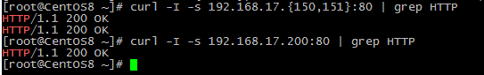
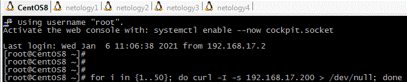
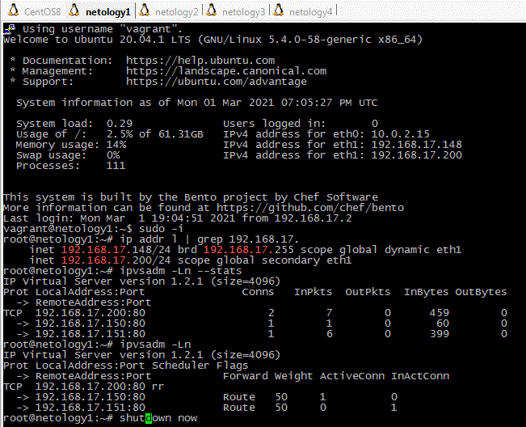
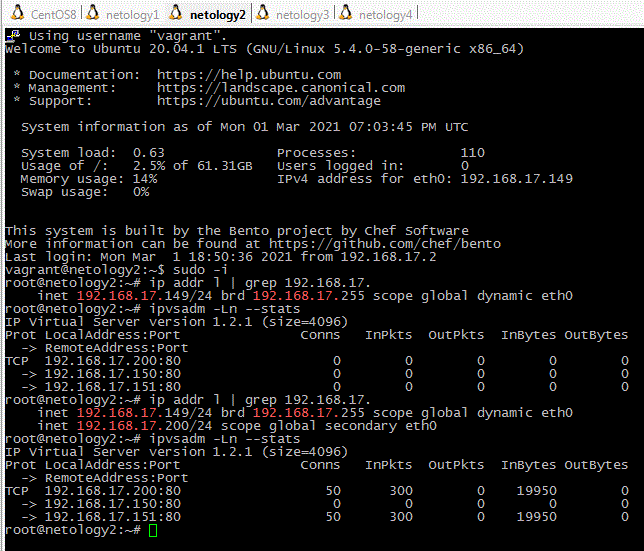

# Домашнее задание «3.8. Компьютерные сети, лекция 3»

**1 - задание.**

InActConn - это все состояния соединенией кроме ESTABLISHED.   
Для LVS типа DR и LVS-Tun директор не видит пакетов от реального сервера к клиенту. 
А для завершения tcp-соединения происходит отправка FIN с последующим ответом ACK с другого конца.
Затем второй участник посылает свой FIN, за которым следует ACK от первой машины.    
Однако если реальный сервер инициирует прекращение соединения, директор сможет сделать вывод о том, 
что это произошло, только увидев ACK от клиента. Директор вынужден делать вывод, 
что соединение закрыто из частичной информации, и использует свою собственную таблицу тайм-аутов, 
чтобы объявить, что соединение прервано. Таким образом в колонке InActConn могут быть видны
 еще некоторое время соединения как активные.

---

**2 - задание.**

[Настройка первого директора](netology1.md)    
[Настройка второго директора](netology2.md)    
[Настройка первого хоста](netology3.md)    
[Настройка второго хоста](netology4.md)   

Проверка:    

Результаты работы:   

После выключения первого директора:   

---

**3 - задание.**

Что бы задействовать 3 балансировщика в активном режиме вероятно понадобится использовать 3 VIP адреса, по одному на каждый балансировщик.
А поочередную выдачу адресов балансировщиков решать на уровне DNS, либо маршрутизацией на anycast.