# Домашнее задание «3.9. Элементы безопасности информационных систем»

**1 - задание.**

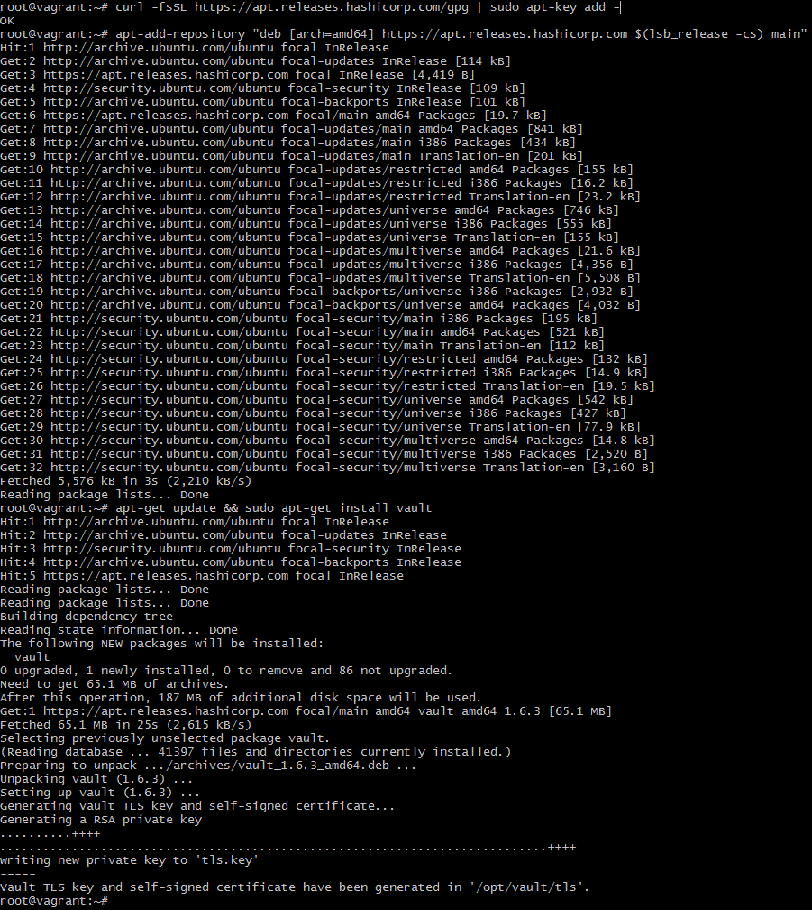

---

**2 - задание.**

```bash
root@vagrant:~# vault server -dev -dev-listen-address="0.0.0.0:8200"
```

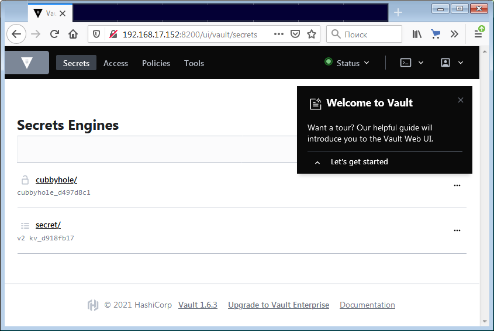

---

**3 - задание.**

Для начала авторизуемся:
```bash
 # в случае упрощенного запуска (-dev) проще сделать это установкой переменных
root@vagrant:~# export VAULT_ADDR='http://127.0.0.1:8200'
root@vagrant:~# export VAULT_TOKEN="s.ekWvFEoqKodQlsmoYeQ5xoh8"
root@vagrant:~# vault status
Key             Value
---             -----
Seal Type       shamir
Initialized     true
Sealed          false
Total Shares    1
Threshold       1
Version         1.6.3
Storage Type    inmem
Cluster Name    vault-cluster-bcb63191
Cluster ID      75ca8be2-7164-8baa-cdb9-1116affe48a1
HA Enabled      false
```

Шаг 1: генерация Root CA

```bash
 # активируем PKI тип секрета для корневого центра сертификации
root@vagrant:~# vault secrets enable \
>     -path=pki_root_ca \
>     -description="PKI Root CA" \
>     -max-lease-ttl="87600h" \
>     pki
Success! Enabled the pki secrets engine at: pki/

 # увеличим максимальное время жизни серификата, если нужно
root@vagrant:~# vault secrets tune -max-lease-ttl=262800h pki
Success! Tuned the secrets engine at: pki/

 # создаем заполненный корневой сертификат и экспортируем все данные в json
root@vagrant:~# vault write -format=json pki_root_ca/root/generate/internal \
>     common_name="Root Certificate Authority" \
>     country="Russian Federation" \
>     locality="Moscow" \
>     street_address="Red Square 1" \
>     postal_code="101000" \
>     organization="Horns and Hooves LLC" \
>     ou="IT" \
>     ttl=262800h > pki-root-ca.json

 # выгружаем из данных json корневой сертификат
root@vagrant:~# apt-get install jq
root@vagrant:~# cat pki-root-ca.json | jq -r .data.certificate > CA_root_cert.crt

 # публикуем URL’ы для корневого центра сертификации
root@vagrant:~# vault write pki_root_ca/config/urls \
>     issuing_certificates="http://netology.biryukov.ru:8200/v1/pki_root_ca/ca" \
>     crl_distribution_points="http://netology.biryukov.ru:8200/v1/pki_root_ca/crl"
Success! Data written to: pki_root_ca/config/urls
```

Шаг 2: генерация Intermediate CA

```bash
 # активируем PKI тип секрета для промежуточного центра сертификации
root@vagrant:~# vault secrets enable \
>     -path=pki_int_ca \
>     -description="PKI Intermediate CA" \
>     -max-lease-ttl="175200h" \
>     pki
Success! Enabled the pki secrets engine at: pki_int_ca/

 # генерируем запрос на выдачу сертификата для промежуточного центра сертификации
root@vagrant:~# vault write pki_root_ca/config/urls \
>     issuing_certificates="http://netology.biryukov.ru:8200/v1/pki_root_ca/ca" \
>     crl_distribution_points="http://netology.biryukov.ru:8200/v1/pki_root_ca/crl"
Success! Data written to: pki_root_ca/config/urls
root@vagrant:~#
root@vagrant:~#
root@vagrant:~# vault write -format=json pki_int_ca/intermediate/generate/internal \
>    common_name="biryukov.ru Intermediate CA" \
>    country="Russian Federation" \
>    locality="Moscow" \
>    street_address="
> Red Square 1
> " \
>    postal_code="101000" \
>    organization="
> Horns and Hooves LLC
> " \
>    ou="IT" \
>    ttl="175200h" | jq -r '.data.csr' > ca_intermediate_cert.csr


 # отправляем полученный CSR-файл в корневой центр сертификации для подписания, получаем сертификат для промежуточного центра сертификации
root@vagrant:~# vault write -format=json pki_root_ca/root/sign-intermediate csr=@ca_intermediate_cert.csr \
>    country="Russia Federation" \
>    locality="Moscow" \
>    street_address="
> Red Square 1
> " \
>    postal_code="101000" \
>    organization="
> Horns and Hooves LLC
> " \
>    ou="IT" \
>    format=pem_bundle \
>    ttl="175200h" | jq -r '.data.certificate' > intermediateCA.cert.pem

 # публикуем подписанный сертификат промежуточного центра сертификации
root@vagrant:~# vault write pki_int_ca/intermediate/set-signed \
>     certificate=@intermediateCA.cert.pem
Success! Data written to: pki_int_ca/intermediate/set-signed

 # публикуем URL’ы для промежуточного центра сертификации
root@vagrant:~# vault write pki_int_ca/config/urls \
>     issuing_certificates="http://netology.biryukov.ru:8200/v1/pki_int_ca/ca" \
>     crl_distribution_points="http://netology.biryukov.ru:8200/v1/pki_int_ca/crl"
Success! Data written to: pki_int_ca/config/urls
```

**4 - задание.**

Создаем роль, с помощью которой будем выдавать сертификаты для серверов:    
```bash
root@vagrant:~# vault write pki_int_ca/roles/biryukov-ru \
>  country="Russia Federation" \
>  locality="Moscow" \
>  street_address="
>   Varshavskoe shosse 1/3
>   " \
>  postal_code="115127" \
>  organization="
>   Nettology LLC
>   " \
>  ou="IT" \
>  allowed_domains="biryukov.ru" \
>  allow_subdomains=true \
>  max_ttl="87600h" \
>  key_bits="2048" \
>  key_type="rsa" \
>  allow_any_name=false \
>  allow_bare_domains=false \
>  allow_glob_domain=false \
>  allow_ip_sans=true \
>  allow_localhost=false \
>  client_flag=false \
>  server_flag=true \
>  enforce_hostnames=true \
>  key_usage="DigitalSignature,KeyEncipherment" \
>  ext_key_usage="ServerAuth" \
>  require_cn=true
Success! Data written to: pki_int_ca/roles/biryukov-ru


```

Создаем сертификаты и ключ для домена netology.biryukov.ru:    
```bash
root@vagrant:~# vault write -format=json pki_int_ca/issue/biryukov-ru \
>     common_name="netology.biryukov.ru" \
>     alt_names="netology.biryukov.ru" \
>     ttl="43800h" > netology.biryukov.ru.json

 # парисим в правильном формате
   # сертификат и публичный ключ в одном файле
cat netology.biryukov.ru.json | jq -r .data.certificate > netology.biryukov.ru.pem
cat netology.biryukov.ru.json| jq -r .data.issuing_ca >> netology.biryukov.ru.pem
   # приватный ключ
cat netology.biryukov.ru.json | jq -r .data.private_key > netology.biryukov.ru.key
```

**5 - задание.**

```bash
root@vagrant:~# mkdir /etc/nginx/cert
root@vagrant:~# cp netology.biryukov.ru.{key,pem} /etc/nginx/cert/

root@vagrant:~# echo 127.0.0.1 netology.biryukov.ru. >> /etc/hosts

root@vagrant:~# rm /etc/nginx/sites-enabled/default


vim /etc/nginx/sites-available/netology.biryukov.ru.conf

server {
  listen 80 default_server;
  server_name _;
  return 301 https://$host$request_uri;
}

server {
  server_name netology.biryukov.ru;
  listen netology.biryukov.ru:443 ssl; # default_server;


  ssl on;
  ssl_certificate /etc/nginx/cert/netology.biryukov.ru.pem;
  ssl_certificate_key /etc/nginx/cert/netology.biryukov.ru.key;

  ssl_protocols TLSv1 TLSv1.1 TLSv1.2;
  ssl_ciphers HIGH:!aNULL:!MD5;

  ssl_prefer_server_ciphers on;
  ssl_session_timeout 1d;
  ssl_session_cache shared:SSL:50m;
  ssl_session_tickets off;

  location / {
    proxy_pass http://127.0.0.1:8200;
    proxy_set_header Host $host;
    proxy_set_header X-Real-IP $remote_addr;
    proxy_set_header X-Forwarded-For $proxy_add_x_forwarded_for;
    proxy_set_header X-Forwarded-Proto https;
  }
}

root@vagrant:~# ln -s /etc/nginx/sites-available/netology.biryukov.ru.conf /etc/nginx/sites-enabled/netology.biryukov.ru.conf

root@vagrant:~# sudo systemctl start nginx

root@vagrant:~# curl -I https://netology.biryukov.ru
curl: (60) SSL certificate problem: unable to get local issuer certificate
More details here: https://curl.haxx.se/docs/sslcerts.html

curl failed to verify the legitimacy of the server and therefore could not
establish a secure connection to it. To learn more about this situation and
how to fix it, please visit the web page mentioned above.
```
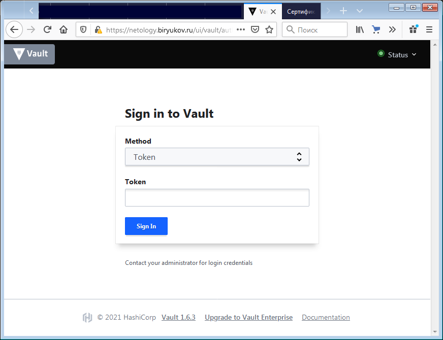    
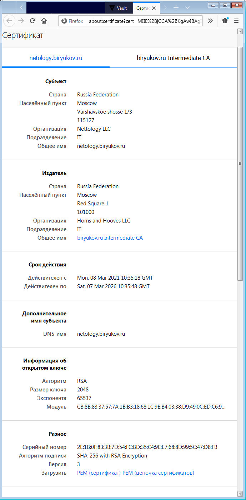    
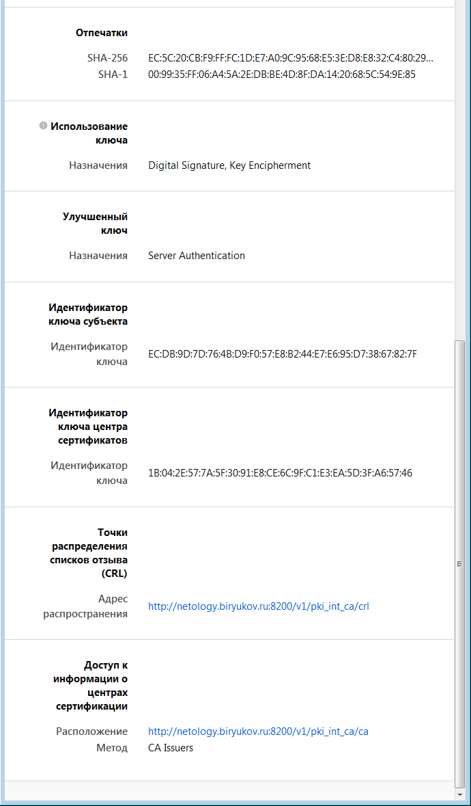

**6 - задание.**

```bash
root@vagrant:~# ln -s /root/CA_root_cert.crt /usr/local/share/ca-certificates/CA_root_cert.crt

 # вызываем сценарий добавления
root@vagrant:~# echo 127.0.0.1 netology.biryukov.ru. >> /etc/hosts # на самом деле было сделано уже в 5ом задании


root@vagrant:~# update-ca-certificates
Updating certificates in /etc/ssl/certs...
1 added, 0 removed; done.
Running hooks in /etc/ca-certificates/update.d...
done.

 # проверяем
root@vagrant:~# curl -I https://netology.biryukov.ru
HTTP/1.1 307 Temporary Redirect
Server: nginx/1.18.0 (Ubuntu)
Date: Mon, 08 Mar 2021 12:12:29 GMT
Content-Type: text/html; charset=utf-8
Connection: keep-alive
Cache-Control: no-store
Location: /ui/
```
скрин:    
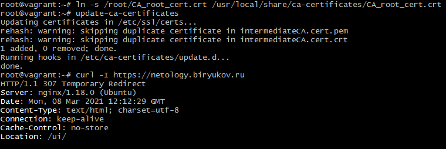    

В браузере под виндой, после добавления корневого сертификата в "доверенные корневые центры сертификации":    
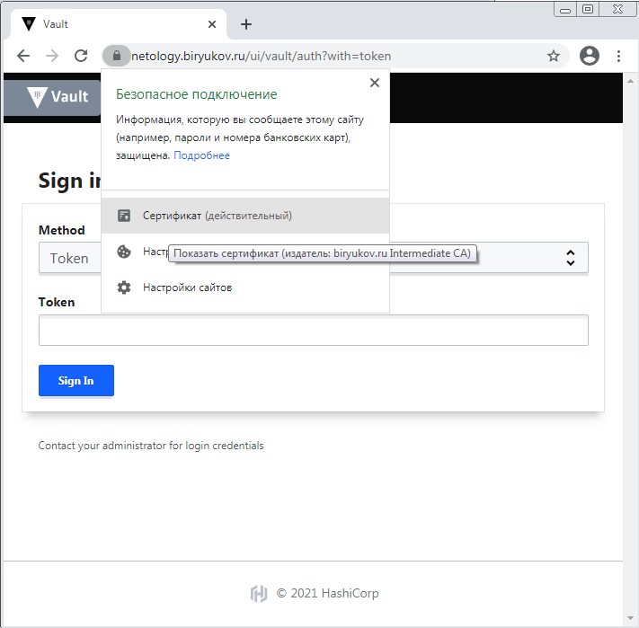    
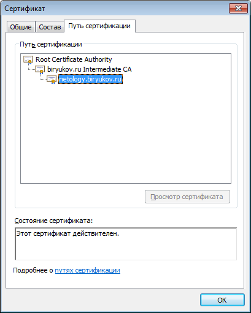


**7 - задание.**

Поскольку хост с живым доменом на котором можно безбоязненно поэкспериментировать у меня находится на Debian 8 c установкой актуальных версий клиентов Let's encrypt возникли сложности.    
То, что и удалось завести к сожалению тоже давно не обновлялось и подтягивает просроченный корневой сертификат.     
С GetSSL получилось как то так:    
 
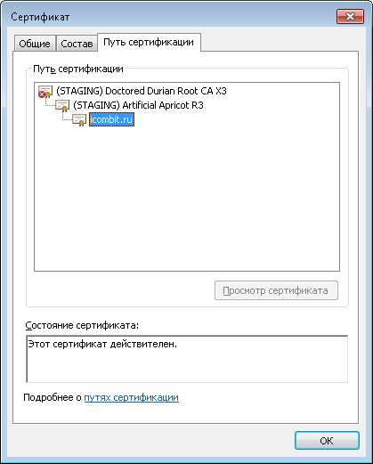
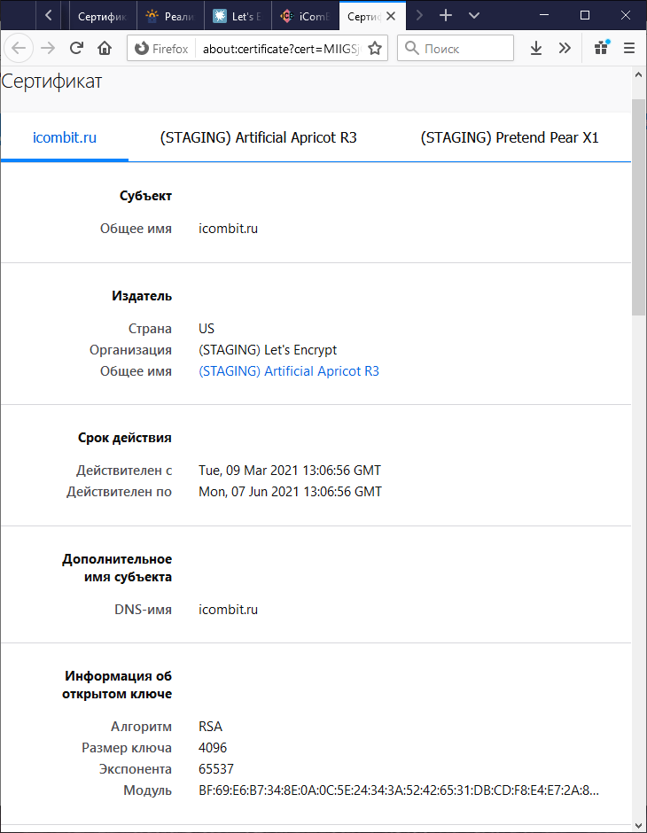

С актуальной версией ОС таких проблем нет, но технология подразумевает запрос сертификатов с хоста к тоторому привязан домен.


**8* - задание.**

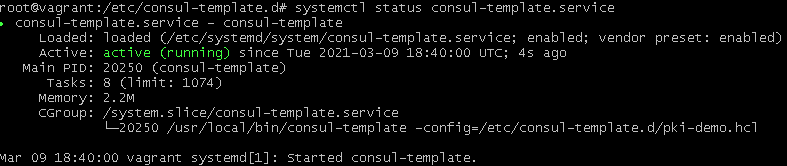    
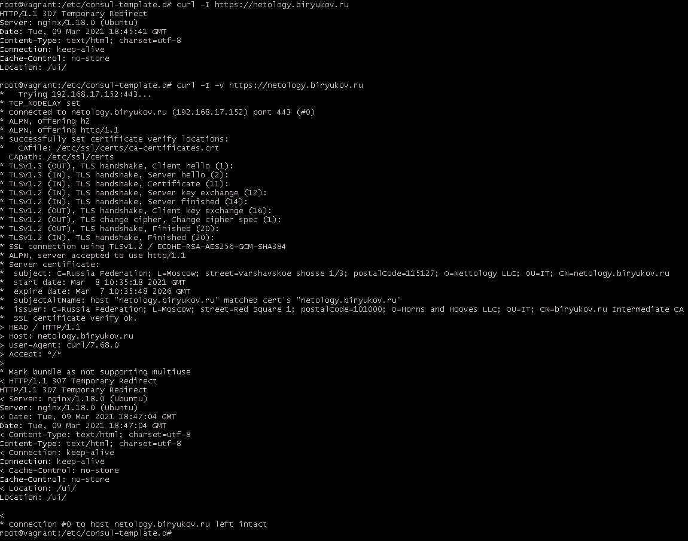