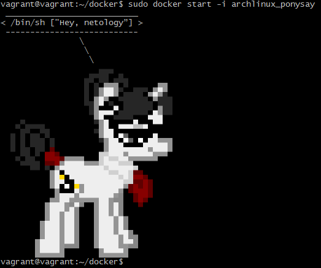
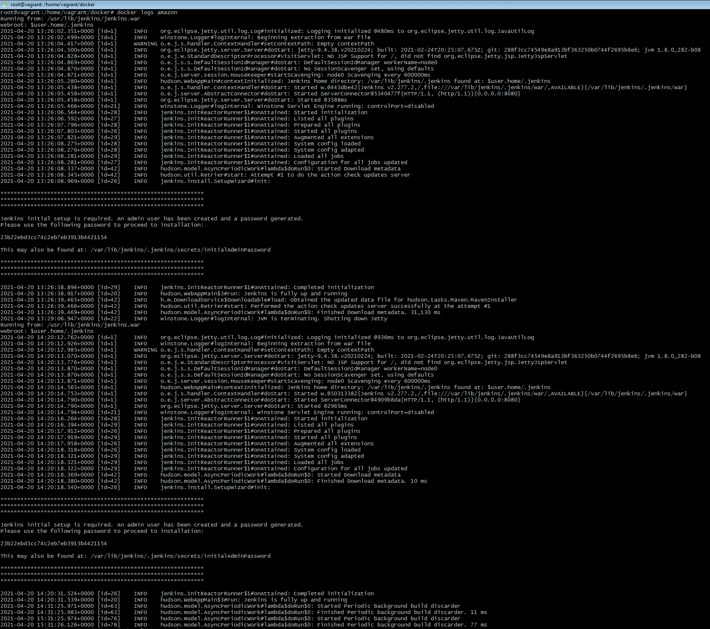
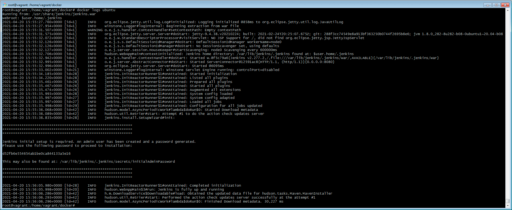
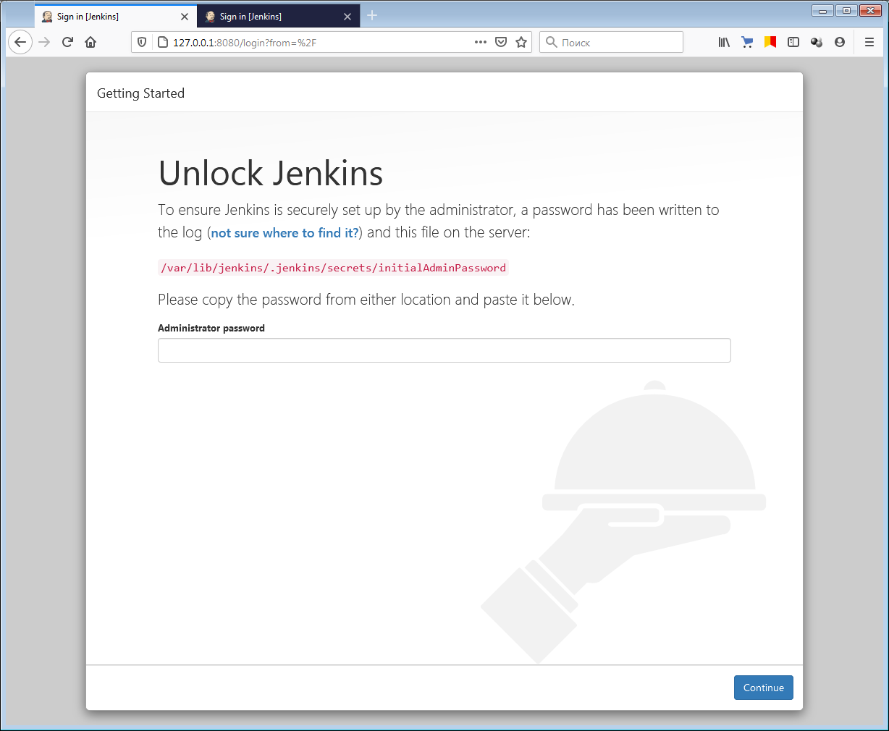
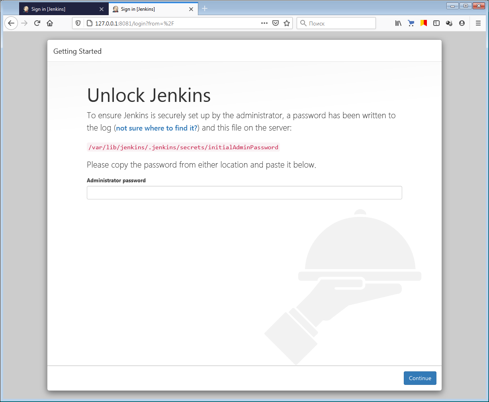
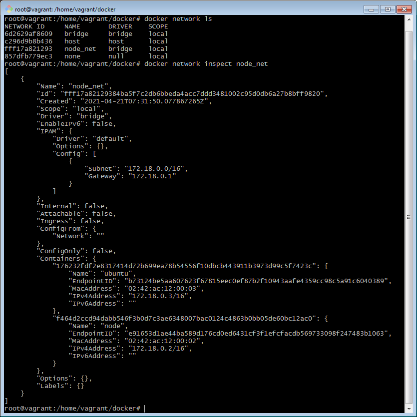
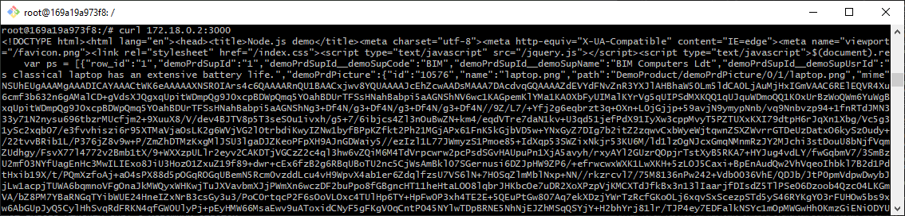
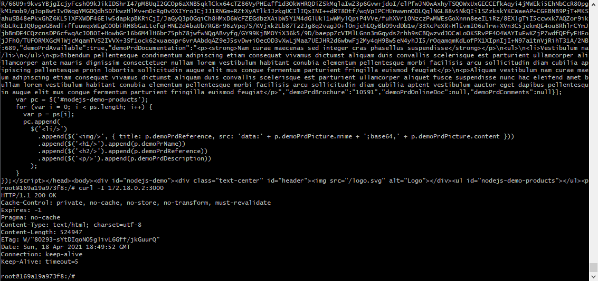

# Домашнее задание «5.4. Практические навыки работы с Docker»

## Задание 1 

В данном задании вы научитесь изменять существующие Dockerfile, адаптируя их под нужный инфраструктурный стек.

Измените базовый образ предложенного Dockerfile на Arch Linux c сохранением его функциональности.

```text
FROM ubuntu:latest

RUN apt-get update && \
    apt-get install -y software-properties-common && \
    add-apt-repository ppa:vincent-c/ponysay && \
    apt-get update
 
RUN apt-get install -y ponysay

ENTRYPOINT ["/usr/bin/ponysay"]
CMD ["Hey, netology”]
```

Для получения зачета, вам необходимо предоставить:
- Написанный вами Dockerfile    
**Ответ:**    
```text
FROM archlinux:latest

RUN pacman -Sy

RUN pacman -S --noconfirm ponysay

ENTRYPOINT ["/usr/bin/ponysay"]
CMD ["Hey, netology”]
```

- Скриншот вывода командной строки после запуска контейнера из вашего базового образа    
**Ответ:**    


- Ссылку на образ в вашем хранилище docker-hub    
**Ответ:**    
https://hub.docker.com/r/0dok0/archlinux_ponysay

---

## Задание 2

В данной задаче вы составите несколько разных Dockerfile для проекта Jenkins, опубликуем образ в `dockerhub.io` и посмотрим логи этих контейнеров.

- Составьте 2 Dockerfile:

    - Общие моменты:
        - Образ должен запускать [Jenkins server](https://www.jenkins.io/download/)
        
    - Спецификация первого образа:
        - Базовый образ - [amazoncorreto](https://hub.docker.com/_/amazoncorretto)
        - Присвоить образу тэг `ver1` 
    
    - Спецификация второго образа:
        - Базовый образ - [ubuntu:latest](https://hub.docker.com/_/ubuntu)
        - Присвоить образу тэг `ver2` 

- Соберите 2 образа по полученным Dockerfile
- Запустите и проверьте их работоспособность
- Опубликуйте образы в своём dockerhub.io хранилище

Для получения зачета, вам необходимо предоставить:
- Наполнения 2х Dockerfile из задания    

**Ответ:**   

DockerFile для amazoncorretto + Jenkins:
```text
FROM amazoncorretto
LABEL maintainer="Timofey Biryukov"
LABEL version="1.0"

ADD https://pkg.jenkins.io/redhat-stable/jenkins.repo /etc/yum.repos.d/jenkins.repo

RUN rpm --import https://pkg.jenkins.io/redhat/jenkins.io.key && \
    yum update -y && \
    yum install -y jenkins

EXPOSE 8080/tcp
EXPOSE 50000

USER jenkins

CMD ["-jar", "/usr/lib/jenkins/jenkins.war"]
ENTRYPOINT ["java"]
```

DockerFile для ubuntu + Jenkins:
```text
FROM ubuntu
LABEL maintainer="Timofey Biryukov"
LABEL version="1.0"

ADD https://pkg.jenkins.io/debian-stable/jenkins.io.key /

RUN apt-get update -y && \
    apt-get install -y gnupg ca-certificates && \
    apt-key add /jenkins.io.key && \
    bash -c 'echo deb https://pkg.jenkins.io/debian-stable binary/ > /etc/apt/sources.list.d/jenkins.list' && \
    apt-get update -y && \
    apt-get install -y openjdk-8-jdk openjdk-8-jre jenkins

EXPOSE 8080/tcp
EXPOSE 5000

USER jenkins

WORKDIR "/usr/share/jenkins"
CMD ["-jar", "jenkins.war"]
ENTRYPOINT ["java"]
```


- Скриншоты логов запущенных вами контейнеров (из командной строки)    
**Ответ:**   



- Скриншоты веб-интерфейса Jenkins запущенных вами контейнеров (достаточно 1 скриншота на контейнер)    
**Ответ:**   



- Ссылки на образы в вашем хранилище docker-hub    
**Ответ:**   
https://hub.docker.com/repository/docker/0dok0/amazon-jenkins    
https://hub.docker.com/repository/docker/0dok0/ubuntu-jenkins

код:
```bash
docker build -t 0dok0/amazon-jenkins:ver1 -f amazon-jenkins .
docker run -d --name amazon -p 8080:8080 -p 5000:5000 0dok0/amazon-jenkins:ver1

docker build -t 0dok0/ubuntu-jenkins:ver2 -f ubuntu-jenkins .
docker run -d --name ubuntu -p 8080:8081 -p 5000:5001 0dok0/ubuntu-jenkins:ver2

docker ps
#CONTAINER ID   IMAGE                       COMMAND                  CREATED         STATUS             PORTS                                                                                             NAMES
#ed1e8482b69a   0dok0/ubuntu-jenkins:ver2   "java -jar jenkins.w…"   6 seconds ago   Up 5 seconds       0.0.0.0:5001->5001/tcp, :::5001->5001/tcp, 0.0.0.0:8081->8081/tcp, :::8081->8081/tcp              ubuntu
#01809bf128b5   0dok0/amazon-jenkins:ver1   "java -jar /usr/lib/…"   2 hours ago     Up About an hour   0.0.0.0:5000->5000/tcp, :::5000->5000/tcp, 0.0.0.0:8080->8080/tcp, :::8080->8080/tcp, 50000/tcp   amazon

docker login
docker push 0dok0/amazon-jenkins:ver1
docker push 0dok0/ubuntu-jenkins:ver2
```


---

## Задание 3 

В данном задании вы научитесь:
- объединять контейнеры в единую сеть
- исполнять команды "изнутри" контейнера

Для выполнения задания вам нужно:
- Написать Dockerfile: 
    - Использовать образ https://hub.docker.com/_/node как базовый
    - Установить необходимые зависимые библиотеки для запуска npm приложения https://github.com/simplicitesoftware/nodejs-demo
    - Выставить у приложения (и контейнера) порт 3000 для прослушки входящих запросов  
    - Соберите образ и запустите контейнер в фоновом режиме с публикацией порта

- Запустить второй контейнер из образа ubuntu:latest 
- Создайть `docker network` и добавьте в нее оба запущенных контейнера
- Используя `docker exec` запустить командную строку контейнера `ubuntu` в интерактивном режиме
- Используя утилиту `curl` вызвать путь `/` контейнера с npm приложением  

Для получения зачета, вам необходимо предоставить:
- Наполнение Dockerfile с npm приложением    
**Ответ:**    
```text
FROM node
LABEL maintainer="Timofey Biryukov"
LABEL version="1.0"

ADD https://github.com/simplicitesoftware/nodejs-demo/archive/master.zip /

RUN unzip master.zip && \
    cd /nodejs-demo-master && \
    npm install

EXPOSE 3000/tcp

WORKDIR "/nodejs-demo-master"
CMD ["start", "0.0.0.0"]
ENTRYPOINT ["npm"]
```

- Скриншот вывода вызова команды списка docker сетей (docker network cli)    
**Ответ:**    


- Скриншот вызова утилиты curl с успешным ответом    
**Ответ:**    



код:
```bash
# создаем image по DockerFile node и запускаем контейнер
docker build -t 0dok0/node -f node .
docker run -d --name node --publish=3000:3000 0dok0/node

# создаем сеть и подключаем контейнер к сети
docker network create node_net
docker network connect node_net node

# создаем контейнер ubuntu и тоже подключаем его к сети
docker run -d -ti -v /home/vagrant/docker:/tmp/docker --name ubuntu ubuntu bash
docker network connect node_net ubuntu

# устанавливаем в контейнере curl и проверяем
docker exec -ti ubuntu bash
apt-get update
apt-get install curl
curl 172.18.0.2:3000
^D
docker network ls
docker network inspect node_net
```

