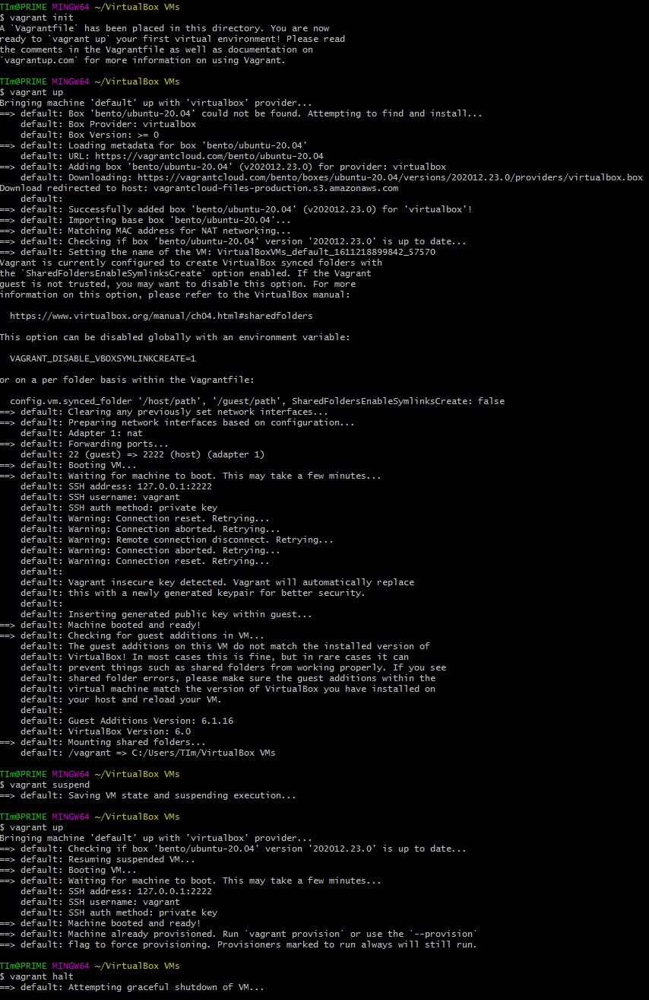
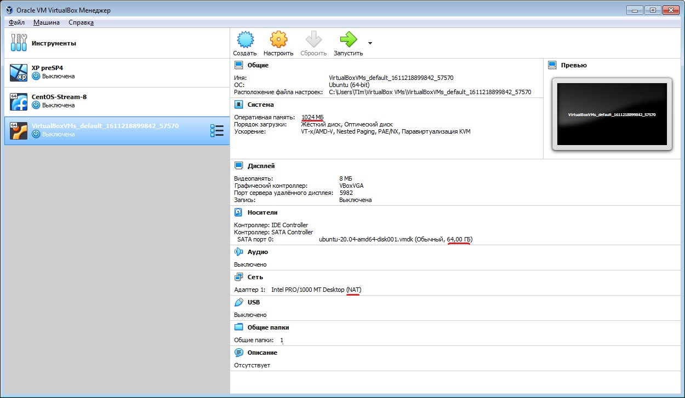
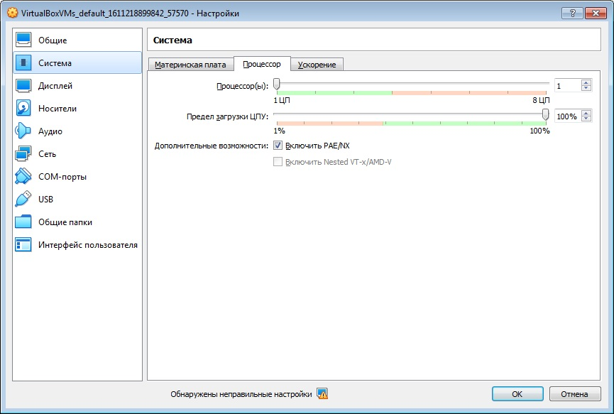
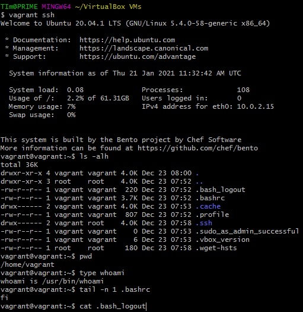

# Домашнее задание «3.1. Работа в терминале, лекция 1»

1. Установите средство виртуализации [Oracle VirtualBox](https://www.virtualbox.org/).

1. Установите средство автоматизации [Hashicorp Vagrant](https://www.vagrantup.com/).

1. В вашем основном окружении подготовьте удобный для дальнейшей работы терминал. Можно предложить:

	* iTerm2 в Mac OS X
	* Windows Terminal в Windows
	* выбрать цветовую схему, размер окна, шрифтов и т.д.
	* почитать о кастомизации PS1/применить при желании.

	Несколько популярных проблем:
	* Добавьте Vagrant в правила исключения перехватывающих трафик для анализа антивирусов, таких как Kaspersky, если у вас возникают связанные с SSL/TLS ошибки,
	* MobaXterm может конфликтовать с Vagrant в Windows,
	* Vagrant плохо работает с директориями с кириллицей (может быть вашей домашней директорией), тогда можно либо изменить [VAGRANT_HOME](https://www.vagrantup.com/docs/other/environmental-variables#vagrant_home), либо создать в системе профиль пользователя с английским именем,
	* VirtualBox конфликтует с Windows Hyper-V и его необходимо [отключить](https://www.vagrantup.com/docs/installation#windows-virtualbox-and-hyper-v),
	* [WSL2](https://docs.microsoft.com/ru-ru/windows/wsl/wsl2-faq#does-wsl-2-use-hyper-v-will-it-be-available-on-windows-10-home) использует Hyper-V, поэтому с ним VirtualBox также несовместим,
	* аппаратная виртуализация (Intel VT-x, AMD-V) должна быть активна в BIOS,
	* в Linux при установке [VirtualBox](https://www.virtualbox.org/wiki/Linux_Downloads) может дополнительно потребоваться пакет `linux-headers-generic` (debian-based) / `kernel-devel` (rhel-based).

1. С помощью базового файла конфигурации запустите Ubuntu 20.04 в VirtualBox посредством Vagrant:

	* Создайте директорию, в которой будут храниться конфигурационные файлы Vagrant. В ней выполните `vagrant init`. Замените содержимое Vagrantfile по умолчанию следующим:

		```bash
		Vagrant.configure("2") do |config|
			config.vm.box = "bento/ubuntu-20.04"
		end
		```

	* Выполнение в этой директории `vagrant up` установит провайдер VirtualBox для Vagrant, скачает необходимый образ и запустит виртуальную машину.

	* `vagrant suspend` выключит виртуальную машину с сохранением ее состояния (т.е., при следующем `vagrant up` будут запущены все процессы внутри, которые работали на момент вызова suspend), `vagrant halt` выключит виртуальную машину штатным образом.

>**Ответ**    
>

---

**5 - задание.**
Ознакомьтесь с графическим интерфейсом VirtualBox, посмотрите как выглядит виртуальная машина, которую создал для вас Vagrant, какие аппаратные ресурсы ей выделены. Какие ресурсы выделены по-умолчанию?

**Ответ**    


  
---
  
**6 - задание.**
Ознакомьтесь с возможностями конфигурации VirtualBox через Vagrantfile: [документация](https://www.vagrantup.com/docs/providers/virtualbox/configuration.html). Как добавить оперативной памяти или ресурсов процессора виртуальной машине?

**Ответ**    
```ruby
Vagrant.configure("2") do |config|
  config.vm.box = "bento/ubuntu-20.04"
   config.vm.provider "virtualbox" do |vub|
     vub.memory = 2048
     vub.cpus = 2
   end
end 
```


**7 - задание.**    
Команда `vagrant ssh` из директории, в которой содержится Vagrantfile, позволит вам оказаться внутри виртуальной машины без каких-либо дополнительных настроек. Попрактикуйтесь в выполнении обсуждаемых команд в терминале Ubuntu.

**Ответ**    


---

**8 - задание.**
Ознакомиться с разделами `man bash`, почитать о настройках самого bash:
    * какой переменной можно задать длину журнала `history`, и на какой строчке manual это описывается?
    * что делает директива `ignoreboth` в bash?

**Ответ**    
Переменна HISTSIZE задает длину журнала history.

```bash
 man bash | grep -n -A2 'HISTSIZE'
```
или
```bash
 man bash
  -N
  &HISTSIZE
```

```text
HISTSIZE
              The number of commands to remember in the command history (see HISTORY below).  If the value is 0, commands are not saved in the history list.  Numeric values less than zero result in every command being saved on the history list (there is no limit).  The shell sets the default value to 500 after reading any startup files.
```
Строка 517 (при моем размее окна).


Директива `ignoreboth` это объединение параметров `ignoredups` и `ignorespace`, отвечающих за отключение записи дубликатов строк в историю и отключение записи строк начанающихся с пробела.

---

**9 - задание.**
В каких сценариях использования применимы скобки `{}` и на какой строчке `man bash` это описано?

**Ответ**    
{} - вариант списка выполняемого в среде текущего командного интерпретатора.    
Сторока man bash 173 (при моем размее окна):    
```text
 { list; }
              list is simply executed in the current shell environment.  list must be terminated with a newline or semicolon.  This is known as a group command.  The return status is the exit status of list.  Note that unlike the metacharacters ( and ), { and } are reserved words and must occur where a reserved word  is  permitted  to  be  recognized.
              Since they do not cause a word break, they must be separated from list by whitespace or another shell metacharacter.
```

---

**10 - задание.**
Основываясь на предыдущем вопросе, как создать однократным вызовом `touch` 100000 файлов? А получилось ли создать 300000?

**Ответ**    

```bash
touch {1..100000}
```

```bash
touch {1..300000}
-bash: /usr/bin/touch: Argument list too long
```
Превышает максимальную длину аргументов среды. Столько файлов нельзя создать одной коммандой.    
```bash
getconf ARG_MAX
2097152
```


**11 - задание.**
В man bash поищите по `/\[\[`. Что делает конструкция `[[ -d /tmp ]]`

**Ответ**    
Конструкция `[[ -d /tmp ]]` проверяет существование каталога, вернет ноль если файл существует и является каталогом.

---

**12 - задание.**
Основываясь на знаниях о просмотре текущих (например, PATH) и установке новых переменных; командах, которые мы рассматривали, добейтесь в выводе type -a bash в виртуальной машине наличия первым пунктом в списке:

	```bash
	bash is /tmp/new_path_directory/bash
	bash is /usr/local/bin/bash
	bash is /bin/bash
	```
	
**Ответ**    
```bash
mkdir /tmp/new_path_directory
cp /bin/bash /tmp/new_path_directory/bash
PATH=/tmp/new_path_directory:$PATH

type -a bash
bash is /tmp/new_path_directory/bash
bash is /usr/bin/bash
bash is /bin/bash
```

---


**13 - задание.**
Чем отличается планирование команд с помощью `batch` и `at`?

**Ответ**    
Комманды `batch` и `at` являются частью пакета at используемого для выполнения разовых задач.    
`at` - добавляет разовое задание в оределенное время. Например : `at -f test.sh 22:30` или `at -f test.sh now + 10 hours`.    
`batch` - добавляет разовое задание, которое выполнится во время периода низкой загруженности системы. Другими словами, когда средний уровень загрузки системы падает ниже значения 1.5 или того значения, которое задано при вызове atd.

---

**14 - задание.**
Завершите работу виртуальной машины чтобы не расходовать ресурсы компьютера и/или батарею ноутбука.

**Ответ**    
`vagrant halt` см. скрин задания 1..4.

---

**ОТЗЫВ ПРЕПОДАВАТЕЛЯ**

Максим Савинцев    
28 января 2021 22:25

*Тимофей здравствуйте.*
*Благодарю за отличную работу.*
*по 10 заданию. действительно, напрямую создать нельзя и максимальную возможную длинну символов в команде вы указале верно,*
*но можно воспользоваться хитрым маневром*    
```
seq 1 300000 | while read digit; do
touch $(printf “yourfilename%06d\n” $digit);
done
```
*Успехов вам в дальнейшей учебе*
