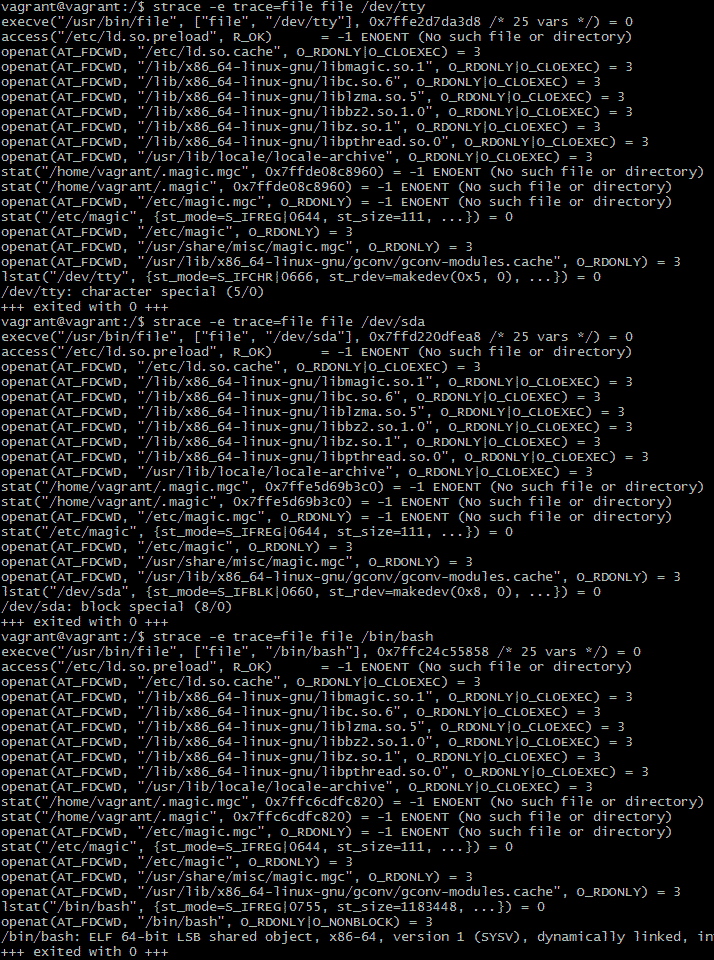
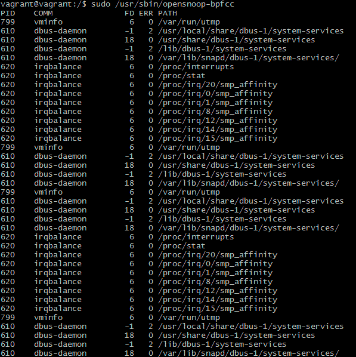

# Домашнее задание «3.3. Операционные системы (лекция 1)»

**1 - задание.**
Какой системный вызов делает команда `cd`? В прошлом ДЗ мы выяснили, что `cd` не является самостоятельной  программой, это `shell builtin`, поэтому запустить `strace` непосредственно на `cd` не получится. Тем не менее, вы можете запустить `strace` на `/bin/bash -c 'cd /tmp'`. В этом случае вы увидите полный список системных вызовов, которые делает сам `bash` при старте. Вам нужно найти тот единственный, который относится именно к `cd`.

**Ответ**    
```bash
strace /bin/bash -c 'cd /tmp'
...
stat("/tmp", {st_mode=S_IFDIR|S_ISVTX|0777, st_size=4096, ...}) = 0
chdir("/tmp") 
...
```

---

**2 - задание.**
Попробуйте использовать команду `file` на объекты разных типов на файловой системе. Например:
    ```bash
    vagrant@netology1:~$ file /dev/tty
    /dev/tty: character special (5/0)
    vagrant@netology1:~$ file /dev/sda
    /dev/sda: block special (8/0)
    vagrant@netology1:~$ file /bin/bash
    /bin/bash: ELF 64-bit LSB shared object, x86-64
    ```
    Используя `strace` выясните, где находится база данных `file` на основании которой она делает свои догадки.

**Ответ**    


/usr/share/misc/magic.mgc

---
  
**3 - задание.**
Предположим, приложение пишет лог в текстовый файл. Этот файл оказался удален (deleted в lsof), однако возможности сигналом сказать приложению переоткрыть файлы или просто перезапустить приложение – нет. Так как приложение продолжает писать в удаленный файл, место на диске постепенно заканчивается. Основываясь на знаниях о перенаправлении потоков предложите способ обнуления открытого удаленного файла (чтобы освободить место на файловой системе).

**Ответ**    
```bash
:~$  ps aux | grep 'имя_процесса'                        # найдем PID процесса нашего приложения
:~$ sudo lsof -p 'PID' | grep deleted                    # найдем файловый дескриптор удаленного файла
:~$ cat /dev/null > /proc/'PID'/fd/'файловый_дескриптор' # очищаем содержимое файла
```

---

**4 - задание.**    
Занимают ли зомби-процессы какие-то ресурсы в ОС (CPU, RAM, IO)?

**Ответ**    
Зомби-процессы не занимают памяти и не нагружают процессор (как процессы-сироты), но расходуют записи PID в таблице процессов процессов и небесконечные дескрипторы процессов.

---

**5 - задание.**
В iovisor BCC есть утилита `opensnoop`:
    ```bash
    root@vagrant:~# dpkg -L bpfcc-tools | grep sbin/opensnoop
    /usr/sbin/opensnoop-bpfcc
    ```
    На какие файлы вы увидели вызовы группы `open` за первую секунду работы утилиты? Воспользуйтесь пакетом `bpfcc-tools` для Ubuntu 20.04. Дополнительные [сведения по установке](https://github.com/iovisor/bcc/blob/master/INSTALL.md).

**Ответ**    


---

**6 - задание.**
Какой системный вызов использует `uname -a`? Приведите цитату из man по этому системному вызову, где описывается альтернативное местоположение в `/proc`, где можно узнать версию ядра и релиз ОС.

**Ответ**    
```bash
vagrant@vagrant:~$ strace -e trace=file uname -a
execve("/usr/bin/uname", ["uname", "-a"], 0x7ffe96366098 /* 24 vars */) = 0
access("/etc/ld.so.preload", R_OK)      = -1 ENOENT (No such file or directory)
openat(AT_FDCWD, "/etc/ld.so.cache", O_RDONLY|O_CLOEXEC) = 3                 # кэш динамического линковщика
openat(AT_FDCWD, "/lib/x86_64-linux-gnu/libc.so.6", O_RDONLY|O_CLOEXEC) = 3  # библиотека стандартных функций
openat(AT_FDCWD, "/usr/lib/locale/locale-archive", O_RDONLY|O_CLOEXEC) = 3   # функции локали
Linux vagrant 5.4.0-58-generic #64-Ubuntu SMP Wed Dec 9 08:16:25 UTC 2020 x86_64 x86_64 x86_64 GNU/Linux
+++ exited with 0 +++
```

Не совсем понятно какой именно вызов имелся в виду в вопросе. Возможно имелся в виду вызов write:
```bash
vagrant@vagrant:~$ strace -e trace=stat uname -a
Linux vagrant 5.4.0-58-generic #64-Ubuntu SMP Wed Dec 9 08:16:25 UTC 2020 x86_64 x86_64 x86_64 GNU/Linux
+++ exited with 0 +++
```
т.к. это единственный системный вызов.

`man 2 uname`    
`/proc`:
```text
NOTES 

       This is a system call, and the operating system presumably knows
       its name, release and version.  It also knows what hardware it
       runs on.  So, four of the fields of the struct are meaningful.
       On the other hand, the field nodename is meaningless: it gives
       the name of the present machine in some undefined network, but
       typically machines are in more than one network and have several
       names.  Moreover, the kernel has no way of knowing about such
       things, so it has to be told what to answer here.  The same holds
       for the additional domainname field.
       ...
       Part of the utsname information is also accessible via
       /proc/sys/kernel/{ostype, hostname, osrelease, version,
       domainname}.
```

---

**7 - задание.**
Чем отличается последовательность команд через `;` и через `&&` в bash? Например:
    ```bash
    root@netology1:~# test -d /tmp/some_dir; echo Hi
    Hi
    root@netology1:~# test -d /tmp/some_dir && echo Hi
    root@netology1:~#
    ```
    Есть ли смысл использовать в bash `&&`, если применить `set -e`?

**Ответ**    
`;` - позволяет последовательно выполнить команды, независимо от результата их выполнения.    
`&&` - при использовании каждая следующая команда выполняется только при успешном выполнении предыдущей (exit code 0), `||` - наоборот, выполнится при exit code > 0.    
`set -e` - приведет к немедленному завершению работы сценария bash при сбое команды. При этом использование `&&` все-равно не утратит свою актуальность т.к. оно не вызывает завершение сценария в целом при возврате ошибки одной из комманд.

К примеру:
```bash
:~$  set -e ; test ; echo "Hello"
```
сразу завершит сессию bash в терминале, но `test && echo "Hello"` - всего лишь вернет ошибку.

---

**8 - задание.**
Из каких опций состоит режим bash `set -euxo pipefail` и почему его хорошо было бы использовать в сценариях?

**Ответ**    
Режим bash `set -euxo pipefail` состоит из следующих опций:    

`-e` - немедленное завершению работы сценария при первом возврате ошибки одной из команд.    
`-o pipefail` - добавляет опцию приводящую к изменения поведения `set -e`. В этом варианте интерпретатор смотрит на результат выполнения последней команды в цепочке.   
`-u` - оболочка bash обрабатывает неустановленные переменные как ошибку и немедленно завершает работу. Неустановленные переменные являются распространенной причиной ошибок в скриптах оболочки, поэтому наличие неустановленных переменных, вызывающих немедленный выход, часто является весьма желательным поведением.    
`-x` - выводит каждую команду, с подставленными значениями переменных, перед ее выполнением. Что удобно для отладки.

В целом эти режимы позволяют приблизиться к тому, что бы наши скрипты вели себя как языки более высокого уровня.

---

**9 - задание.**
Используя `-o stat` для `ps`, определите, какой наиболее часто встречающийся статус у процессов в системе. В `man ps` ознакомьтесь (`/PROCESS STATE CODES`) что значат дополнительные к основной заглавной буквы статуса процессов. Его можно не учитывать при расчете (считать S, Ss или Ssl равнозначными).

**Ответ**    
```bash
vagrant@vagrant:~$ ps -eo stat                   # больше всего со статусом I и S
vagrant@vagrant:~$ ps -eo stat | grep S | wc -c
139
vagrant@vagrant:~$ ps -eo stat | grep I | wc -c
136
```
Больше процессов со статусом "S".

`man ps`    
`/PROCESS STATE CODES`:
```text
PROCESS STATE CODES
       Here are the different values that the s, stat and state output specifiers (header "STAT" or "S") will display to describe the state of a process:

               D    uninterruptible sleep (usually IO)
               I    Idle kernel thread
               R    running or runnable (on run queue)
               S    interruptible sleep (waiting for an event to complete)
               T    stopped by job control signal
               t    stopped by debugger during the tracing
               W    paging (not valid since the 2.6.xx kernel)
               X    dead (should never be seen)
               Z    defunct ("zombie") process, terminated but not reaped by its parent

       For BSD formats and when the stat keyword is used, additional characters may be displayed:

               <    high-priority (not nice to other users)
               N    low-priority (nice to other users)
               L    has pages locked into memory (for real-time and custom IO)
               s    is a session leader
               l    is multi-threaded (using CLONE_THREAD, like NPTL pthreads do)
               +    is in the foreground process group
```

---


**ОТЗЫВ ПРЕПОДАВАТЕЛЯ**

Сергей Буйлов    
14 февраля 2021 00:28

*Здравствуйте. Ответ на вопрос 6 не совсем точный. Используется системный вызов uname (для получения информации о ядре) , а для вывода write, в этом Вы правы. Цитата из мана ниже корректная, видимо было небольшое непонимание вопроса. Задание принято.*


