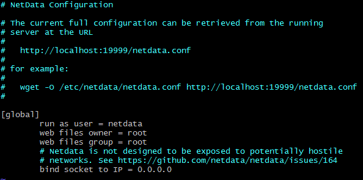
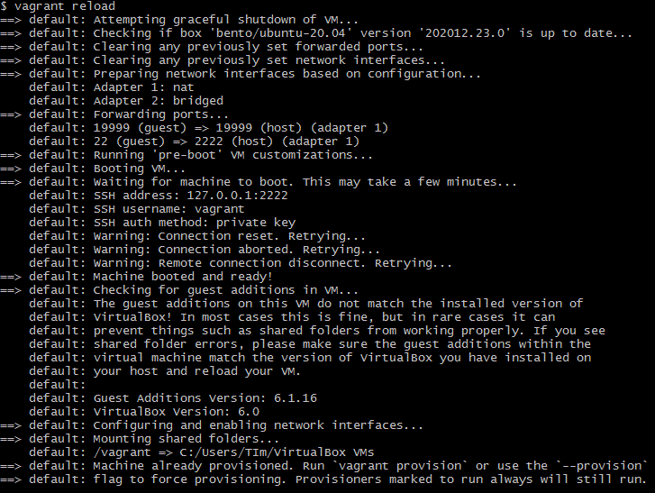
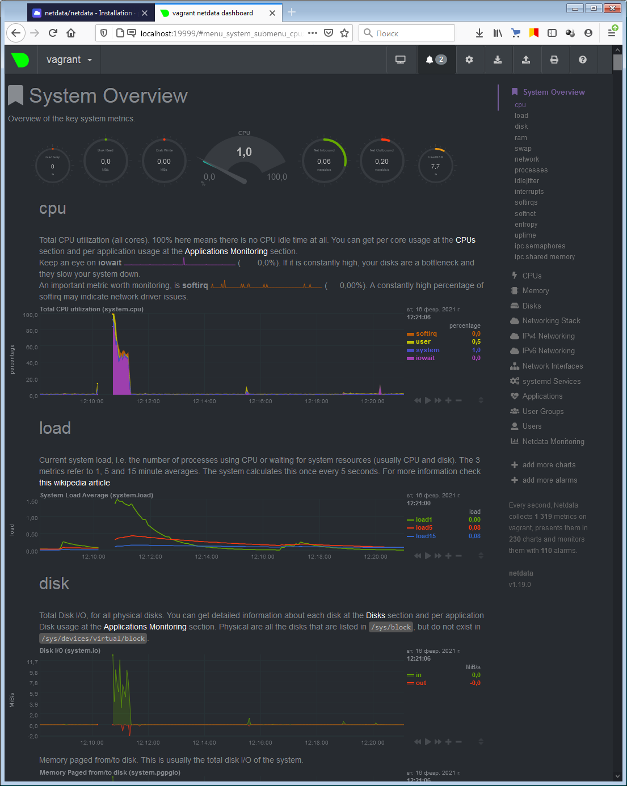

# Домашнее задание «3.4. Операционные системы (лекция 2)»

**1 - задание.**
На лекции мы познакомились с [node_exporter](https://github.com/prometheus/node_exporter/releases). В демонстрации его исполняемый файл запускался в background. Этого достаточно для демо, но не для настоящей production-системы, где процессы должны находиться под внешним управлением. Используя знания из лекции по systemd, создайте самостоятельно простой [unit-файл](https://www.freedesktop.org/software/systemd/man/systemd.service.html) для node_exporter:

    * поместите его в автозагрузку,
    * предусмотрите возможность добавления опций к запускаемому процессу через внешний файл (посмотрите, например, на `systemctl cat cron`),
    * удостоверьтесь, что с помощью systemctl процесс корректно стартует, завершается, а после перезагрузки автоматически поднимается.


**Ответ**    
Установка node_exporter:
```bash
:~$ wget https://github.com/prometheus/node_exporter/releases/download/v1.1.1/node_exporter-1.1.1.linux-amd64.tar.gz
:~$ tar zxvf node_exporter-1.1.1.linux-amd64.tar.gz
:~$ sudo cp node_exporter-1.1.1.linux-amd64/node_exporter /usr/local/bin/
```
Пример файла systemd - cron.service:
```bash
:~$ systemctl cat cron
# /lib/systemd/system/cron.service
[Unit]
Description=Regular background program processing daemon
Documentation=man:cron(8)
After=remote-fs.target nss-user-lookup.target

[Service]
EnvironmentFile=-/etc/default/cron
ExecStart=/usr/sbin/cron -f $EXTRA_OPTS
IgnoreSIGPIPE=false
KillMode=process
Restart=on-failure

[Install]
WantedBy=multi-user.target
```
Создаем unit-файл для node_exporter:
```bash
:~$ sudo vim /etc/systemd/system/node_exporter.service

[Unit]
Description=Node Exporter Service
After=network.target

[Service]
EnvironmentFile=-/etc/default/node_exporter
ExecStart=/usr/local/bin/node_exporter
ExecReload=/bin/kill -HUP $MAINPID
KillMode=process
Type=simple
Restart=on-failure

[Install]
WantedBy=multi-user.target
```
 Добавляем node_exporter в автозапуск:
```bash
:~$ sudo systemctl daemon-reload        # перечитываем конфигурацию systemctl
:~$ sudo systemctl enable node_exporter
:~$ sudo systemctl start node_exporter
```
Проверки:
```bash
:~$ ps -ax | grep node_exporter
   2095 ?        Ssl    0:00 /usr/local/bin/node_exporter 
   2115 pts/0    S+     0:00 grep --color=auto node_exporter

:~$ sudo systemctl stop node_exporter
:~$ ps -ax | grep node_exporter
   2136 pts/0    S+     0:00 grep --color=auto node_exporter

:~$ sudo reboot
...
:~$ systemctl status node_exporter
● node_exporter.service - Node Exporter Service
     Loaded: loaded (/etc/systemd/system/node_exporter.service; enabled; vendor preset: enabled)
     Active: active (running) since Fri 2021-02-12 01:05:34 UTC; 3 days ago
   Main PID: 626 (node_exporter)
      Tasks: 4 (limit: 2281)
     Memory: 14.2M
     CGroup: /system.slice/node_exporter.service
             └─626 /usr/local/bin/node_exporter

Feb 12 01:05:36 vagrant node_exporter[626]: level=info ts=2021-02-12T01:05:36.225Z caller=node_exporter.go:113 collector=thermal_zone
Feb 12 01:05:36 vagrant node_exporter[626]: level=info ts=2021-02-12T01:05:36.225Z caller=node_exporter.go:113 collector=time
Feb 12 01:05:36 vagrant node_exporter[626]: level=info ts=2021-02-12T01:05:36.225Z caller=node_exporter.go:113 collector=timex
Feb 12 01:05:36 vagrant node_exporter[626]: level=info ts=2021-02-12T01:05:36.225Z caller=node_exporter.go:113 collector=udp_queues
Feb 12 01:05:36 vagrant node_exporter[626]: level=info ts=2021-02-12T01:05:36.225Z caller=node_exporter.go:113 collector=uname
Feb 12 01:05:36 vagrant node_exporter[626]: level=info ts=2021-02-12T01:05:36.225Z caller=node_exporter.go:113 collector=vmstat
Feb 12 01:05:36 vagrant node_exporter[626]: level=info ts=2021-02-12T01:05:36.225Z caller=node_exporter.go:113 collector=xfs
Feb 12 01:05:36 vagrant node_exporter[626]: level=info ts=2021-02-12T01:05:36.225Z caller=node_exporter.go:113 collector=zfs
Feb 12 01:05:36 vagrant node_exporter[626]: level=info ts=2021-02-12T01:05:36.226Z caller=node_exporter.go:195 msg="Listening on" address=:9100
Feb 12 01:05:36 vagrant node_exporter[626]: level=info ts=2021-02-12T01:05:36.228Z caller=tls_config.go:191 msg="TLS is disabled." http2=false
```

---

**2 - задание.**
Ознакомьтесь с опциями node_exporter и выводом `/metrics` по-умолчанию. Приведите несколько опций, которые вы бы выбрали для базового мониторинга хоста по CPU, памяти, диску и сети.

**Ответ**    
http://vagranthost:9100/metrics

по CPU:
```text
# HELP node_load1 1m load average.
node_load1 0
# HELP node_load5 5m load average.
node_load5 0
# HELP node_load15 15m load average.
node_load15 0
# HELP node_cpu_seconds_total Seconds the CPUs spent in each mode.
node_cpu_seconds_total{cpu="1",mode="system"} 3.4
node_cpu_seconds_total{cpu="1",mode="user"} 2.1
```

по памяти:
```text
# HELP node_memory_MemAvailable_bytes Memory information field MemAvailable_bytes.
node_memory_MemAvailable_bytes 1.81080064e+09
# HELP node_memory_MemFree_bytes Memory information field MemFree_bytes.
node_memory_MemFree_bytes 1.531830272e+09
```

по диску:
```text
# HELP node_disk_discards_merged_total The total number of discards merged.
node_disk_discards_merged_total{device="sda"} 0
# HELP node_disk_io_now The number of I/Os currently in progress.
node_disk_io_now{device="sda"} 0
```

по сети:
```text
# HELP node_network_speed_bytes speed_bytes value of /sys/class/net/<iface>.
node_network_speed_bytes{device="eth0"} 1.25e+08
# HELP node_network_transmit_errs_total Network device statistic transmit_errs.
node_network_transmit_errs_total{device="eth0"} 
# HELP node_network_receive_errs_total Network device statistic receive_errs.
node_network_receive_errs_total{device="eth0"} 0
```

---
  
**3 - задание.**
 Установите в свою виртуальную машину [Netdata](https://github.com/netdata/netdata). Воспользуйтесь [готовыми пакетами](https://packagecloud.io/netdata/netdata/install) для установки (`sudo apt install -y netdata`). После успешной установки:
    * в конфигурационном файле `/etc/netdata/netdata.conf` в секции [web] замените значение с localhost на `bind to = 0.0.0.0`,
    * добавьте в Vagrantfile проброс порта Netdata на свой локальный компьютер и сделайте `vagrant reload`:

    ```bash
    config.vm.network "forwarded_port", guest: 19999, host: 19999
    ```

    После успешной перезагрузки в браузере *на своем ПК* (не в виртуальной машине) вы должны суметь зайти на `localhost:19999`. Ознакомьтесь с метриками, которые по умолчанию собираются Netdata и с комментариями, которые даны к этим метрикам.


**Ответ**    
/etc/netdata/netdata.conf    






---

**4 - задание.**    
Можно ли по выводу `dmesg` понять, осознает ли ОС, что загружена не на настоящем оборудовании, а на системе виртуализации?

**Ответ**    


Да, система обнаруживает гипервизор.

---

**5 - задание.**
Как настроен sysctl `fs.nr_open` на системе по-умолчанию? Узнайте, что означает этот параметр. Какой другой существующий лимит не позволит достичь такого числа (`ulimit --help`)?


**Ответ**    
```bash
:~$ sysctl fs.nr_open
fs.nr_open = 1048576 # Лимит открытых файлов в системе
```

```bash
:~$ ulimit -a
core file size          (blocks, -c) 0
data seg size           (kbytes, -d) unlimited
scheduling priority             (-e) 0
file size               (blocks, -f) unlimited
pending signals                 (-i) 7605
max locked memory       (kbytes, -l) 65536
max memory size         (kbytes, -m) unlimited
open files                      (-n) 1024      # Лимит открытых файлов одним процессом
pipe size            (512 bytes, -p) 8
POSIX message queues     (bytes, -q) 819200
real-time priority              (-r) 0
stack size              (kbytes, -s) 8192
cpu time               (seconds, -t) unlimited
max user processes              (-u) 7605
virtual memory          (kbytes, -v) unlimited
file locks                      (-x) unlimited

:~$ ulimit -aH
core file size          (blocks, -c) unlimited
data seg size           (kbytes, -d) unlimited
scheduling priority             (-e) 0
file size               (blocks, -f) unlimited
pending signals                 (-i) 7605
max locked memory       (kbytes, -l) 65536
max memory size         (kbytes, -m) unlimited
open files                      (-n) 1048576   # Лимит открытых файлов в системе
pipe size            (512 bytes, -p) 8
POSIX message queues     (bytes, -q) 819200
real-time priority              (-r) 0
stack size              (kbytes, -s) unlimited
cpu time               (seconds, -t) unlimited
max user processes              (-u) 7605
virtual memory          (kbytes, -v) unlimited
file locks                      (-x) unlimited
```
Ограничить колличество открытых фалов может лимит открытых фылов одним процессом (по умолчанию 1024).    
Так же максимальное значение fs.nr_open ограничено в ядре (sysctl_nr_open_max), и составляет 2147483584 на x86_64.
```bash
:~$ sudo sysctl -w fs.nr_open=2147483585
sysctl: setting key "fs.nr_open": Invalid argument
:~$ sudo sysctl -w fs.nr_open=2147483584
fs.nr_open = 2147483584
```

---

**6 - задание.**
Запустите любой долгоживущий процесс (не `ls`, который отработает мгновенно, а, например, `sleep 1h`) в отдельном неймспейсе процессов; покажите, что ваш процесс работает под PID 1 через `nsenter`. Для простоты работайте в данном задании под root (`sudo -i`). Под обычным пользователем требуются дополнительные опции (`--map-root-user`) и т.д.

**Ответ**    
```bash
vagrant@vagrant:~$ sudo screen
root@vagrant:/home/vagrant# unshare -f --pid --mount-proc sleep 1h
^AD

vagrant@vagrant:~$ pstree -p
           |--screen(2289)---bash(2290)---unshare(2299)---sleep(2300)

vagrant@vagrant:~$ sudo nsenter --target 2300 --pid --mount
root@vagrant:/# ps aux
USER         PID %CPU %MEM    VSZ   RSS TTY      STAT START   TIME COMMAND
root           1  0.0  0.0   8076   528 pts/2    S+   12:45   0:00 sleep 1h
root           2  0.0  0.1   9836  3920 pts/0    S    12:46   0:00 -bash
root          11  0.0  0.1  11492  3256 pts/0    R+   12:46   0:00 ps aux

```

---

**7 - задание.**
Найдите информацию о том, что такое `:(){ :|:& };:`. Запустите эту команду в своей виртуальной машине Vagrant с Ubuntu 20.04 (**это важно, поведение в других ОС не проверялось**). Некоторое время все будет "плохо", после чего (минуты) – ОС должна стабилизироваться. Вызов `dmesg` расскажет, какой механизм помог автоматической стабилизации. Как настроен этот механизм по-умолчанию, и как изменить число процессов, которое можно создать в сессии?

**Ответ**    
`(){ :|:& };:` - Логическая бомба (известная также как fork bomb), забивающая память системы, что в итоге приводит к её зависанию. Код создаёт функцию, которая запускает ещё два своих экземпляра, которые, в свою очередь снова запускают эту функцию и так до тех пор, пока этот процесс не займёт всю физическую память компьютера.

Сработало ограничение на число создаваемых процессов пользователем.


По умолчанию число создаваемых процессов пользователем:
```bash
vagrant@vagrant:~$ ulimit -u
7605
```
Для изменения максимального числа процессов создаваемых в сесии можно использовать комманду ` ulimit -Su`:
```bash
vagrant@vagrant:~$ ulimit -Su 2000
vagrant@vagrant:~$ ulimit -u
2000
```
 
Либо внести исправления в файл `/etc/security/limits.conf`, например:
```text
# /etc/security/limits.conf
#
#Each line describes a limit for a user in the form:
#
#<domain>        <type>  <item>  <value>

*                soft    nproc           1024
@student         hard    nproc           20
#*               soft    core            0
#root            hard    core            100000
#*               hard    rss             10000
#@faculty        soft    nproc           20
#@faculty        hard    nproc           50
#ftp             hard    nproc           0
#ftp             -       chroot          /ftp
#@student        -       maxlogins       4
```

---

**ОТЗЫВ ПРЕПОДАВАТЕЛЯ**

Петр Шило    
24 февраля 2021 20:58

*Здравствуйте, Тимофей.*
*Спасибо за выполненное задание. Все сделано отлично. Успехов в учебе!*


