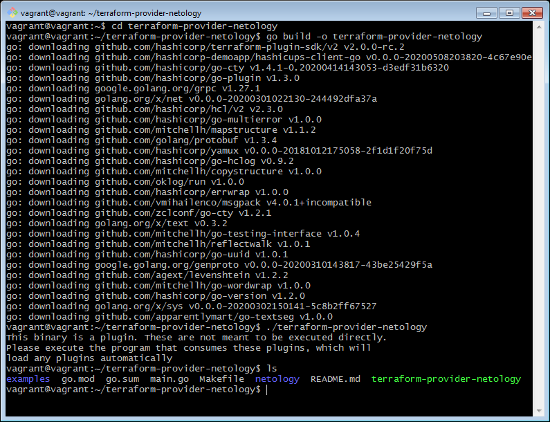

# Домашнее задание «7.6. Написание собственных провайдеров для Terraform.»

Бывает, что 
* общедоступная документация по терраформ ресурсам не всегда достоверна,
* в документации не хватает каких-нибудь правил валидации или неточно описаны параметры,
* понадобиться использовать провайдер без официальной документации,
* может возникнуть необходимость написать свой провайдер для системы используемой в ваших проектах.   

## Задача 1. 
Давайте потренируемся читать исходный код AWS провайдера, который можно склонировать от сюда: 
[https://github.com/hashicorp/terraform-provider-aws.git](https://github.com/hashicorp/terraform-provider-aws.git).
Просто найдите нужные ресурсы в исходном коде и ответы на вопросы станут понятны.

1. Найдите, где перечислены все доступные `resource` и `data_source`, приложите ссылку на эти строки в коде на 
гитхабе.   
>**Ответ:**    
>https://github.com/hashicorp/terraform-provider-aws/blob/main/aws/provider.go#L447    
>https://github.com/hashicorp/terraform-provider-aws/blob/main/aws/provider.go#L186

1. Для создания очереди сообщений SQS используется ресурс `aws_sqs_queue` у которого есть параметр `name`. 
    * С каким другим параметром конфликтует `name`? Приложите строчку кода, в которой это указано.
     >**Ответ:**   
     `"name_prefix"`    
     https://github.com/hashicorp/terraform-provider-aws/blob/main/aws/resource_aws_sqs_queue.go#L99

    * Какая максимальная длина имени? 
    >**Ответ:**   
    >Вообще, как я понял, `name` в сервисе SQS не проверяется, и приходит уже готовым из API-запросов. Но в функции `resourceAwsSqsQueueCustomizeDiff` есть проверка генерируемого имени:    
    >https://github.com/hashicorp/terraform-provider-aws/blob/main/aws/resource_aws_sqs_queue.go#L407   
    >и в ней есть проверка длины до 80 знаков.

    * Какому регулярному выражению должно подчиняться имя? 
    >**Ответ:**   
    >Там же есть проверка на подчинение выражению `^[a-zA-Z0-9_-]$` либо `^[a-zA-Z0-9_-]{1,75}\.fifo$` в зависимости от состояния fifoQueue.
    

---

## Задача 2. (Не обязательно) 
В рамках вебинара и презентации мы разобрали как создать свой собственный провайдер на примере кофемашины. 
Также вот официальная документация о создании провайдера: 
[https://learn.hashicorp.com/collections/terraform/providers](https://learn.hashicorp.com/collections/terraform/providers).

1. Проделайте все шаги создания провайдера.
>**Ответ:**   
>Шаги проделал, но почти ничего не менял в примере hashicups. Только переименовал проект и несколько параметров.

2. В виде результата приложение ссылку на исходный код.
>**Ответ:**   https://github.com/Dok-dev/terraform-provider-netology

3. Попробуйте скомпилировать провайдер, если получится то приложите снимок экрана с командой и результатом компиляции.
>**Ответ:**   
>

---

Андрей Борю (преподаватель)
14 июня 2021 15:22

Здравствуйте, Тимофей!

Хорошая работа, здорово что разобрались в структуре провайдера.

Хорошего продолжения курса!
