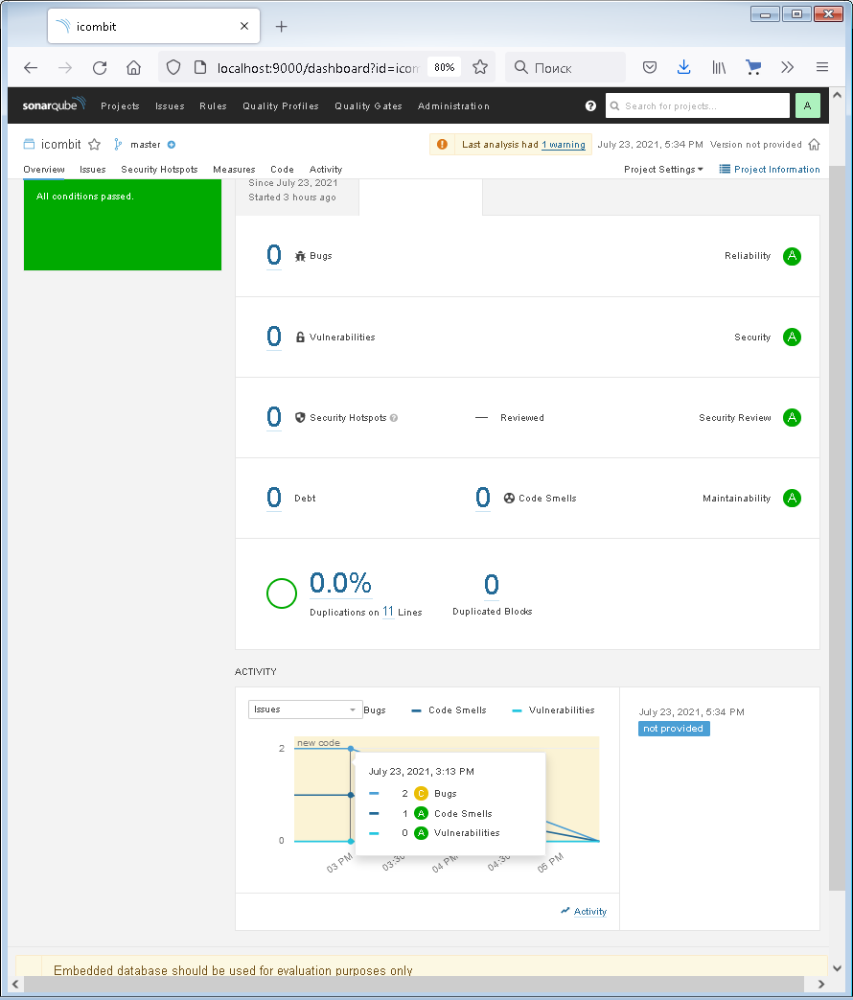
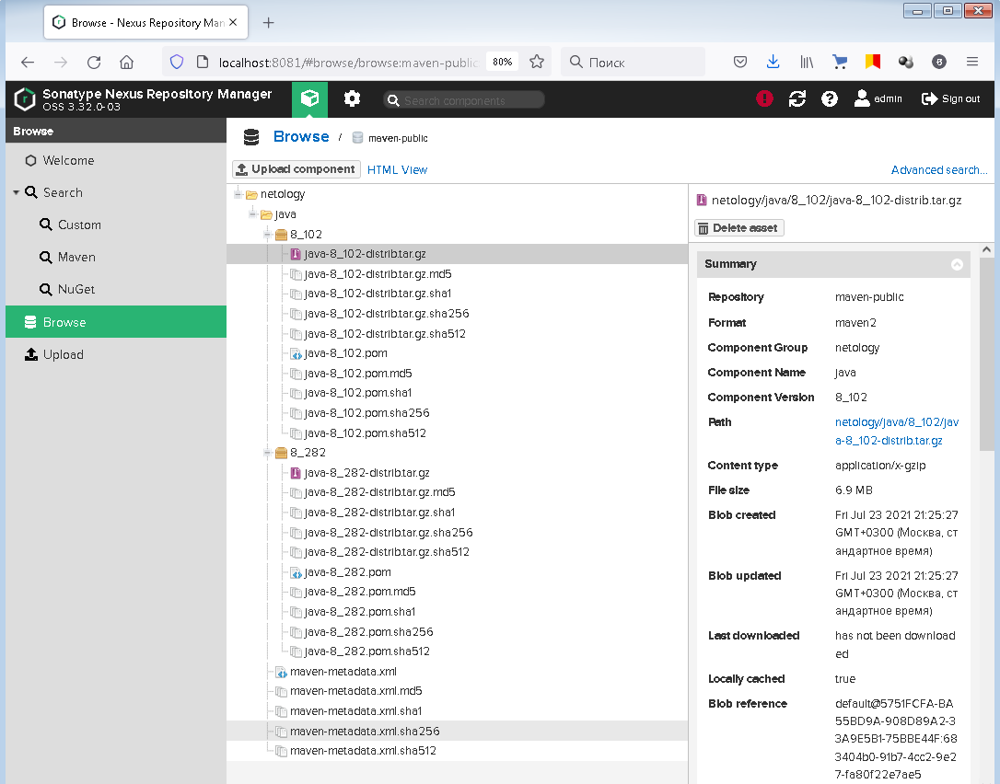

# Домашнее задание «9.2 CI\CD»

## Знакомоство с SonarQube

### Подготовка к выполнению

1. Выполняем `docker pull sonarqube:8.7-community`
2. Выполняем `docker run -d --name sonarqube -e SONAR_ES_BOOTSTRAP_CHECKS_DISABLE=true -p 9000:9000  --memory 2g sonarqube:8.7-community`
3. Ждём запуск, смотрим логи через `docker logs -f sonarqube`
4. Проверяем готовность сервиса через [браузер](http://localhost:9000)
5. Заходим под admin\admin, меняем пароль на свой

В целом, в [этой статье](https://docs.sonarqube.org/latest/setup/install-server/) описаны все варианты установки, включая и docker, но так как нам он нужен разово, то достаточно того набора действий, который я указал выше.

### Основная часть

1. Создаём новый проект, название произвольное
2. Скачиваем пакет sonar-scanner, который нам предлагает скачать сам sonarqube
3. Делаем так, чтобы binary был доступен через вызов в shell (или меняем переменную PATH или любой другой удобный вам способ)
> **Выполнение:**    
```
vagrant@vagrant:~$ wget https://binaries.sonarsource.com/Distribution/sonar-scanner-cli/sonar-scanner-cli-4.6.2.2472-linux.zip
vagrant@vagrant:~$ unzip sonar-scanner-cli-4.6.2.2472-linux.zip && sudo mv sonar-scanner-4.6.2.2472-linux /var/lib
vagrant@vagrant:~$ export PATH=$PATH:/var/lib/sonar-scanner-4.6.2.2472-linux/bin
```

4. Проверяем `sonar-scanner --version`
```
vagrant@vagrant:~$ sonar-scanner --version
INFO: Scanner configuration file: /var/lib/sonar-scanner-4.6.2.2472-linux/conf/sonar-scanner.properties
INFO: Project root configuration file: NONE
INFO: SonarScanner 4.6.2.2472
INFO: Java 11.0.11 AdoptOpenJDK (64-bit)
INFO: Linux 5.8.0-49-generic amd64
```

5. Запускаем анализатор против кода из директории [example](./example) с дополнительным ключом `-Dsonar.coverage.exclusions=fail.py`
> **Выполнение:** 
```
# Возможно нужно было назвать директорию /example,но поздно это заметил. Поэтому у меня называется - testcode.
vagrant@vagrant:~$ cd testcode
vagrant@vagrant:~/testcode$ sonar-scanner \
   -Dsonar.projectKey=icombit \
   -Dsonar.sources=. \
   -Dsonar.host.url=http://localhost:9000 \
   -Dsonar.coverage.exclusions=fail.py \
   -Dsonar.login=5c8398a2695ad94db879a9127d6576c99f38a39e
```

6. Смотрим результат в интерфейсе
7. Исправляем ошибки, которые он выявил(включая warnings)
8. Запускаем анализатор повторно - проверяем, что QG пройдены успешно
9. Делаем скриншот успешного прохождения анализа, прикладываем к решению ДЗ
> **Ответ:**    
>
>    
>

---

## Знакомство с Nexus

### Подготовка к выполнению

1. Выполняем `docker pull sonatype/nexus3`
2. Выполняем `docker run -d -p 8081:8081 --memory 2g --name nexus sonatype/nexus3`
3. Ждём запуск, смотрим логи через `docker logs -f nexus`
4. Проверяем готовность сервиса через [бразуер](http://localhost:8081)
5. Узнаём пароль от admin через `docker exec -it nexus /bin/bash`
6. Подключаемся под админом, меняем пароль, сохраняем анонимный доступ

### Основная часть

1. В репозиторий `maven-public` загружаем артефакт с GAV параметрами:
   1. groupId: netology
   2. artifactId: java
   3. version: 8_282
   4. classifier: distrib
   5. type: tar.gz
2. В него же загружаем такой же артефакт, но с version: 8_102
3. Проверяем, что все файлы загрузились успешно
4. В ответе присылаем файл `maven-metadata.xml` для этого артефекта

> **Ответ:**    
>
> [maven-metadata.xml](maven-metadata.xml)
>
>   

---

### Знакомство с Maven

### Подготовка к выполнению

1. Скачиваем дистрибутив с [maven](https://maven.apache.org/download.cgi)
2. Разархивируем, делаем так, чтобы binary был доступен через вызов в shell (или меняем переменную PATH или любой другой удобный вам способ)
3. Проверяем `mvn --version`
4. Забираем директорию [mvn](./mvn) с pom

### Основная часть

1. Меняем в `pom.xml` блок с зависимостями под наш артефакт из первого пункта задания для Nexus (java с версией 8_282)
2. Запускаем команду `mvn package` в директории с `pom.xml`, ожидаем успешного окончания
3. Проверяем директорию `~/.m2/repository/`, находим наш артефакт
4. В ответе присылаем исправленный файл `pom.xml`

> **Ответ:**    
>
> [pom.xml](pom.xml)    
>
>  
