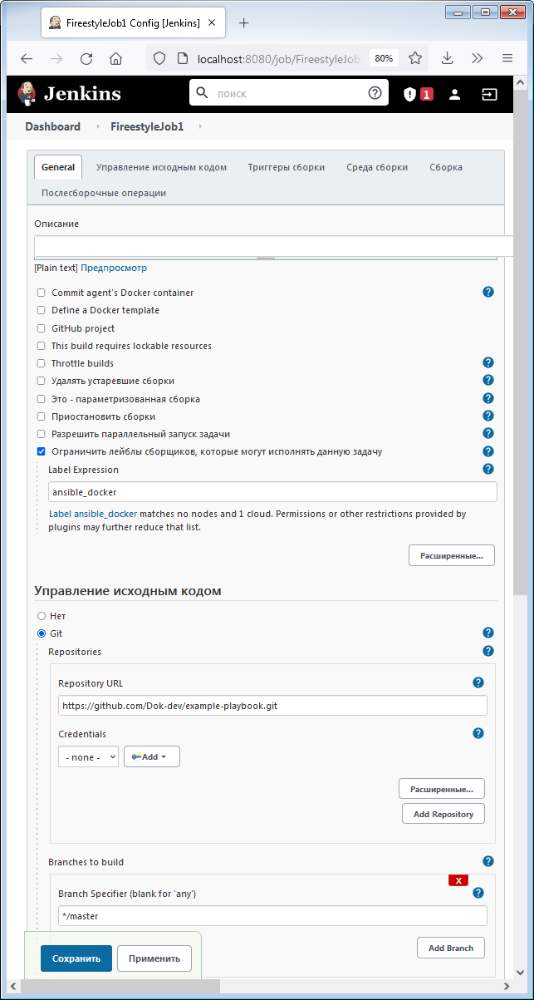
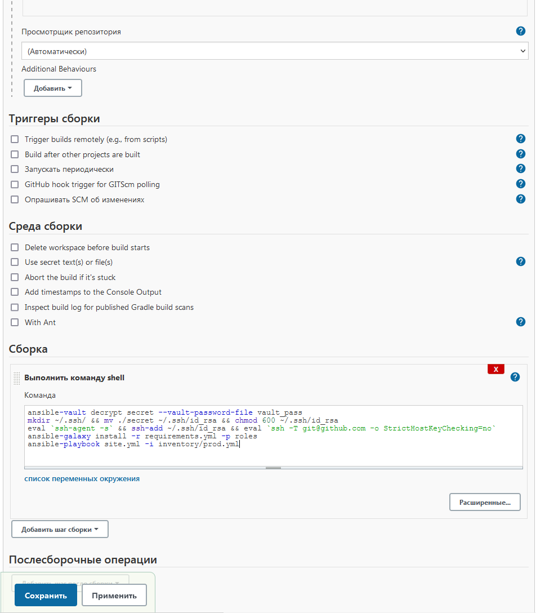
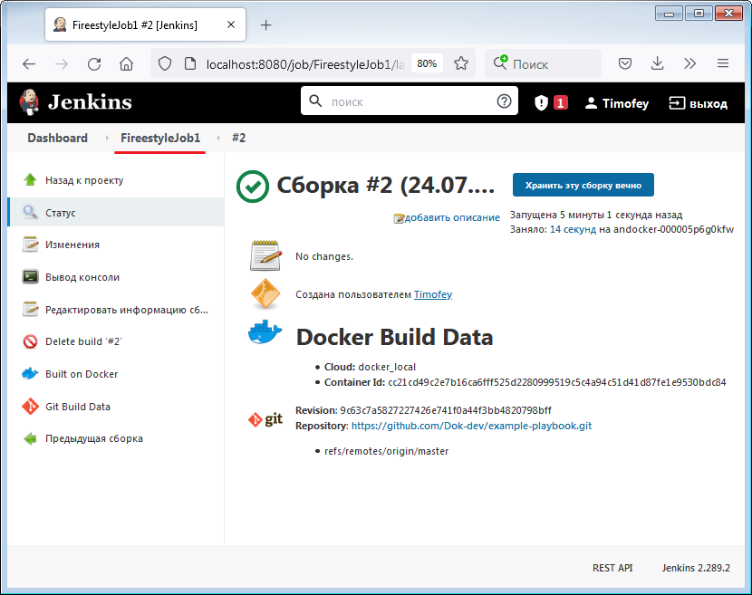
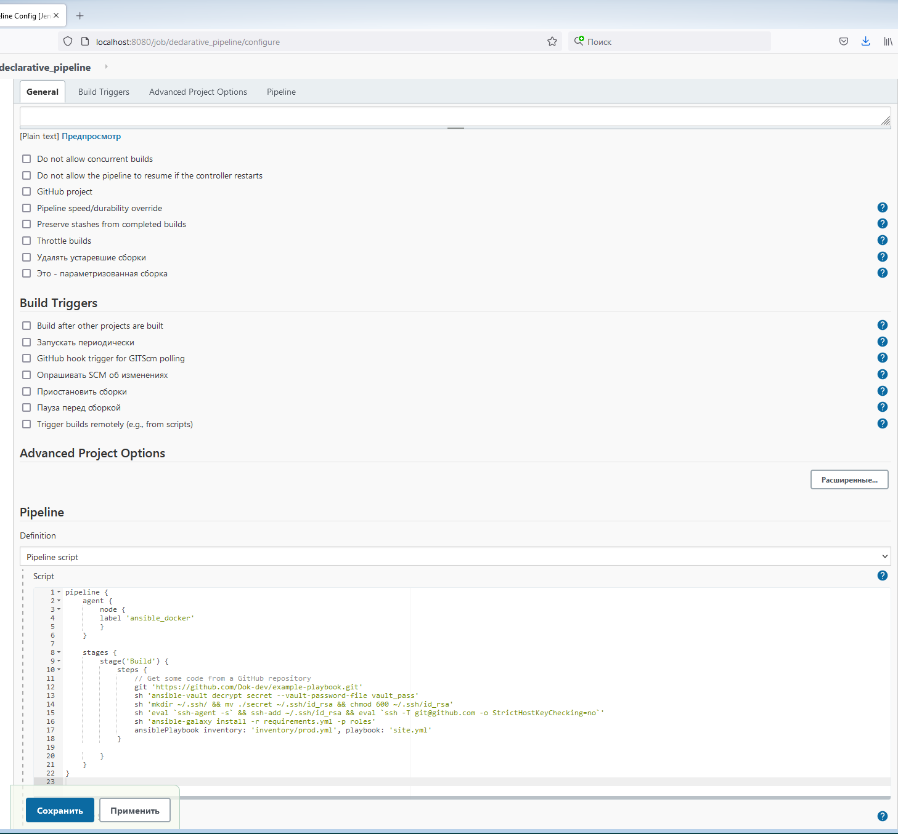
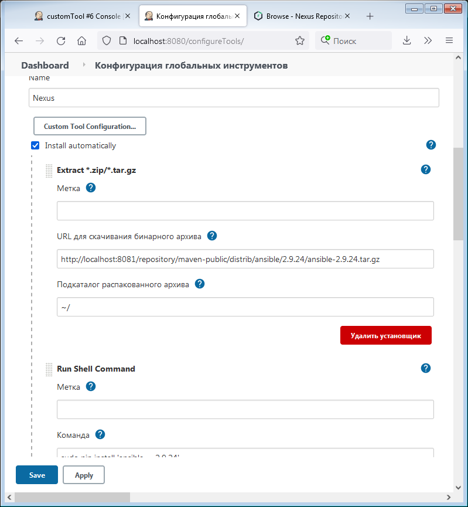

# Домашнее задание «9.3 JenkinsD»

## Подготовка к выполнению

1. Установить jenkins по любой из [инструкций](https://www.jenkins.io/download/)

> **Выполнение:**   
``` 
vagrant@vagrant:~$ wget -q -O - https://pkg.jenkins.io/debian-stable/jenkins.io.key | sudo apt-key add -
vagrant@vagrant:~$ sudo apt-add-repository  deb https://pkg.jenkins.io/debian-stable binary/
vagrant@vagrant:~$ apt update
vagrant@vagrant:~$ sudo apt install jenkins
``` 
2. Запустить и проверить работоспособность
3. Сделать первоначальную настройку
4. Настроить под свои нужды
5. Поднять отдельный cloud
6. Для динамических агентов можно использовать [образ](https://hub.docker.com/repository/docker/aragast/agent)    

> **Выполнение:**   
``` 
vagrant@vagrant:~$ sudo docker pull aragast/agent:7
vagrant@vagrant:~$ sudo usermod -aG docker jenkins
``` 
7. Обязательный параметр: поставить label для динамических агентов: `ansible_docker`
8.  Сделать форк репозитория с [playbook](https://github.com/aragastmatb/example-playbook)

## Основная часть

1. Сделать Freestyle Job, который будет запускать `ansible-playbook` из форка репозитория

> **Выполнение:**    
>     
>     
>     
  
2. Сделать Declarative Pipeline, который будет выкачивать репозиторий с плейбукой и запускать её

> **Выполнение:**    
>    

3. Перенести Declarative Pipeline в репозиторий в файл `Jenkinsfile`
4. Перенастроить Job на использование `Jenkinsfile` из репозитория
5. Создать Scripted Pipeline, наполнить его скриптом из [pipeline](./pipeline)
6. Заменить credentialsId на свой собственный
7. Проверить работоспособность, исправить ошибки, исправленный Pipeline вложить в репозитрий в файл `ScriptedJenkinsfile`
8. Отправить ссылку на репозиторий в ответе

> **Ответ:**    
> https://github.com/Dok-dev/example-playbook

## Необязательная часть

1. Создать скрипт на groovy, который будет собирать все Job, которые завершились хотя бы раз неуспешно. Добавить скрипт в репозиторий с решеним с названием `AllJobFailure.groovy`
2. Установить customtools plugin
3. Поднять инстанс с локальным nexus, выложить туда в анонимный доступ  .tar.gz с `ansible`  версии 2.9.x
4. Создать джобу, которая будет использовать `ansible` из `customtool`

> **Выполнение:**    
>     

5. Джоба должна просто исполнять команду `ansible --version`, в ответ прислать лог исполнения джобы 

> **Результат по ubuntu-20.04 c 2.9.x:**    
```
Started by user Timofey
Running as SYSTEM
[CustomTools] - Nexus: Starting installation
[CustomTools] - Nexus: Tool is installed at /var/lib/jenkins/tools/com.cloudbees.jenkins.plugins.customtools.CustomTool/Nexus/~
[CustomTools] - Nexus: Setting Nexus_HOME=/var/lib/jenkins/tools/com.cloudbees.jenkins.plugins.customtools.CustomTool/Nexus/~
Building in workspace /var/lib/jenkins/workspace/customTool
[customTool] $ /bin/sh -xe /tmp/jenkins6690238660466417354.sh
+ ansible --version
ERROR! Unexpected Exception, this is probably a bug: cannot import name 'AnsibleCollectionLoader' from 'ansible.utils.collection_loader' (/usr/local/lib/python3.8/dist-packages/ansible/utils/collection_loader/__init__.py)
the full traceback was:

Traceback (most recent call last):
  File "/usr/local/bin/ansible", line 92, in <module>
    mycli = getattr(__import__("ansible.cli.%s" % sub, fromlist=[myclass]), myclass)
  File "/usr/local/lib/python3.8/dist-packages/ansible/cli/__init__.py", line 22, in <module>
    from ansible.inventory.manager import InventoryManager
  File "/usr/local/lib/python3.8/dist-packages/ansible/inventory/manager.py", line 38, in <module>
    from ansible.plugins.loader import inventory_loader
  File "/usr/local/lib/python3.8/dist-packages/ansible/plugins/loader.py", line 26, in <module>
    from ansible.utils.collection_loader import AnsibleCollectionLoader, AnsibleFlatMapLoader, AnsibleCollectionRef
ImportError: cannot import name 'AnsibleCollectionLoader' from 'ansible.utils.collection_loader' (/usr/local/lib/python3.8/dist-packages/ansible/utils/collection_loader/__init__.py)
Build step 'Execute shell' marked build as failure
Finished: FAILURE
```
Возможно нужно подгонять версию python.

> **Результат по ubuntu-20.04 c 2.10.12:**    
```
Started by user Timofey
Running as SYSTEM
[CustomTools] - Nexus: Starting installation
[CustomTools] - Nexus: Tool is installed at /var/lib/jenkins/tools/com.cloudbees.jenkins.plugins.customtools.CustomTool/Nexus/~
[CustomTools] - Nexus: Setting Nexus_HOME=/var/lib/jenkins/tools/com.cloudbees.jenkins.plugins.customtools.CustomTool/Nexus/~
Building in workspace /var/lib/jenkins/workspace/customTool
[customTool] $ /bin/sh -xe /tmp/jenkins6327526607909709807.sh
+ ansible --version
ansible 2.10.12
  config file = None
  configured module search path = ['/var/lib/jenkins/.ansible/plugins/modules', '/usr/share/ansible/plugins/modules']
  ansible python module location = /usr/local/lib/python3.8/dist-packages/ansible
  executable location = /usr/local/bin/ansible
  python version = 3.8.10 (default, Jun  2 2021, 10:49:15) [GCC 10.3.0]
Finished: SUCCESS
```

---

Алексей Хмелевских (преподаватель)
3 августа 2021 17:53

Здравствуйте, Тимофей,
Спасибо за проделанную работу и детальное описание процесса. Кроме съехавшей местави лесенки в Jenkinsfile’ах я никаких упущений не обнаружил:)
Работу засчитываем, продолжайте в том же духе!
