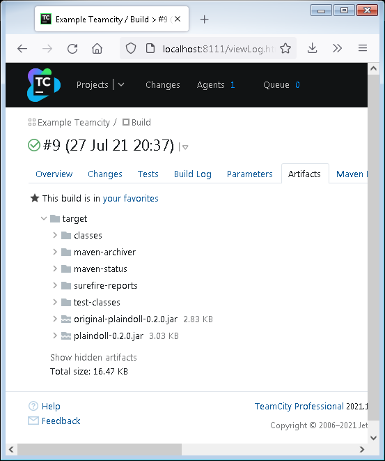

# Домашнее задание «9.4 Teamcity»

## Подготовка к выполнению

1. Поднимите инфраструктуру [teamcity](./teamcity/docker-compose.yml)
2. Если хочется, можете создать свою собственную инфраструктуру на основе той технологии, которая нравится. Инструкция по установке из [документации](https://www.jetbrains.com/help/teamcity/installing-and-configuring-the-teamcity-server.html)
3. Дождитесь запуска teamcity, выполните первоначальную настройку
4. Авторизуйте агент
5. Сделайте fork [репозитория](https://github.com/aragastmatb/example-teamcity)

## Основная часть

1. Создайте новый проект в teamcity на основе fork
2. Сделайте autodetect конфигурации
3. Сохраните необходимые шаги, запустите первую сборку master'a
4. Поменяйте условия сборки: если сборка по ветке `master`, то должен происходит `mvn clean package`, иначе `mvn clean test`
5. Мигрируйте `build configuration` в репозиторий
6. Создайте отдельную ветку `feature/add_reply` в репозитории
7. Напишите новый метод для класса Welcomer: метод должен возвращать произвольную реплику, содержащую слово `hunter`
8. Дополните тест для нового метода на поиск слова `hunter` в новой реплике
9. Сделайте push всех изменений в новую ветку в репозиторий
10. Убедитесь что сборка самостоятельно запустилась, тесты прошли успешно
11. Внесите изменения из произвольной ветки `feature/add_reply` в `master` через `Merge`
12. Убедитесь, что нет собранного артефакта в сборке по ветке `master`
13. Настройте конфигурацию так, чтобы она собирала `.jar` в артефакты сборки
14. Проведите повторную сборку мастера, убедитесь, что сбора прошла успешно и артефакты собраны
15. Проверьте, что конфигурация в репозитории содержит все настройки конфигурации из teamcity
16. В ответ предоставьте ссылку на репозиторий

> **Ответ:**    
> https://github.com/Dok-dev/example-teamcity
>
>    

---

Булат Замилов (преподаватель)
4 августа 2021 12:06

Здравствуйте, Тимофей

Спасибо за хорошо выполненную работу, вы описали все подробно и понятно. Работу я вам засчитываю, вы хорошо разобрались в материале.

Хорошей вам дальнейшей учебы
