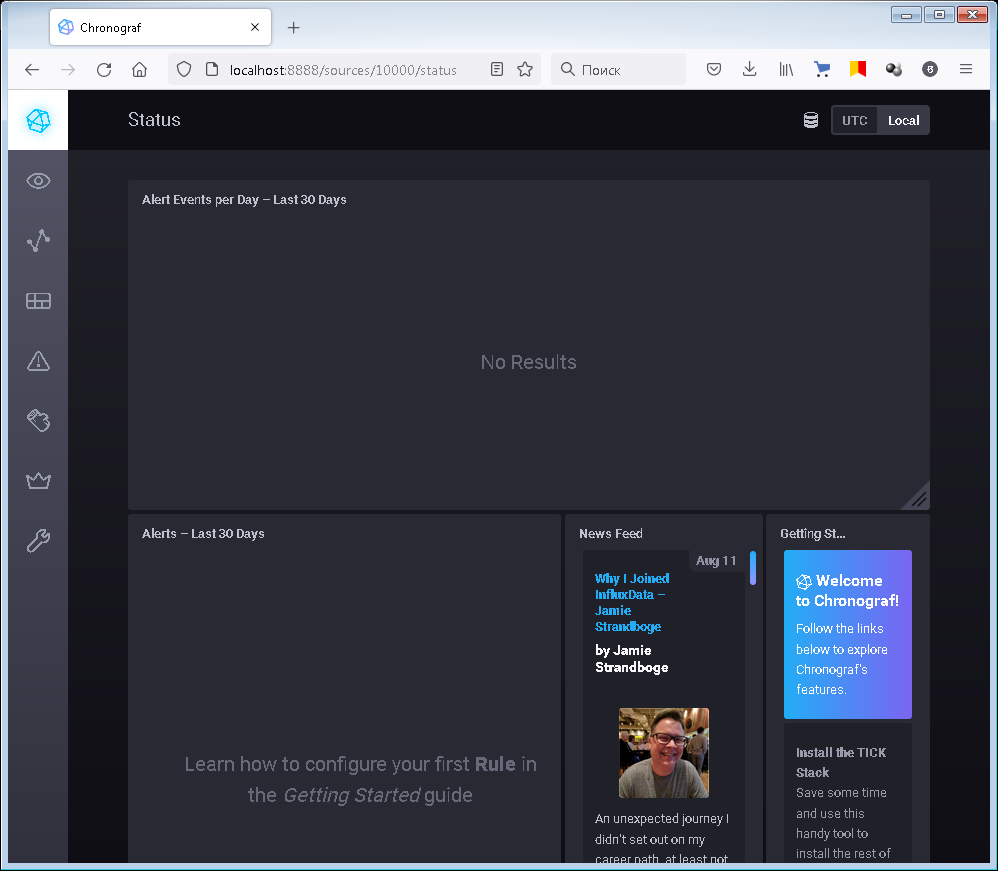
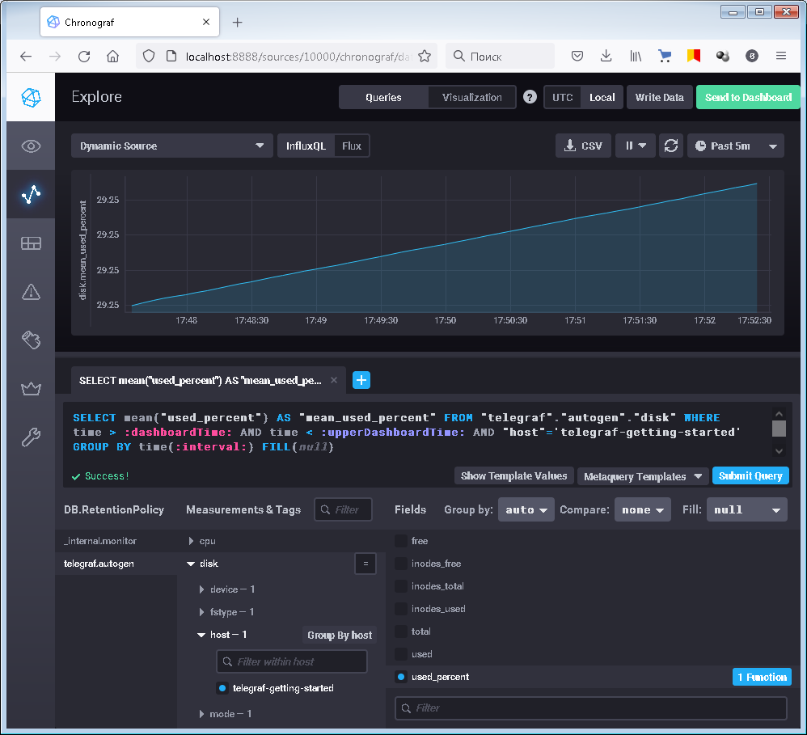
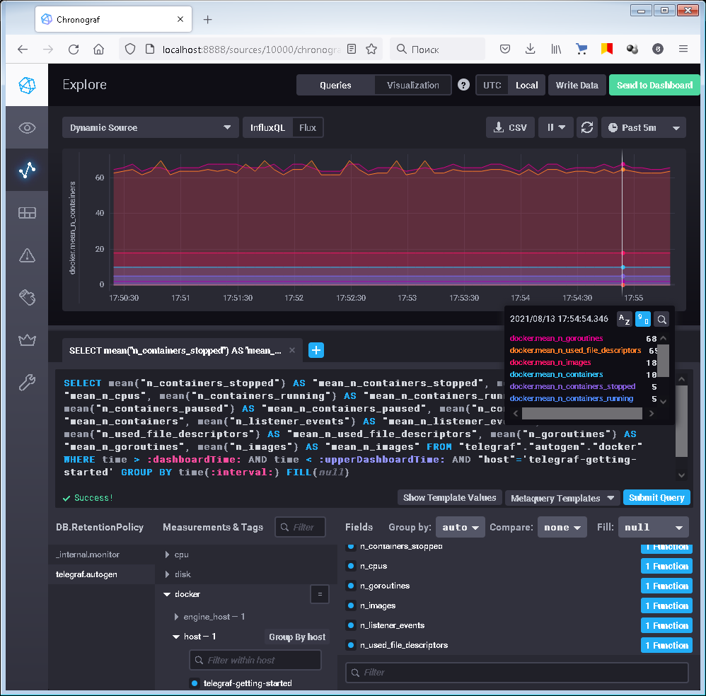
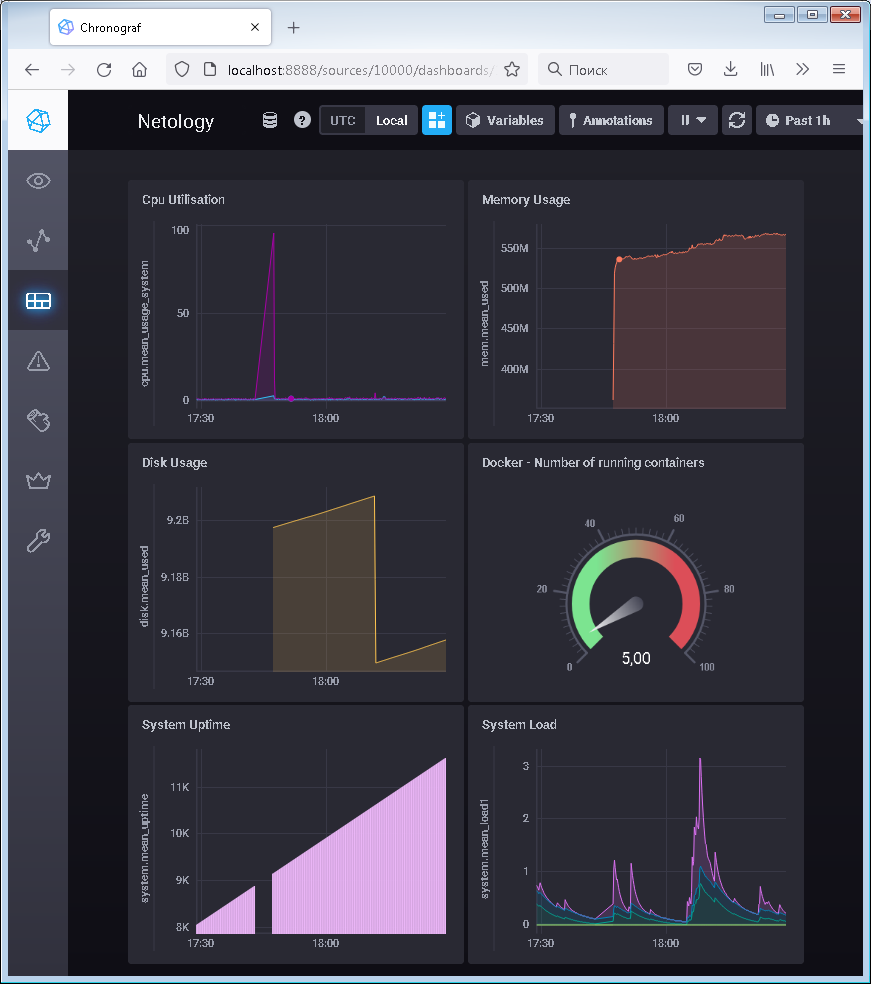

# Домашнее задание «10.2. Системы мониторинга»

## Обязательные задания

1. Опишите основные плюсы и минусы pull и push систем мониторинга.

> **Ответ:**    
> Многие системы на самом деле могут совмещать эти модели. И использование только одной из них не всегда представляется возможным. Например, если часть сервисов и оборудования расположены за шлюзом с динамическим адресом или на нем просто запрещено открывать порты и делать NAT. В таком случае необходимо использование Push-модели или различных proxy-сборщиков данных.    
> Однако при pull-модели намного проще производить централизанную настройку сбора метрик без раскатки и настройки агентов на отслеживаемом оборудовании, меньше риски сделать ошибк при настройке и перепутать источник данных.    
> В презентации было указано использование UDP-протокола как одно из преимуществ использования push-метода, но pull-модель также может осуществлять обмен данными по UDP (level 4) например при работе протокола SMTP (level 7).    
> В целом мне представляется наиболее предпочтительной pull-модель сбора метрик с небольшими использованием push-агентов при необходимости.


2. Какие из ниже перечисленных систем относятся к push модели, а какие к pull? А может есть гибридные?

    - Prometheus 
    - TICK
    - Zabbix
    - VictoriaMetrics
    - Nagios
	
> **Ответ:**    
> - Prometheus - Преимущественно pull-модель, но можно использовать получение метрик методом push с помощью Pushgateway.
> - TICK - push-модель.
> - Zabbix - Pull/Push. Агенты могут работать как в активном так и в пассивном режиме. Помимо pull-методов могут использоваться Zabbix Traper, SNMP Traps и Zabbix Proxy.
> - VictoriaMetrics - не является самостоятельной системой мониторинга это масштабируемая СУБД для хранения и обработки данных в форме временного ряда.
> - Nagios - возможны оба способа сбора данных.

3. Склонируйте себе [репозиторий](https://github.com/influxdata/sandbox/tree/master) и запустите TICK-стэк, 
используя технологии docker и docker-compose.

В виде решения на это упражнение приведите выводы команд с вашего компьютера (виртуальной машины):

    - curl http://localhost:8086/ping
    - curl http://localhost:8888
    - curl http://localhost:9092/kapacitor/v1/ping
	
> **Ответ:**    
```
vagrant@vagrant:~/sandbox$ curl http://localhost:8086/ping
vagrant@vagrant:~/sandbox$ curl http://localhost:9092/kapacitor/v1/ping
vagrant@vagrant:~/sandbox$ curl http://localhost:8888
<!DOCTYPE html><html><head><meta http-equiv="Content-type" content="text/html; charset=utf-8"><title>Chronograf</title><link rel="icon shortcut" href="/favicon.fa749080.ico"><link rel="stylesheet" href="/src.d80ed715.css"></head><body> <div id="react-root" data-basepath=""></div> <script src="/src.c278d833.js"></script> </body></html>
vagrant@vagrant:~/sandbox$
```

А также скриншот веб-интерфейса ПО chronograf (`http://localhost:8888`). 
> **Ответ:**    
>   

P.S.: если при запуске некоторые контейнеры будут падать с ошибкой - проставьте им режим `Z`, например
`./data:/var/lib:Z`

4. Перейдите в веб-интерфейс Chronograf (`http://localhost:8888`) и откройте вкладку `Data explorer`.

    - Нажмите на кнопку `Add a query`
    - Изучите вывод интерфейса и выберите БД `telegraf.autogen`
    - В `measurments` выберите mem->host->telegraf_container_id , а в `fields` выберите used_percent. 
    Внизу появится график утилизации оперативной памяти в контейнере telegraf.
    - Вверху вы можете увидеть запрос, аналогичный SQL-синтаксису. 
    Поэкспериментируйте с запросом, попробуйте изменить группировку и интервал наблюдений.

Для выполнения задания приведите скриншот с отображением метрик утилизации места на диске 
(disk->host->telegraf_container_id) из веб-интерфейса.
> **Ответ:**    
>    

5. Изучите список [telegraf inputs](https://github.com/influxdata/telegraf/tree/master/plugins/inputs). 
Добавьте в конфигурацию telegraf следующий плагин - [docker](https://github.com/influxdata/telegraf/tree/master/plugins/inputs/docker):
```
[[inputs.docker]]
  endpoint = "unix:///var/run/docker.sock"
```

Дополнительно вам может потребоваться донастройка контейнера telegraf в `docker-compose.yml` дополнительного volume и 
режима privileged:
```
  telegraf:
    image: telegraf:1.4.0
    privileged: true
    volumes:
      - ./etc/telegraf.conf:/etc/telegraf/telegraf.conf:Z
      - /var/run/docker.sock:/var/run/docker.sock:Z
    links:
      - influxdb
    ports:
      - "8092:8092/udp"
      - "8094:8094"
      - "8125:8125/udp"
```

После настройке перезапустите telegraf, обновите веб интерфейс и приведите скриншотом список `measurments` в 
веб-интерфейсе базы telegraf.autogen . Там должны появиться метрики, связанные с docker.

Факультативно можете изучить какие метрики собирает telegraf после выполнения данного задания.

> **Ответ:**    
>    

## Дополнительное задание (со звездочкой*) - необязательно к выполнению

В веб-интерфейсе откройте вкладку `Dashboards`. Попробуйте создать свой dashboard с отображением:

    - утилизации ЦПУ
    - количества использованного RAM
    - утилизации пространства на дисках
    - количество поднятых контейнеров
    - аптайм
    - ...
    - фантазируйте)
	
> **Ответ:**    
>    

