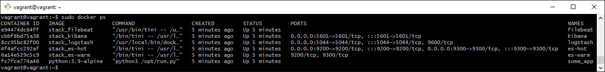
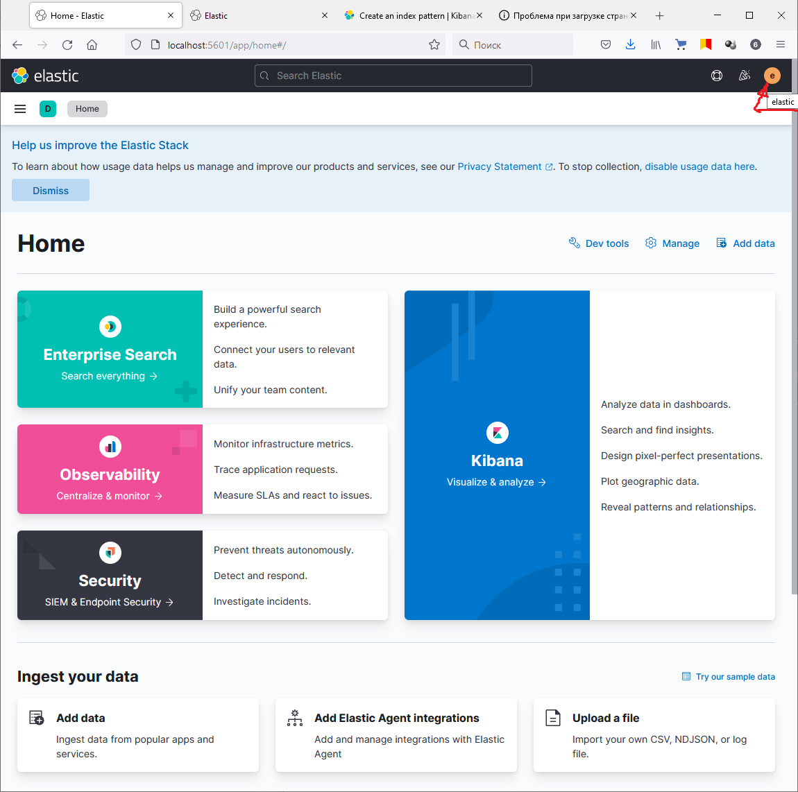
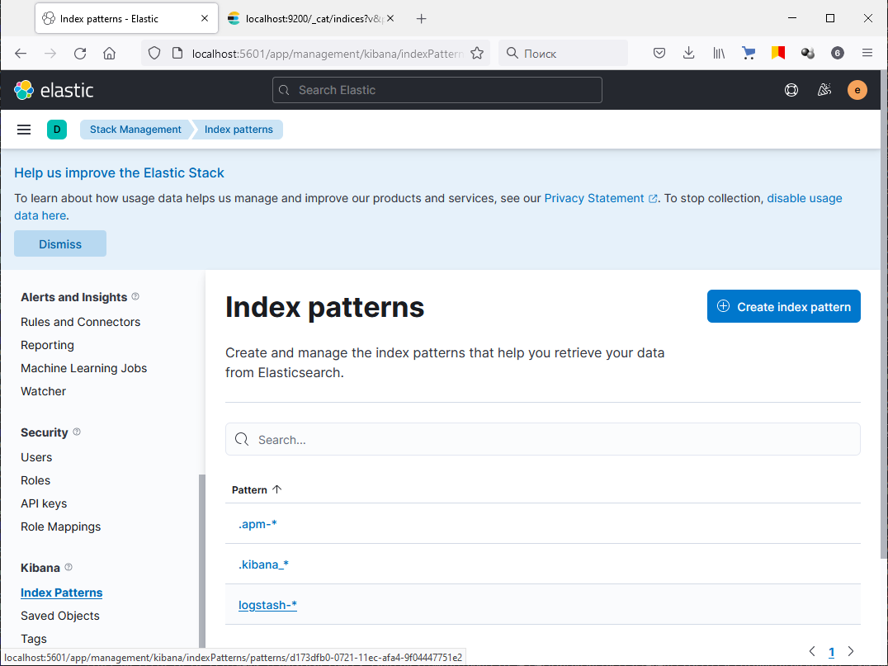
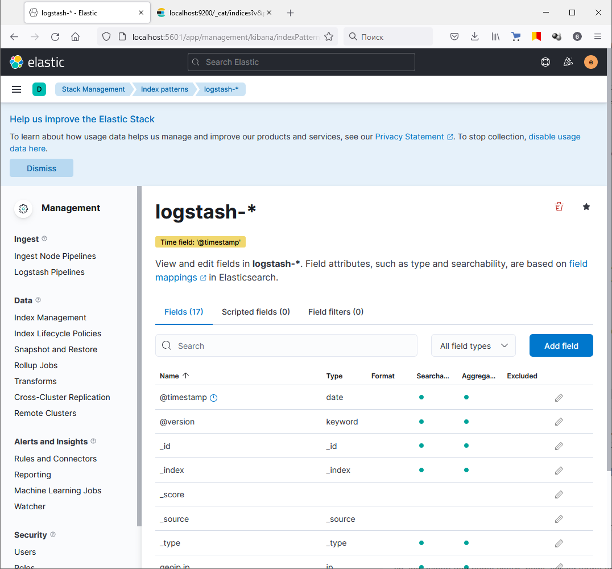
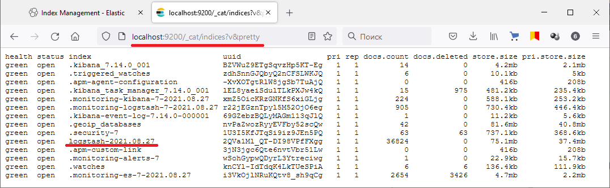
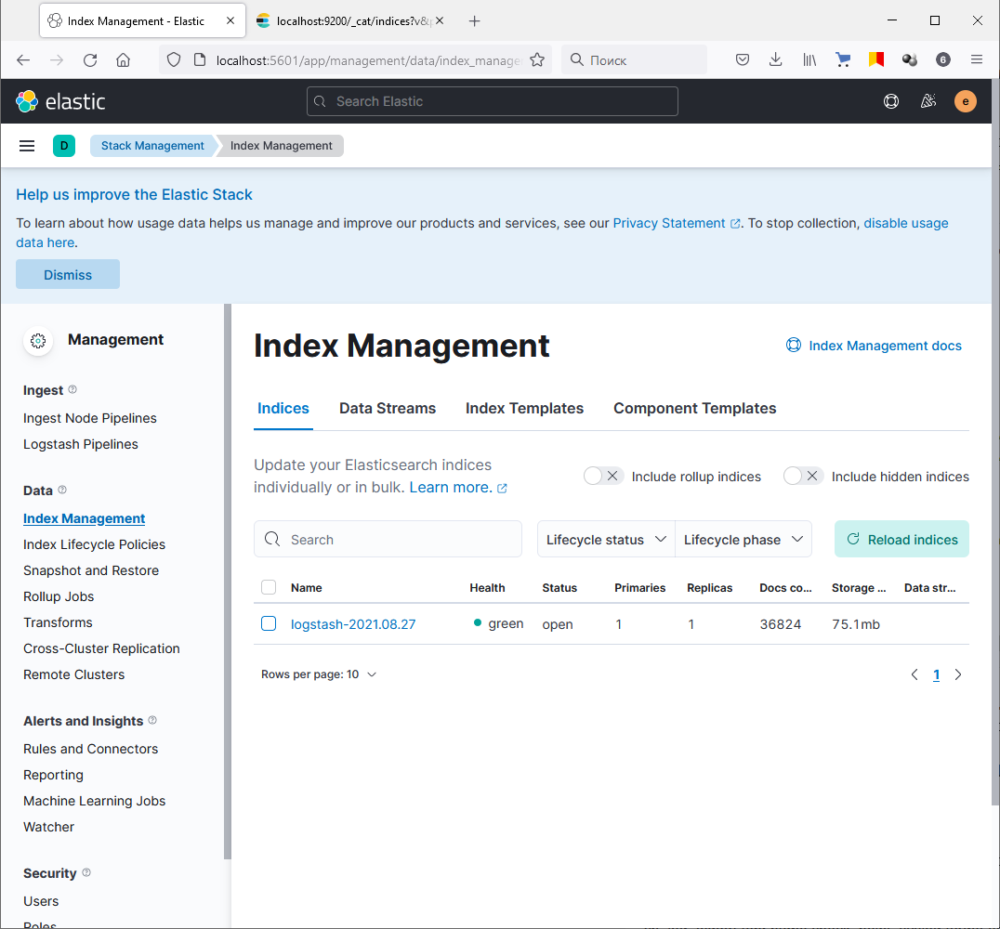
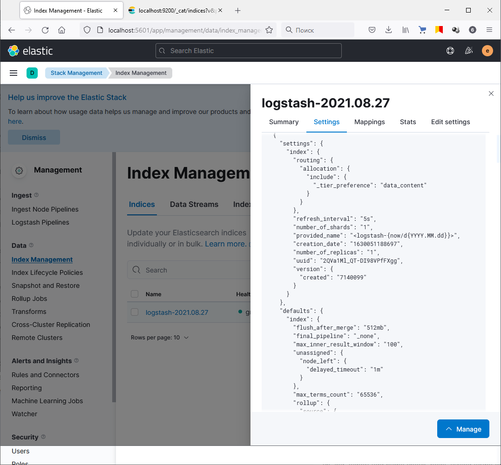

# Домашнее задание к занятию "10.4 ELK"

## Дополнительные ссылки

При выполнении задания пользуйтесь вспомогательными ресурсами:

- [поднимаем elk в докер](https://www.elastic.co/guide/en/elastic-stack-get-started/current/get-started-docker.html)
- [поднимаем elk в докер с filebeat и докер логами](https://www.sarulabs.com/post/5/2019-08-12/sending-docker-logs-to-elasticsearch-and-kibana-with-filebeat.html)
- [конфигурируем logstash](https://www.elastic.co/guide/en/logstash/current/configuration.html)
- [плагины filter для logstash](https://www.elastic.co/guide/en/logstash/current/filter-plugins.html)
- [конфигурируем filebeat](https://www.elastic.co/guide/en/beats/libbeat/5.3/config-file-format.html)
- [привязываем индексы из elastic в kibana](https://www.elastic.co/guide/en/kibana/current/index-patterns.html)
- [как просматривать логи в kibana](https://www.elastic.co/guide/en/kibana/current/discover.html)
- [решение ошибки increase vm.max_map_count elasticsearch](https://stackoverflow.com/questions/42889241/how-to-increase-vm-max-map-count)

В процессе выполнения задания могут возникнуть также не указанные тут проблемы в зависимости от системы.

Используйте output stdout filebeat/kibana и api elasticsearch для изучения корня проблемы и ее устранения.

## Задание повышенной сложности

Не используйте директорию [help](./help) при выполнении домашнего задания.

## Задание 1

Вам необходимо поднять в докере:
- elasticsearch(hot и warm ноды)
- logstash
- kibana
- filebeat

и связать их между собой.

Logstash следует сконфигурировать для приёма по tcp json сообщений.

Filebeat следует сконфигурировать для отправки логов docker вашей системы в logstash.

В директории [help](./help) находится манифест docker-compose и конфигурации filebeat/logstash для быстрого 
выполнения данного задания.

Результатом выполнения данного задания должны быть:
- скриншот `docker ps` через 5 минут после старта всех контейнеров (их должно быть 5)
- скриншот интерфейса kibana
- docker-compose манифест (если вы не использовали директорию help)
- ваши yml конфигурации для стека (если вы не использовали директорию help)
> **Ответ:**    
> https://github.com/Dok-dev/devops-netology/blob/main/hw-10.4_Monitoring-ELK/stack

> **Для корректного запуска elasticsearch:**    
>
``` bash
sudo sysctl -w vm.max_map_count=262144
sudo systemctl restart docker
```
> **Ответ:**    
>    
> 
> 

## Задание 2

Перейдите в меню [создания index-patterns  в kibana](http://localhost:5601/app/management/kibana/indexPatterns/create)
и создайте несколько index-patterns из имеющихся.
> **Ответ:**    
>     
>     
> 

Перейдите в меню просмотра логов в kibana (Discover) и самостоятельно изучите как отображаются логи и как производить 
поиск по логам.

В манифесте директории help также приведенно dummy приложение, которое генерирует рандомные события в stdout контейнера.
Данные логи должны порождать индекс logstash-* в elasticsearch. Если данного индекса нет - воспользуйтесь советами 
и источниками из раздела "Дополнительные ссылки" данного ДЗ.

> **Ответ:**    
> Индекс в Elasticsearch:    
>     
>     
> В Kibana:   
>     
> 
>     

---

Тимофей Бирюков
24 августа 2021 16:48
Почему то не удается добавить индексы elastic-*. Хотя вроде данные собираются судя по данным Stack Monotoring.
В логах все соединения устанавливаются, непонятно. В документации не нашел в чем может быть причина.

Сергей Андрюнин (преподаватель)
24 августа 2021 23:29
А не пробовали проверить запросом в эластик какие индексы есть? И посмотреть вообще какие пишутся? Попробуйте проверить это и отправьте задание на проверку.

Тимофей Бирюков
27 августа 2021 13:51
Оказалось зря взял некоторые элементы из папки “help”. Её правильнее было бы назвать “obstruct”. ))
Там несколько серьезных ошибок.


Сергей Андрюнин (преподаватель)
27 августа 2021 21:46
Ок принимается, зачет.
