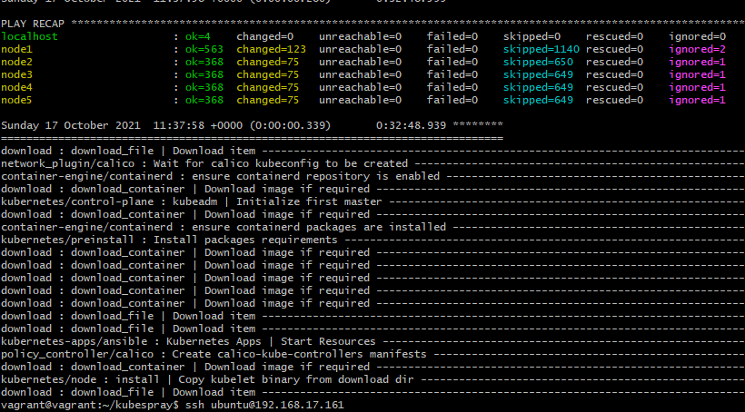
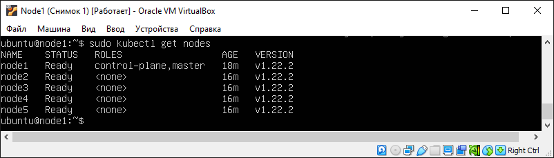
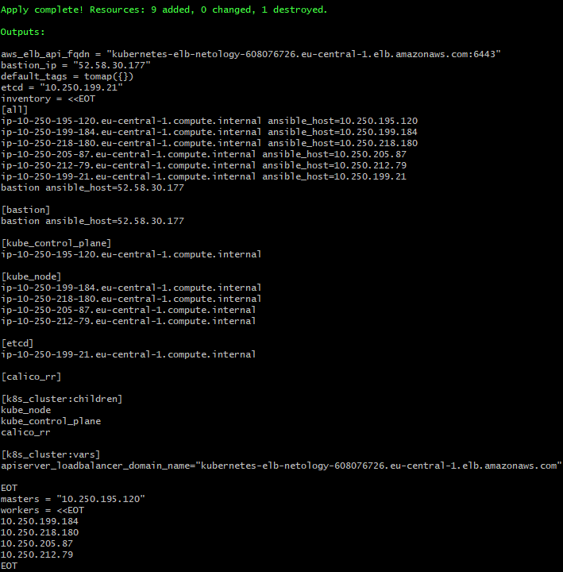
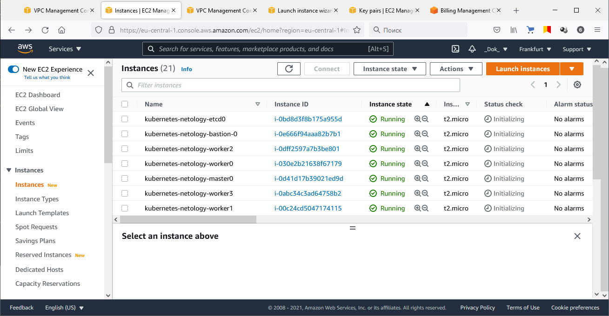
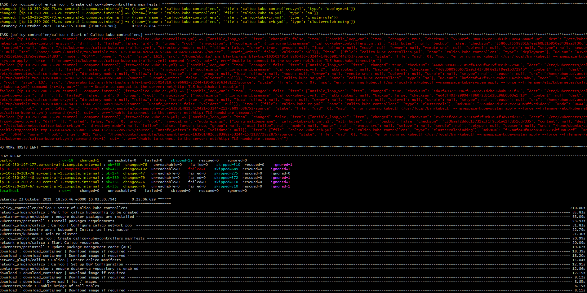

# Домашнее задание к занятию "12.4 Развертывание кластера на собственных серверах, лекция 2"

Новые проекты пошли стабильным потоком. Каждый проект требует себе несколько кластеров: под тесты и продуктив. Делать все руками — не вариант, поэтому стоит автоматизировать подготовку новых кластеров.

## Задание 1: Подготовить инвентарь kubespray
Новые тестовые кластеры требуют типичных простых настроек. Нужно подготовить инвентарь и проверить его работу. Требования к инвентарю:
* подготовка работы кластера из 5 нод: 1 мастер и 4 рабочие ноды;
* в качестве CRI — containerd;
* запуск etcd производить на мастере.


> **Выполнение:**    
> 
>  ### Настроим ssh-авторизацию для подключения с локальной машины ко всем нодам: 
> ```console
> vagrant@vagrant:~$ ssh-keygen
> vagrant@vagrant:~$ ssh-copy-id ubuntu@192.168.17.161
> vagrant@vagrant:~$ ssh-copy-id ubuntu@192.168.17.162
> vagrant@vagrant:~$ ssh-copy-id ubuntu@192.168.17.163
> vagrant@vagrant:~$ ssh-copy-id ubuntu@192.168.17.164
> vagrant@vagrant:~$ ssh-copy-id ubuntu@192.168.17.165
> ```
> 
> Задаем правильного пользователя для подключения в нодам:
> ```console
> vim ~/.ssh/config
> Host 192.168.17.16*
>     User ubuntu
>     ServerAliveInterval 60
>     IdentityFile ~/.ssh/id_rsa
> ```
>
> ### Установка Kybespray
> Клонируем репозиторий:    
> ```console
> vagrant@vagrant:~$ git clone https://github.com/kubernetes-sigs/kubespray.git
> ```
> 
> Установка зависимостей для работы Kybespray (вместе с ansible):
> ```console
> vagrant@vagrant:~$ cd kubespray
> sudo pip3 install -r requirements.txt
> ```
> 
> Создаем файл нашего инвентори из примера в репозитории:
> ```console
> cp -rfp inventory/sample inventory/prod_cluster
> ```
>
> Отредактируем `inventory\prod_cluster\inventory.ini` под наши ноды согласно ТЗ:
> ```console
> vagrant@vagrant:~/kubespray$ cat inventory/prod_cluster/inventory.ini
> [all]
> node1 ansible_host=192.168.17.161
> node2 ansible_host=192.168.17.162
> node3 ansible_host=192.168.17.163
> node4 ansible_host=192.168.17.164
> node5 ansible_host=192.168.17.165
> 
> # #> # configure a bastion host if your nodes are not directly reachable
> # [bastion]
> # bastion ansible_host=x.x.x.x ansible_user=some_user
> 
> [kube_control_plane]
> node1
> # node2
> # node3
> 
> [etcd]
> node1
> # node2
> # node3
> 
> [kube_node]
> node2
> node3
> node4
> node5
> # node6
> 
> [calico_rr]
> 
> [k8s_cluster:children]
> kube_control_plane
> kube_node
> # calico_rr
> ```
>
> Для использования containerd в качестве CRI меняем слудующие параметры в файлах:
> #### k8s-cluster.yml
> 
> ```yaml
> container_manager: containerd
> ```
> 
> #### etcd.yml
> 
> ```yaml
> etcd_deployment_type: host
> ```
> 
> #### containerd.yml config
> 
> ```yaml
> containerd_registries:
>   "docker.io":
>     - "https://hub.docker.com"
>#     - "https://registry-1.docker.io"
>     - "https://k8s.gcr.io"
>#     - "https://mirror.gcr.io"
> ```
>
> Запускаем развертывание кластера:
> ```console
> vagrant@vagrant:~/kubespray$ ansible-playbook -i inventory/prod_cluster/inventory.ini cluster.yml -b -v -e ansible_user=ubuntu
> ```
>
>    
>    
>
> Создадим деплоймент посмотрим как он применился на ноды:
> ```console
> ubuntu@node1:~$ kubectl create deployment hello-node --image=k8s.gcr.io/echoserver:1.4 --replicas=4
> deployment.apps/hello-node created
> ubuntu@node1:~$ kubectl get po -o wide
> NAME                          READY   STATUS              RESTARTS   AGE 		  IP       NODE    NOMINATED NODE   READINESS GATES
> hello-node-7567d9fdc9-ct4s7   1/1     Running   0    			       9m3s	 10.233.92.3   node2   <none>           <none>
> hello-node-7567d9fdc9-ltdws   1/1     Running   0   			       9m4s	 10.233.97.1   node3   <none>           <none>
> hello-node-7567d9fdc9-f8hxa   1/1     Running   0    			       9m5s	 10.233.98.6   node4   <none>           <none>
> hello-node-7567d9fdc9-y6ikl   1/1     Running   0    			       9m6s	 10.233.96.2   node5   <none>           <none>
> ```

---

## Задание 2 (*): подготовить и проверить инвентарь для кластера в AWS
Часть новых проектов хотят запускать на мощностях AWS. Требования похожи:
* разворачивать 5 нод: 1 мастер и 4 рабочие ноды;
* работать должны на минимально допустимых EC2 — t3.small.

> **Выполнение:**    
> 
> Для выполнения нам понадобятся "Kubectl CLI tool" и "Aws CLI tool" с настройкой:
> ```console
> curl -LO https://storage.googleapis.com/kubernetes-release/release/`curl -s https://storage.googleapis.com/kubernetes-release/release/stable.txt`/bin/linux/amd64/kubectl
> chmod +x ./kubectl
> sudo mv ./kubectl /usr/local/bin/kubectl
> vagrant@vagrant:~/$ pip3 install awscli
> vagrant@vagrant:~/$ aws configure
> ```


> Воспользуемся заготовкой Kubespray для Terraform:
> ```console
> vagrant@vagrant:~$ cd kubespray/contrib/terraform/aws/
> vagrant@vagrant:~/kubespray/contrib/terraform/aws$ cp credentials.tfvars.example credentials.tfvars
> vagrant@vagrant:~/kubespray/contrib/terraform/aws$ vim credentials.tfvars
> 
> #AWS Access Key
> AWS_ACCESS_KEY_ID = "A**************"
> #AWS Secret Key
> AWS_SECRET_ACCESS_KEY = "8**************"
> #EC2 SSH Key Name
> AWS_SSH_KEY_NAME = "aws_keypar"
> #AWS Region
> AWS_DEFAULT_REGION = "eu-central-1"
> 
> vagrant@vagrant:~/kubespray/contrib/terraform/aws$ vim terraform.tfvars
> #Global Vars
> aws_cluster_name = "netology_kube"
> 
> #VPC Vars
> aws_vpc_cidr_block       = "10.250.192.0/18"
> aws_cidr_subnets_private = ["10.250.192.0/20", "10.250.208.0/20"]
> aws_cidr_subnets_public  = ["10.250.224.0/20", "10.250.240.0/20"]
> 
> # single AZ deployment
> #aws_cidr_subnets_private = ["10.250.192.0/20"]
> #aws_cidr_subnets_public  = ["10.250.224.0/20"]
> 
> # 3+ AZ deployment
> #aws_cidr_subnets_private = ["10.250.192.0/24","10.250.193.0/24","10.250.194.0/24","10.250.195.0/24"]
> #aws_cidr_subnets_public  = ["10.250.224.0/24","10.250.225.0/24","10.250.226.0/24","10.250.227.0/24"]
> 
> #Bastion Host
> aws_bastion_num  = 1
> aws_bastion_size = "t2.micro"
> 
> #Kubernetes Cluster
> aws_kube_master_num       = 1
> aws_kube_master_size      = "t2.micro"
> aws_kube_master_disk_size = 50
> 
> aws_etcd_num       = 1
> aws_etcd_size      = "t2.micro"
> aws_etcd_disk_size = 50
> 
> aws_kube_worker_num       = 4
> aws_kube_worker_size      = "t2.micro"
> aws_kube_worker_disk_size = 50
> 
> #Settings AWS ELB
> aws_elb_api_port    = 6443
> k8s_secure_api_port = 6443
> 
> default_tags = {
>   #  Env = "devtest"
>   #  Product = "kubernetes"
> }
> 
> inventory_file = "../../../inventory/hosts"
> ```
> Дистрибутив в `variables.tf` заменим на ubuntu 20.4 (согласно README).
>
> Из за использования машины `t2.micro` в бесплатном режиме придется уменьшить системные требования:
> ```console
> vagrant@vagrant:~/kubespray/contrib/terraform/aws$ vim ~/kubespray/roles/kubernetes/preinstall/defaults/main.yml
> # Minimal memory requirement in MB for safety checks
> minimal_node_memory_mb: 956
> minimal_master_memory_mb: 956
> ```
>
> Инициализируем Terraform
> ```console
> vagrant@vagrant:~/kubespray/contrib/terraform/aws$ terraform init
> Initializing modules...
> - aws-elb in modules/elb
> - aws-iam in modules/iam
> - aws-vpc in modules/vpc
> 
> Initializing the backend...
> 
> Initializing provider plugins...
> - Finding latest version of hashicorp/aws...
> - Finding latest version of hashicorp/null...
> - Finding latest version of hashicorp/template...
> - Installing hashicorp/aws v3.63.0...
> - Installed hashicorp/aws v3.63.0 (signed by HashiCorp)
> - Installing hashicorp/null v3.1.0...
> - Installed hashicorp/null v3.1.0 (signed by HashiCorp)
> - Installing hashicorp/template v2.2.0...
> - Installed hashicorp/template v2.2.0 (signed by HashiCorp)
> ...
> ```
>
> Применяем план:
> ```console
> vagrant@vagrant:~/kubespray/contrib/terraform/aws$ terraform plan -out mysuperplan -var-file=credentials.tfvars
> vagrant@vagrant:~/kubespray/contrib/terraform/aws$ terraform apply -var-file=credentials.tfvars
> ```
>    
>
> 
>
> Теперь небходимо загрузить SSH ключ для подключения в AWS и корректной отработки блейбука:
> ```console
> vagrant@vagrant:~/kubespray$ cp ~/.ssh/aws_keypar.pem ~/.ssh/netology/kubespray.pem
> 
> vagrant@vagrant:~/kubespray$ eval $(ssh-agent)
> Agent pid 41055
>
> vagrant@vagrant:~/kubespray$ ssh-add -D
> All identities removed.
>
> vagrant@vagrant:~/kubespray$ ssh-add ~/.ssh/netology/kubespray.pem
> Identity added: /home/vagrant/.ssh/netology/kubespray.pem (/home/vagrant/.ssh/netology/kubespray.pem)
> ```
>
> Запускаем сам плейбук:
> ```console
> vagrant@vagrant:~/kubespray$ ansible-playbook -i ./inventory/hosts ./cluster.yml -e ansible_user=ubuntu -b --become-user=root --flush-cache
> ```
>
> В итоге получаем такую картину:    
>     
>
> Похоже, что t2.micro не вытягивает master-ноду и etcd. Пробовал 4 раза с удалением кластера, результат одинаковый. t3.smal не рискнул пробовать т.к. уже влетел на 7 баксов :) за неудаленные NAT Gateways оставшиеся от кластеров.

---

**Использованные источники:**    
https://www.altoros.com/blog/installing-kubernetes-with-kubespray-on-aws/


---

Андрей Копылов (преподаватель)
24 октября 2021 10:56

Тимофей, добрый день!

Эталонное решение. Спасибо.
