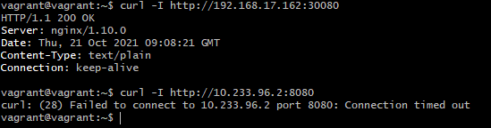

# Домашнее задание к занятию "12.5 Сетевые решения CNI"

После работы с Flannel появилась необходимость обеспечить безопасность для приложения. Для этого лучше всего подойдет Calico.
## Задание 1: установить в кластер CNI плагин Calico
Для проверки других сетевых решений стоит поставить отличный от Flannel плагин — например, Calico. Требования: 
* установка производится через ansible/kubespray;
* после применения следует настроить политику доступа к hello world извне.
> **Выполнение:**    
> 
> Сперва убедимся, что в `inventory/prod_cluster/group_vars/k8s-cluster.yml` указан нужный CNI плагин:
> ```yaml
> kube_network_plugin: calico
> ```
> Таким образом после развертывания с помощью Kubespray Calico утановится автоматически. Проверяем:
> ```console
> ubuntu@node1:~$ kubectl get pods -n kube-system
> NAME                                       READY   STATUS        RESTARTS       AGE
> calico-kube-controllers-684bcfdc59-gbkll   1/1     Running       17 (21h ago)   25h
> calico-node-6nkhs                          1/1     Running       1 (21h ago)    25h
> calico-node-8n9db                          1/1     Running       0              25h
> calico-node-sszdh                          1/1     Running       0              25h
> calico-node-w2gct                          1/1     Running       0              25h
> calico-node-zpqcz                          1/1     Running       0              25h
> coredns-8474476ff8-ljcmx                   1/1     Running       0              25h
> ...
> ```
>
> Создадим немспейс и деплоймент `frontend` к которому должен быть доступ:
> ```console
> ubuntu@node1:~$ kubectl create namespace frontend
> namespace/frontend created
> 
> ubuntu@node1:~$ cat <<EOF | kubectl create -f -
> ---
> apiVersion: apps/v1
> kind: Deployment
> metadata:
>   name: hello-nodes-depl
>   namespace: frontend
>   labels:
>     app: hello-world
> spec:
>   replicas: 2
>   selector:
>     matchLabels:
>       app: hello-world
>   template:
>     metadata:
>       labels:
>         app: hello-world
>     spec:
>       containers:
>       - name: hello-node
>         image: k8s.gcr.io/echoserver:1.4
>         ports:
>         - containerPort: 8080
> EOF
> deployment.apps/hello-nodes-depl created
> ```
>
> Проверим доступ к подам деплоймента:
> ```console
> ubuntu@node1:~$ kubectl get po -o wide -n frontend
> NAMESPACE     NAME                                       READY   STATUS    RESTARTS   AGE    IP               NODE    NOMINATED NODE   READINESS GATES
> frontend      hello-nodes-depl-7984878ddf-8bh6t          1/1     Running   0          7m9s   10.233.96.2      node2   <none>           <none>
> frontend      hello-nodes-depl-7984878ddf-tq6bj          1/1     Running   0          7m9s   10.233.96.3      node2   <none>           <none>
> ^D
> vagrant@vagrant:~$ curl -I http://10.233.96.2:8080
> HTTP/1.1 200 OK
> Server: nginx/1.10.0
> Date: Thu, 21 Oct 2021 08:30:55 GMT
> Content-Type: text/plain
> Connection: keep-alive
> ```
>
> Создадим глобальную политику которая должна запрещать любой внешний доступ к подам, но сохранять взаиможействие подов кластера:
> ```console
> ubuntu@node1:~$ cat <<EOF | calicoctl apply -f -
> ---
> apiVersion: projectcalico.org/v3
> kind: GlobalNetworkPolicy
> metadata:
>   name: deny-app-policy
> spec:
>   namespaceSelector: has(projectcalico.org/name) && projectcalico.org/name not in {"kube-system", "calico-system"}
>   types:
>   - Ingress
>   - Egress
>   egress:
>   # allow all namespaces to communicate to DNS pods
>   - action: Allow
>     protocol: UDP
>     destination:
>       selector: 'k8s-app == "kube-dns"'
>       ports:
>       - 53
> EOF
> Successfully applied 1 'GlobalNetworkPolicy' resource(s)
> ```
>
> Проверим доступ к подам деплоймента:
> ```console
> vagrant@vagrant:~$ curl -I http://10.233.96.2:8080
> curl: (28) Failed to connect to 10.233.96.2 port 8080: Connection timed out
> ```
>
> Теперь создадим сервис для доступа к деплойменту из вне:
> ```console
> ubuntu@node1:~$ cat <<EOF | kubectl apply -f -
> ---
> kind: Service
> apiVersion: v1
> metadata:
>   name: hello-world-ingress
>   namespace: frontend
> spec:
>   selector:
> #   run: hello-node
>     app: hello-world
>   type: LoadBalancer
>   ports:
>   - port: 8080
>     targetPort: 8080
>     nodePort: 30080
>     protocol: TCP
> #  externalIPs: [192.168.17.162, 192.168.17.163, 192.168.17.164, 192.168.17.165] - !!!не должно совпадать с IP-нод!!!
> EOF
> service/hello-world-ingress created
> ubuntu@node1:~$ kubectl get services -n frontend
> NAME                  TYPE           CLUSTER-IP      EXTERNAL-IP       PORT(S)          AGE
> hello-world-ingress   LoadBalancer   10.233.52.126   <none>            8080:30080/TCP   1m
> ```
>
> Проверяем что получилось:    
>


## Задание 2: изучить, что запущено по умолчанию
Самый простой способ — проверить командой calicoctl get <type>. Для проверки стоит получить список нод, ipPool и profile.
Требования: 
* установить утилиту calicoctl;
* получить 3 вышеописанных типа в консоли.
 
> **Выполнение:**    
> 
> Для работы с calicoctl требуется настроить calicoctl.cfg:    
> `sudo vim /etc/calico/calicoctl.cfg`    
> ```yaml
> apiVersion: projectcalico.org/v3
> kind: CalicoAPIConfig
> metadata:
> spec:
>   datastoreType: "kubernetes"
>   kubeconfig: "/home/ubuntu/.kube/config"
> ```
> 
> Проверим требуемые запросы:    
>

---

Андрей Копылов (преподаватель)
24 октября 2021 10:58

Добрый день!

Отлично! Зачет
