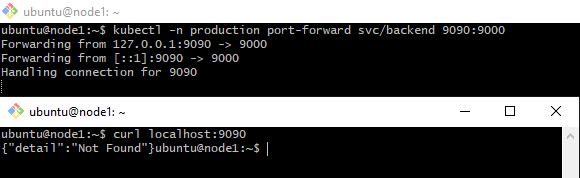
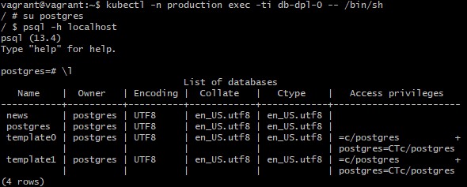

# Домашнее задание к занятию "13.3 работа с kubectl"
## Задание 1: проверить работоспособность каждого компонента
Для проверки работы можно использовать 2 способа: port-forward и exec. Используя оба способа, проверьте каждый компонент:
* сделайте запросы к бекенду;
* сделайте запросы к фронту;
* подключитесь к базе данных.

> **Выполнение:**    
> 
> Смотрим имена подов и проверяем состояние сервисов развернутых ранее:    
> 
>
> Проверяем сервисы через `port-forward`.
> Frontend:    
> 
>
> Backend:    
> 
>
> DB Postgree:    
> 
>
> Проверяем доступность бэкэнда с фронтенда и наоборот, при помощи `exec`:    
> 
>
> Продключаемся к поду с БД и смотрим список баз так же при помощи `exec`:    
> 
> 


## Задание 2: ручное масштабирование
При работе с приложением иногда может потребоваться вручную добавить пару копий. Используя команду kubectl scale, попробуйте увеличить количество бекенда и фронта до 3. После уменьшите количество копий до 1. Проверьте, на каких нодах оказались копии после каждого действия (kubectl describe).
 
> **Выполнение:**    
> 
> Увеличиваем реплики:    
> ```console 
> vagrant@vagrant:~$ kubectl scale --replicas=3 deployment/frontend-dpl -n production
> deployment.apps/frontend-dpl scaled
> vagrant@vagrant:~$ kubectl scale --replicas=3 deployment/backend-dpl -n production
> deployment.apps/backend-dpl scaled
> ```
> Проверяем:    
> 
>
> Уменьшаем колличество реплик:    
> ```console 
> vagrant@vagrant:~$ kubectl scale --replicas=1 deployment/frontend-dpl -n production
> deployment.apps/frontend-dpl scaled
> vagrant@vagrant:~$ kubectl scale --replicas=1 deployment/backend-dpl -n production
> deployment.apps/backend-dpl scaled
> ```
> Проверяем:    
> 