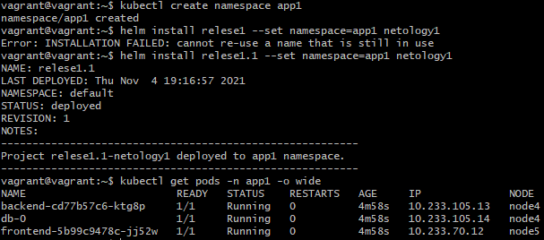
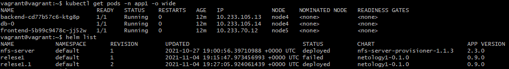
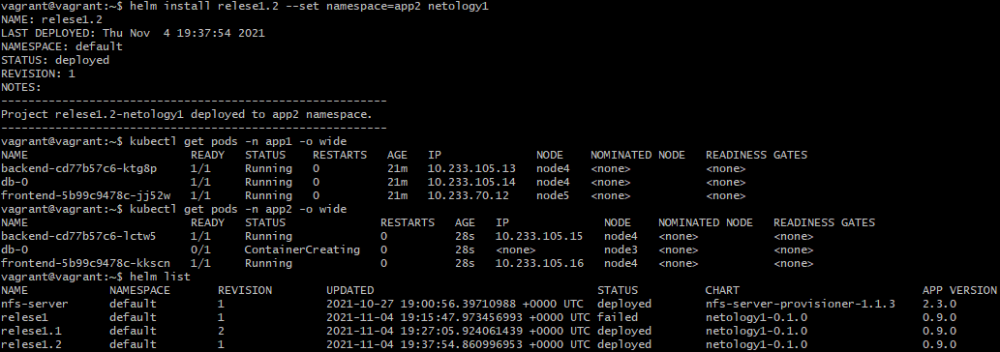

# Домашнее задание к занятию "13.4 инструменты для упрощения написания конфигурационных файлов. Helm и Jsonnet"
В работе часто приходится применять системы автоматической генерации конфигураций. Для изучения нюансов использования разных инструментов нужно попробовать упаковать приложение каждым из них.

## Задание 1: подготовить helm чарт для приложения
Необходимо упаковать приложение в чарт для деплоя в разные окружения. Требования:
* каждый компонент приложения деплоится отдельным deployment’ом/statefulset’ом;
* в переменных чарта измените образ приложения для изменения версии.

> **Выполнение:**    
> 
> Создадим чарт:    
> ```console
> vagrant@vagrant:~$ helm create netology1
> Creating netology1
> ```
> 
> Создадим директорию для раздельного деплоя сервисов и файл для деплоя statefulset, деплой фротэнда и бэкэнда в порядке оптимизации и отработки навыков поместим в один файл:
> ``` bash
> mkdir netology1\templates\services
> touch backend.yaml && touch frontend.yaml && touch statefulset.yaml
> mr netology1\templates\services.yaml
> touch netology1\templates\statefulset.yaml
>```
>
> Готовый чарт - [/netology1](./netology1)
> 
> Проверяем линтом и выгружаем в [fullDeployment.yaml](fullDeployment.yaml)
> ```console
> vagrant@vagrant:~$ helm lint netology1
> ==> Linting netology1
> [INFO] Chart.yaml: icon is recommended
> 
> 1 chart(s) linted, 0 chart(s) failed
> 
> vagrant@vagrant:~$ helm template netology1 > fullDeployment.yaml
>```
>


## Задание 2: запустить 2 версии в разных неймспейсах
Подготовив чарт, необходимо его проверить. Попробуйте запустить несколько копий приложения:
* одну версию в namespace=app1;
* вторую версию в том же неймспейсе;
* третью версию в namespace=app2.

> **Выполнение:**    
> 
> Создадим нейсмпейс `app1` и воспользуемся helm для установки нашего приложения:    
> ```console
> vagrant@vagrant:~$ kubectl create namespace app1
> namespace/app1 created
> vagrant@vagrant:~$ helm install relese1.1 --set namespace=app1 netology1
> NAME: relese1.1
> LAST DEPLOYED: Thu Nov  4 19:16:57 2021
> NAMESPACE: default
> STATUS: deployed
> REVISION: 1
> NOTES:
> ---------------------------------------------------------
> Project relese1.1-netology1 deployed to app1 namespace.
> ---------------------------------------------------------
> ```
>
> Проверяем:    
> 
>
> Попробуем поставить в том же неймспейсе:    
> ```console
> vagrant@vagrant:~$ helm install relese1.1 --set namespace=app1 netology1
> Error: INSTALLATION FAILED: cannot re-use a name that is still in use
> vagrant@vagrant:~$ helm install relese1.2 --set namespace=app1 netology1
> Error: INSTALLATION FAILED: rendered manifests contain a resource that already exists. Unable to continue with install: Service "backend" in namespace "app1" exists and cannot be imported into the current release: invalid ownership metadata; annotation validation error: key "meta.helm.sh/release-name" must equal "relese1.2": current value is "relese1.1"
> ```
> 
> Попробуем сделать upgrade:    
> ```console
> vagrant@vagrant:~$ helm upgrade relese1.1 --set namespace=app1 netology1
> Release "relese1.1" has been upgraded. Happy Helming!
> NAME: relese1.1
> LAST DEPLOYED: Thu Nov  4 19:27:05 2021
> NAMESPACE: default
> STATUS: deployed
> REVISION: 2
> NOTES:
> ---------------------------------------------------------
> Project relese1.1-netology1 deployed to app1 namespace.
> ---------------------------------------------------------
> ```
>
> Проверяем:    
> 
>
> Создаем еще один экземпляр приложения в другом неймспейсе с relese1.2 и проверяем:    
> 
>

## Задание 3 (*): повторить упаковку на jsonnet
Для изучения другого инструмента стоит попробовать повторить опыт упаковки из задания 1, только теперь с помощью инструмента jsonnet.
 
> **Выполнение:**    
> 
> Для начала установим Jsonnet:
> ```console
> vagrant@vagrant:~$ sudo snap install jsonnet
> jsonnet 0.9.5-59-g190a3f1 from JuanJo Ciarlante (jjo) installed
> ```
>
> Вариант Jsonnet конфига для генерации деплоймента:    
> [/json.net/deloyment.jsonnet](./json.net/deloyment.jsonnet)
>


---

*Использованные материалы:*    
https://habr.com/ru/post/548720/    
https://itnext.io/helm-reusable-chart-named-templates-and-a-generic-chart-for-multiple-applications-13d9b26e9244    
https://medium.com/kapitan-blog/kubernetes-with-jsonnet-and-kapitan-5e3991d5bca