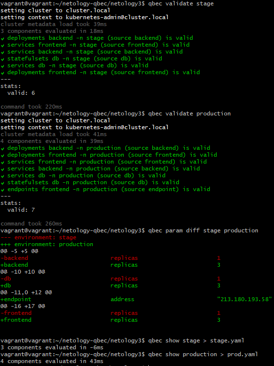
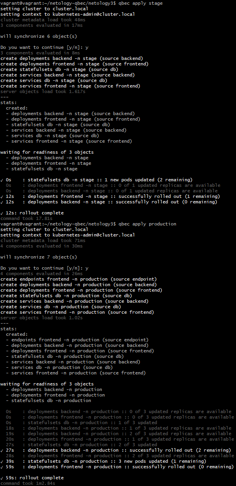
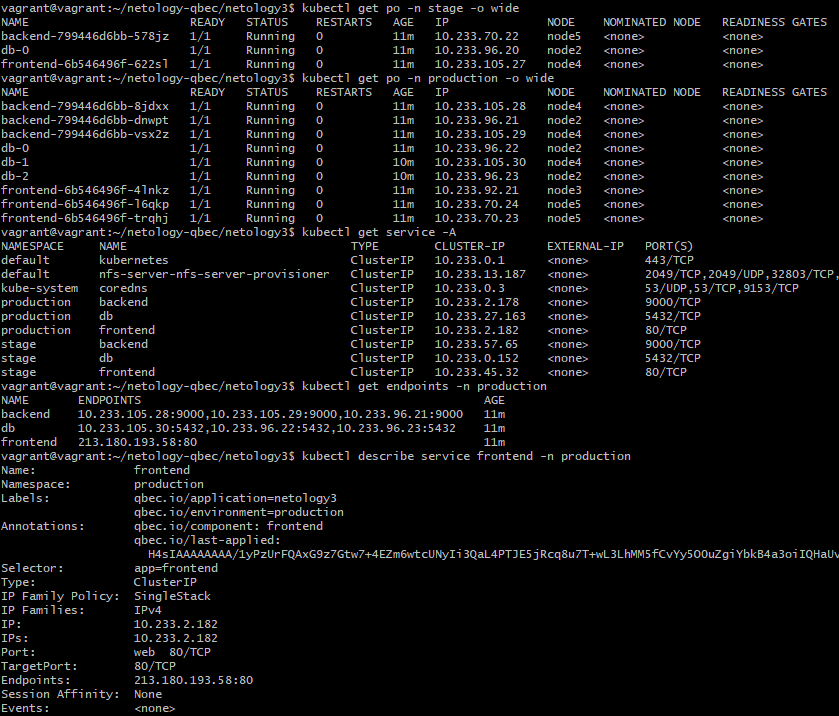

# Домашнее задание к занятию "13.5 поддержка нескольких окружений на примере Qbec"
Приложение обычно существует в нескольких окружениях. Для удобства работы следует использовать соответствующие инструменты, например, Qbec.

## Задание 1: подготовить приложение для работы через qbec
Приложение следует упаковать в qbec. Окружения должно быть 2: stage и production. 

Требования:
* stage окружение должно поднимать каждый компонент приложения в одном экземпляре;
* production окружение — каждый компонент в трёх экземплярах;
* для production окружения нужно добавить endpoint на внешний адрес.
 
> **Выполнение:**    
> 
> Для начала установим Qbec:
> ```bash
> wget https://github.com/splunk/qbec/releases/download/v0.14.8/qbec-linux-amd64.tar.gz
> tar -C ~/qbec -xzf qbec-linux-amd64.tar.gz
> sudo mv qbec /usr/local
> export PATH=$PATH:/usr/local/qbec
> qbec completion | sudo tee /etc/bash_completion.d/qbec
> ```
> 
> Создадим структуру файлов и папок для деполоя приложения с помощью Qbec:    
> ```bash
> qbec init netology3 --with-example
> ```
>
> Упаковываем наше приложение в двух окружениях. Получилось следющая структура: [/netology3](./netology3).    
>
> Проверяем при помощи Qbec в выгружаем все компоненты для проверки:    
> 
>
> Компонеты для окружения `stage`: [stage.yaml](./stage.yaml)
> Компонеты для окружения `production`: [prod.yaml](./prod.yaml)
>
> Задеплоим наши окружения:
> ```bash
> qbec apply stage
> qbec apply production
> qbec apply production # второй раз после создания сервисов для применения endpoints
> ```
> 
> 
>
> Проверяем:    
> 

---

*Использованные материалы:*    
https://github.com/aak74/kubernetes-for-beginners/tree/master/deploy/qbec


---

Андрей Копылов (преподаватель)
13 ноября 2021 15:50

Тимофей, добрый день!

Спасибо за эталонное решение!
