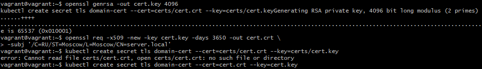
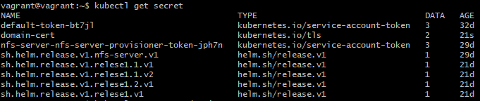
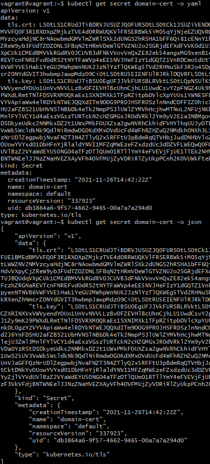
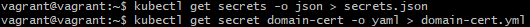
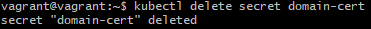
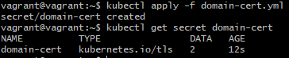
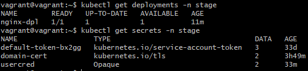
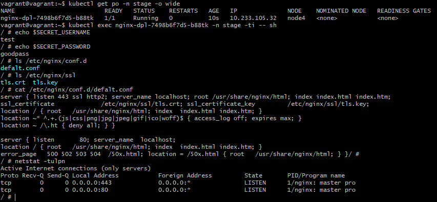

# Домашнее задание к занятию "14.1 Создание и использование секретов"

## Задача 1: Работа с секретами через утилиту kubectl в установленном minikube

Выполните приведённые ниже команды в консоли, получите вывод команд. Сохраните
задачу 1 как справочный материал.

### Как создать секрет?

```
openssl genrsa -out cert.key 4096
openssl req -x509 -new -key cert.key -days 3650 -out cert.crt \
-subj '/C=RU/ST=Moscow/L=Moscow/CN=server.local'
kubectl create secret tls domain-cert --cert=certs/cert.crt --key=certs/cert.key
```

> **Выполнение:**  
> 

### Как просмотреть список секретов?

```
kubectl get secrets
kubectl get secret
```

> **Выполнение:**  
> 

### Как просмотреть секрет?

```
kubectl get secret domain-cert
kubectl describe secret domain-cert
```

> **Выполнение:**  
> 

### Как получить информацию в формате YAML и/или JSON?

```
kubectl get secret domain-cert -o yaml
kubectl get secret domain-cert -o json
```

> **Выполнение:**  
> 

### Как выгрузить секрет и сохранить его в файл?

```
kubectl get secrets -o json > secrets.json
kubectl get secret domain-cert -o yaml > domain-cert.yml
```

> **Выполнение:**  
> 

### Как удалить секрет?

```
kubectl delete secret domain-cert
```

> **Выполнение:**  
> 

### Как загрузить секрет из файла?

```
kubectl apply -f domain-cert.yml
```

> **Выполнение:**  
> 


## Задача 2 (*): Работа с секретами внутри модуля

Выберите любимый образ контейнера, подключите секреты и проверьте их доступность
как в виде переменных окружения, так и в виде примонтированного тома.

 
> **Выполнение:**    
> 
> Создадим секрет для нужного неймспейса на основе ключей из предыдущего задания:
> ```console
> vagrant@vagrant:~$ kubectl create secret -n stage tls domain-cert --cert=cert.crt --key=cert.key
> secret/domain-cert created
> ```
> 
> Создадим [ConfigMap](configMap.yaml) с конфигураецией домена nginx:    
> ```console
> vagrant@vagrant:~$ kubectl apply -n stage -f configMap.yaml
> configmap/config created
> ```
>
> Создадим [Secret](secretUser.yaml) с данными аккаунта:
> ```console
> vagrant@vagrant:~$ kubectl apply -n stage -f secretUser.yaml
> secret/usercred created
> vagrant@vagrant:~$ kubectl get secret usercred -n stage -o yaml
> apiVersion: v1
> data:
>   password: Z29vZHBhc3M=
>   user: dGVzdA==
> kind: Secret
> metadata:
>   annotations:
>     kubectl.kubernetes.io/last-applied-configuration: |
>       {"apiVersion":"v1","kind":"Secret","metadata":{"annotations":{},"name":"usercred","namespace":"stage"},"stringData":{"password":"goodpass","user":"test"},"type":"Opaque"}
>   creationTimestamp: "2021-11-27T17:13:20Z"
>   name: usercred
>   namespace: stage
>   resourceVersion: "431033"
>   uid: 4bc37327-2bb9-4cf3-9edc-a4a28e85bdc4
> ```
> Применяем подготовленный [Deployment](deployment.yaml) с томом содержащим ключи и [ConfigMap](configMap.yaml):
> ```console
> vagrant@vagrant:~$ kubectl apply -n stage -f deployment.yaml
> eployment.apps/nginx-dpl created
> ```
>
> Проверяем:    
>     
> 
