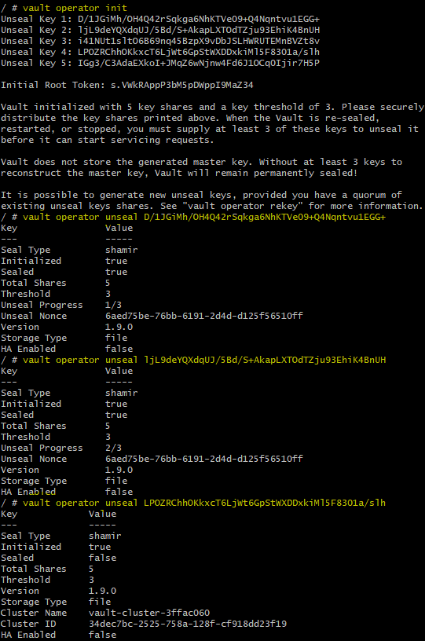
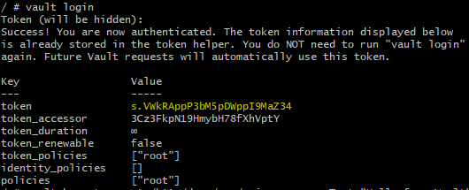
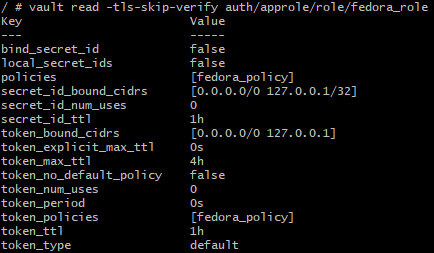
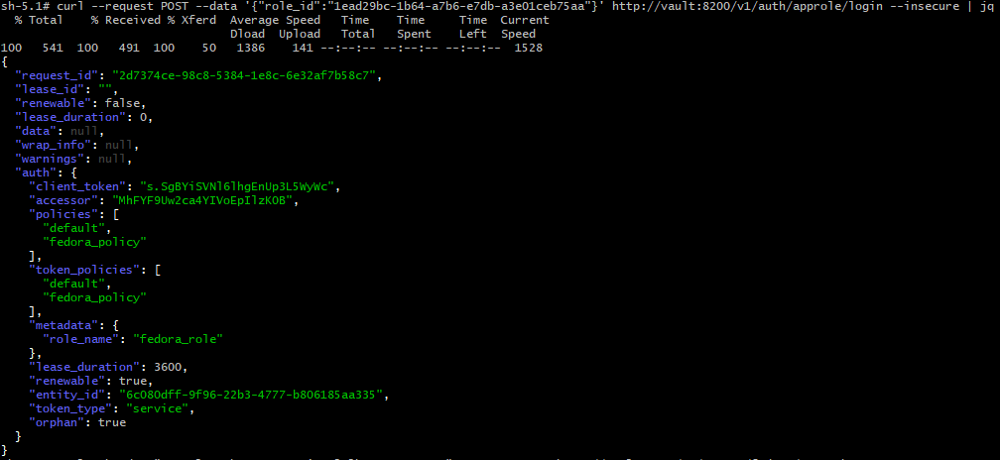
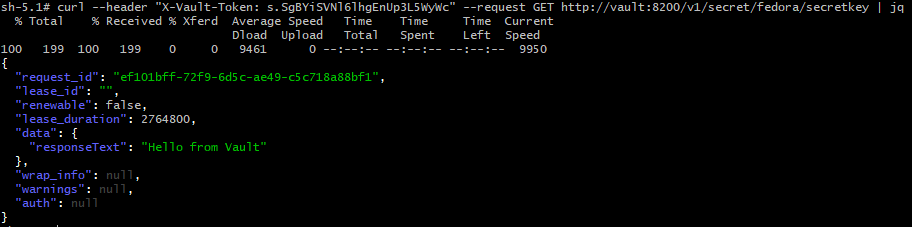

# Домашнее задание к занятию "14.2 Синхронизация секретов с внешними сервисами. Vault"

## Задача 1: Работа с модулем Vault

Запустить модуль Vault конфигураций через утилиту kubectl в установленном minikube

```
kubectl apply -f 14.2/vault-pod.yml
```

> **Выполнение:**    
> 
>     

Получить значение внутреннего IP пода

```
sudo apt install jq
kubectl get pod 14.2-netology-vault -o json | jq -c '.status.podIPs'
```

Примечание: jq - утилита для работы с JSON в командной строке

> **Выполнение:**    
> 
>    
>    


Запустить второй модуль для использования в качестве клиента

```
kubectl run -i --tty fedora --image=fedora --restart=Never -- sh
```

Установить дополнительные пакеты

```
dnf -y install pip
pip install hvac
```

> **Выполнение:**    
> 
>    

Запустить интепретатор Python и выполнить следующий код, предварительно
поменяв IP и токен

```
import hvac
client = hvac.Client(
    url='http://10.10.133.71:8200',
    token='aiphohTaa0eeHei'
)
client.is_authenticated()

# Пишем секрет
client.secrets.kv.v2.create_or_update_secret(
    path='hvac',
    secret=dict(netology='Big secret!!!'),
)

# Читаем секрет
client.secrets.kv.v2.read_secret_version(
    path='hvac',
)
```

> **Выполнение:**    
> 
>  

## Задача 2 (*): Работа с секретами внутри модуля

* На основе образа fedora создать модуль;
* Создать секрет, в котором будет указан токен;
* Подключить секрет к модулю;
* Запустить модуль и проверить доступность сервиса Vault.

> **Выполнение:**    
> 
> ###Сделаем более безопасный вариант авторизации основанный на ролях.
>
> Создадим образ на основе fedora ([см. Dockerfile](./Dockerfile)):
> ```console
> vagrant@vagrant:~/fedora$ docker build -t 0dok0/fedora-hvac .
> ```
> 
> Задеплоим Vault в [StatefulSet](./vault/01-ss.yaml) и сделаем для него [сервис](./vault/02-svc.yaml):    
> ```console
> vagrant@vagrant:~/14.2/vault$ kubectl apply -f 00-configMap.yaml
> configmap/vault-config created
> vagrant@vagrant:~/14.2/vault$ kubectl create -f 01-ss.yaml
> statefulset.apps/vault created
> 
> vagrant@vagrant:~/14.2/vault$ kubectl get po
> NAME                                  READY   STATUS    RESTARTS        AGE
> nfs-server-nfs-server-provisioner-0   1/1     Running   50 (2d6h ago)   40d
> vault-0                               1/1     Running   0               22s
> 
> vagrant@vagrant:~/14.2/vault$ kubectl apply -f 02-svc.yaml
> service/vault created
> ```
>
> Зайдем в под Vault и подготовим его к работе:
> ```console
> vagrant@vagrant:~/14.2/vault$ kubectl exec -ti vault-0 -- sh
> 
> / # export VAULT_ADDR=http://127.0.0.1:8200
>
> / # vault status
> Key                Value
> ---                -----
> Seal Type          shamir
> Initialized        false
> Sealed             true
> Total Shares       0
> Threshold          0
> Unseal Progress    0/0
> Unseal Nonce       n/a
> Version            1.9.0
> Storage Type       file
> HA Enabled         false
> ```
> 
> Распечатываем Vautlt:    
> 
> 
> Попробуем зайти:    
> 
> 
> Включим движок secret для хранения ключей:    
> ```console
> / # vault secrets enable -version=1 -path=secret kv
> Success! Enabled the kv secrets engine at: secret/
> ```
> 
> Добавим секретные данные для модуля используя cli:
> ```console
> / # vault kv put secret/fedora/secretkey responseText="Hello from Vault"
> Success! Data written to: secret/fedora/secretkey
> ```
> 
> Проверяем:    
> ```console
> / # vault kv get --format=json secret/fedora/secretkey
> {
>   "request_id": "9689d2be-9318-db21-f2fd-12a4b6ee35b4",
>   "lease_id": "",
>   "lease_duration": 2764800,
>   "renewable": false,
>   "data": {
>     "responseText": "Hello from Vault"
>   },
>   "warnings": null
> }
> ```
> 
> Создадим политику для роли:    
> ```console
> / # vault policy write -tls-skip-verify nginx_policy -<<EOF
> # Read-only permission on secrets stored at 'secret/fedora/secretkey'
> path "secret/fedora/secretkey" {
>   capabilities = [ "read" ]
> }
> EOF
> Success! Uploaded policy: nginx_policy
> ```
> 
> Активируем движок для ролей:
> ```console
> / # vault auth enable approle
> Success! Enabled approle auth method at: approle/
> ```
> 
> Создадим роль:    
> ```console
> / # vault write -tls-skip-verify auth/approle/role/fedora_role \
>   token_policies="fedora_policy" \
>   token_ttl=1h \
>   token_max_ttl=4h \
>   secret_id_bound_cidrs="0.0.0.0/0","127.0.0.1/32" \
>   token_bound_cidrs="0.0.0.0/0","127.0.0.1/32" \
>   secret_id_ttl=60m policies="fedora_policy" \
>   bind_secret_id=false
> Success! Data written to: auth/approle/role/fedora_role
> ```
> 
> Проверим созданную роль:    
>  
> 
> Получим RoleID:    
> ```console
> / # vault read -tls-skip-verify auth/approle/role/fedora_role/role-id
> Key        Value
> ---        -----
> role_id    1ead29bc-1b64-a7b6-e7db-a3e01ceb75aa
> ```
>
> Запустим под в котором будем получать данные из Vault зная только role_id:    
> ```bash
> kubectl run -i --tty fedora --image=0dok0/fedora-hvac --restart=Never
> ```
>
> Запросим токен для нашей role_id:
> ```bash
> curl --request POST --data '{"role_id":"1ead29bc-1b64-a7b6-e7db-a3e01ceb75aa"}' http://vault:8200/v1/auth/approle/login --insecure | jq
> ```
>  
>
> С помощью полученного токена запросим конфиденциальную информацию из Vault:    
> ```bash
> curl --header "X-Vault-Token: s.SgBYiSVNl6lhgEnUp3L5WyWc" --request GET http://vault:8200/v1/secret/fedora/secretkey
>```
>  
>

---

***Использованные материалы***

https://gitlab.com/k11s-os/vault-approle-auth    
https://gitlab.com/k11s-os/k8s-lessons/-/tree/main/Vault    
https://habr.com/ru/company/dataline/blog/571356/    
https://tech.davidfield.co.uk/from-zero-to-code-hashicorp-vault-using-approle-to-pull-secrets/    
https://learn.hashicorp.com/tutorials/vault/getting-started-apis    
https://www.vaultproject.io/docs/auth/approle    

---

Андрей Копылов (преподаватель)
8 декабря 2021 19:58

Добрый день!

Отлично
