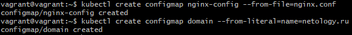
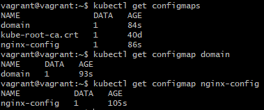
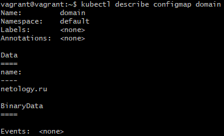
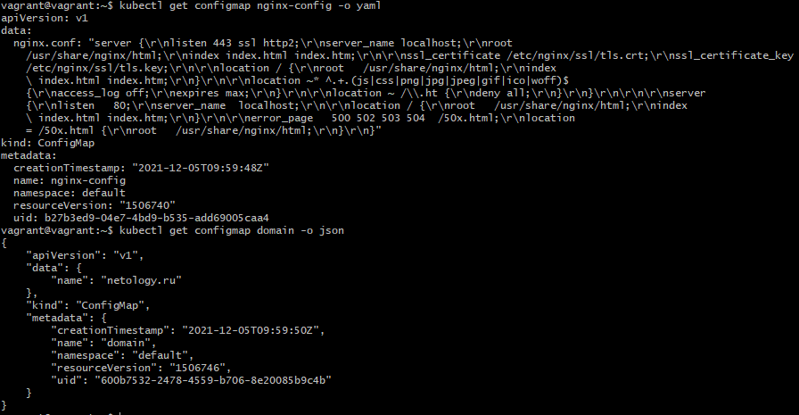
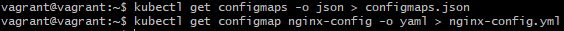
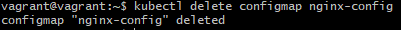
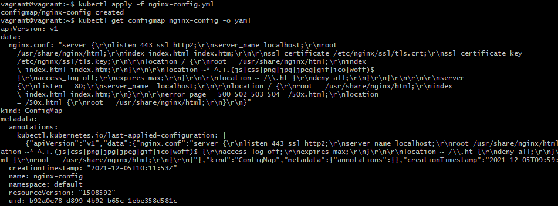
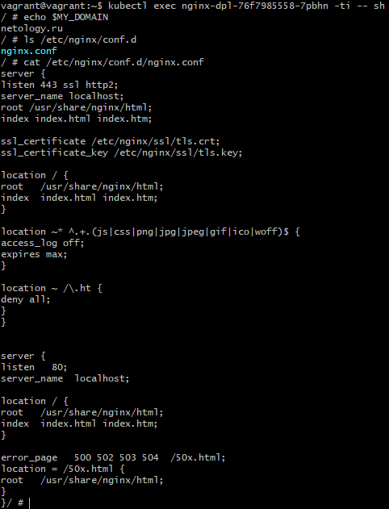

# Домашнее задание к занятию "14.3 Карты конфигураций"

## Задача 1: Работа с картами конфигураций через утилиту kubectl в установленном minikube

Выполните приведённые команды в консоли. Получите вывод команд. Сохраните
задачу 1 как справочный материал.

### Как создать карту конфигураций?

```bash
kubectl create configmap nginx-config --from-file=nginx.conf
kubectl create configmap domain --from-literal=name=netology.ru
```

> **Выполнение:**    
> 
>  


### Как просмотреть список карт конфигураций?

```bash
kubectl get configmaps
kubectl get configmap
```

> **Выполнение:**    
> 
>  

### Как просмотреть карту конфигурации?

```bash
kubectl get configmap nginx-config
kubectl describe configmap domain
```

> **Выполнение:**    
> 
>  

### Как получить информацию в формате YAML и/или JSON?

```bash
kubectl get configmap nginx-config -o yaml
kubectl get configmap domain -o json
```

> **Выполнение:**    
> 
>  

### Как выгрузить карту конфигурации и сохранить его в файл?

```bash
kubectl get configmaps -o json > configmaps.json
kubectl get configmap nginx-config -o yaml > nginx-config.yml
```

> **Выполнение:**    
> 
>  

### Как удалить карту конфигурации?

```bash
kubectl delete configmap nginx-config
```

> **Выполнение:**    
> 
>  

### Как загрузить карту конфигурации из файла?

```bash
kubectl apply -f nginx-config.yml
```

> **Выполнение:**    
> 
>  

## Задача 2 (*): Работа с картами конфигураций внутри модуля

Выбрать любимый образ контейнера, подключить карты конфигураций и проверить
их доступность как в виде переменных окружения, так и в виде примонтированного
тома

> **Выполнение:**    
> В переменной окружения будем использовать configMap `domain` из предыдущего задания, а в виде тома будем монтировать карту [`nginx-config`](nginx.conf).    
> Для деплоймента nginx нам понадобятся так же сертификаты, создадим secret для них:
> ```bash
> kubectl create secret tls domain-cert --cert=cert.crt --key=cert.key
> ```
> Создадим [деплоймент](deployment.yaml) с подготовленными configMap:
> ```console
> vagrant@vagrant:~$ kubectl apply -f deployment.yaml
> deployment.apps/nginx-dpl created
> vagrant@vagrant:~$ kubectl get po -o wide
> NAME                                  READY   STATUS              RESTARTS         AGE    IP             NODE    NOMINATED NODE   READINESS GATES
> nginx-dpl-76f7985558-7pbhn            1/1     Running   0                33s    10.233.105.33   node4   <none>           <none>
> ```
> Проверяем:    
>     


