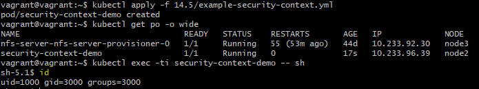

# Домашнее задание к занятию "14.5 SecurityContext, NetworkPolicies"

## Задача 1: Рассмотрите пример 14.5/example-security-context.yml

Создайте модуль

```
kubectl apply -f 14.5/example-security-context.yml
```

Проверьте установленные настройки внутри контейнера

```
kubectl logs security-context-demo
uid=1000 gid=3000 groups=3000
```

> **Выполнение:**    
> 
>  


## Задача 2 (*): Рассмотрите пример 14.5/example-network-policy.yml

Создайте два модуля. Для первого модуля разрешите доступ к внешнему миру
и ко второму контейнеру. Для второго модуля разрешите связь только с
первым контейнером. Проверьте корректность настроек.

> **Выполнение:**    
> 
> Пометим наш нейспейс, а также "kube-system" для фильтрации в дальнейшем:
> ```console
> vagrant@vagrant:~/14.5$ kubectl label namespace production project=myproject
> namespace/production labeled
> kubectl label namespace kube-system name=kube-system
> namespace/kube-system labeled
> ```
>
> Создадим и разместим [деплоймент для второго компонента](deployment-backend.yml) (backend):
> ```console
> vagrant@vagrant:~/14.5$  kubectl create -f deployment-backend.yml -n production
> deployment.apps/backend-dpl created
> service/backend created
> ```
>
> Создадим и разместим [деплоймент для первого компонента](deployment-frontend.yml) (frontend):
> ```console
> vagrant@vagrant:~/14.5$ kubectl create -f deployment-frontend.yml -n production
> deployment.apps/frontend-dpl created
> service/frontend created
> ```
> 
> Проверяем поды:
> ```console
> vagrant@vagrant:~/14.5$ kubectl get  po -n production
> NAME                            READY   STATUS    RESTARTS   AGE
> backend-dpl-595b644d67-5d6x6    1/1     Running   0          41s
> db-dpl-0                        1/1     Running   0          2m57s
> frontend-dpl-7d89758b96-h6gtb   1/1     Running   0          21s
> ```
> 
> Проверяем доступ между подами и вне кластера:
> ```console
> vagrant@vagrant:~/14.5$ kubectl exec -ti frontend-dpl-7d89758b96-h6gtb -n production -- sh
> 
> # curl -i http://backend:9000
> HTTP/1.1 404 Not Found
> date: Sun, 12 Dec 2021 11:14:33 GMT
> server: uvicorn
> content-length: 22
> content-type: application/json
> 
> # curl -i ya.ru
> HTTP/1.1 302 Found
> Cache-Control: no-cache,no-store,max-age=0,must-revalidate
> Content-Length: 0
> Date: Sun, 12 Dec 2021 11:19:41 GMT
> ...
> ^d
>
> vagrant@vagrant:~/14.5$ kubectl exec -ti backend-dpl-595b644d67-5d6x6 -n production -- sh
> # curl -i ya.ru
> HTTP/1.1 302 Found
> Cache-Control: no-cache,no-store,max-age=0,must-revalidate
> Content-Length: 0
> Date: Sun, 12 Dec 2021 11:21:29 GMT
> ...
> ```
>
> Применяем [политику для backend](backend-network-policy.yml) и [политику для frontend](frontend-network-policy.yml) подов:
> ```console
> vagrant@vagrant:~/14.5$ kubectl apply -f backend-network-policy.yml
> networkpolicy.networking.k8s.io/allow-dns-access created
> networkpolicy.networking.k8s.io/backend-network-policy created
> vagrant@vagrant:~/14.5$ kubectl apply -f frontend-network-policy.yml
> networkpolicy.networking.k8s.io/frontend-network-policy created
> ```
> 
> Проверяем доступ между подами и вне кластера из frontend:
> ```console
> vagrant@vagrant:~/14.5$ kubectl exec -ti frontend-dpl-7d89758b96-h6gtb -n production -- sh
> # curl -i http://backend:9000
> HTTP/1.1 404 Not Found
> date: Sun, 12 Dec 2021 11:25:04 GMT
> server: uvicorn
> content-length: 22
> content-type: application/json
> {"detail":"Not Found"}#
> 
> # curl -i ya.ru
> HTTP/1.1 302 Found
> Cache-Control: no-cache,no-store,max-age=0,must-revalidate
> Content-Length: 0
> Date: Sun, 12 Dec 2021 11:25:21 GMT
> ...
> ^d
> ```
> 
> Проверяем доступ между подами и вне кластера из backend:
> ```console
> vagrant@vagrant:~/14.5$ kubectl exec -ti backend-dpl-595b644d67-5d6x6 -n production -- sh
> # cat /etc/resolv.conf
> search production.svc.cluster.local svc.cluster.local cluster.local
> nameserver 169.254.25.10
> options ndots:5
> # curl -i http://frontend
> HTTP/1.1 200 OK
> Server: nginx/1.21.3
> Date: Mon, 13 Dec 2021 08:45:59 GMT
> ...
>
> # curl -i http://ya.ru
> curl: (7) Failed to connect to ya.ru port 80: Connection timed out
> ```

---

***Использованные материалы***

https://projectcalico.docs.tigera.io/security/kubernetes-network-policy    
https://tufin.medium.com/best-practices-for-kubernetes-network-policies-2b643c4b1aa    
https://orca.tufin.io/netpol/    
https://habr.com/ru/company/flant/blog/490174/    
https://kubernetes.io/docs/concepts/services-networking/dns-pod-service/    

---

Андрей Копылов (преподаватель)
13 декабря 2021 22:32

Добрый день!

Отлично
