# Домашнее задание к занятию "15.1. Организация сети"

Домашнее задание будет состоять из обязательной части, которую необходимо выполнить на провайдере Яндекс.Облако и дополнительной части в AWS по желанию. Все домашние задания в 15 блоке связаны друг с другом и в конце представляют пример законченной инфраструктуры.  
Все задания требуется выполнить с помощью Terraform, результатом выполненного домашнего задания будет код в репозитории. 

Перед началом работ следует настроить доступ до облачных ресурсов из Terraform используя материалы прошлых лекций и [ДЗ](https://github.com/netology-code/virt-homeworks/tree/master/07-terraform-02-syntax ). А также заранее выбрать регион (в случае AWS) и зону
---
## Вариант с Яндекс.Облако. (Обязательная часть)

1. Создать VPC.
- Создать пустую VPC. Выбрать зону.
2. Публичная подсеть.
- Создать в vpc subnet с названием public, сетью 192.168.10.0/24.
- Создать в этой подсети NAT-инстанс, присвоив ему адрес 192.168.10.254. В качестве image_id использовать fd80mrhj8fl2oe87o4e1
- Создать в этой публичной подсети виртуалку с публичным IP и подключиться к ней, убедиться что есть доступ к интернету.
3. Приватная подсеть.
- Создать в vpc subnet с названием private, сетью 192.168.20.0/24.
- Создать route table. Добавить статический маршрут, направляющий весь исходящий трафик private сети в NAT-инстанс
- Создать в этой приватной подсети виртуалку с внутренним IP, подключиться к ней через виртуалку, созданную ранее и убедиться что есть доступ к интернету

Resource terraform для ЯО
- [VPC subnet](https://registry.terraform.io/providers/yandex-cloud/yandex/latest/docs/resources/vpc_subnet)
- [Route table](https://registry.terraform.io/providers/yandex-cloud/yandex/latest/docs/resources/vpc_route_table)
- [Compute Instance](https://registry.terraform.io/providers/yandex-cloud/yandex/latest/docs/resources/compute_instance)

> **Выполнение:**    
> 
> Для начала установим Terraform
> ```console
> curl -fsSL https://apt.releases.hashicorp.com/gpg | sudo apt-key add -
> sudo apt-add-repository "deb [arch=amd64] https://apt.releases.hashicorp.com $(lsb_release -cs) main"
> sudo apt update && sudo apt install terraform
> ```
>
> Подготовим конфигурацию для подключения к облаку:
> ```console
> vagrant@vagrant:~$ mkdir yandex-cloud-terraform
> vagrant@vagrant:~$ cd yandex-cloud-terraform
> vagrant@vagrant:~/yandex-cloud-terraform$ vim main.tf
> vagrant@vagrant:~/yandex-cloud-terraform$ export YC_TOKEN="XXXXXXXXXXXXXXXXXXXXX-XXXXXXXXXXXX"
> vagrant@vagrant:~/yandex-cloud-terraform$ terraform init
> ```
>
> Получим IAM-тоекен для работы через API:
> ```console
> vagrant@vagrant:~/yandex-cloud-terraform$ curl -d "{"yandexPassportOauthToken":$YC_TOKEN}" "https://iam.api.cloud.yandex.net/iam/v1/tokens"
> vagrant@vagrant:~/yandex-cloud-terraform$ export IAM_TOKEN="XXXXXXXXXXXXXXXX..."
> ```
>
> Получим список имэджей для создания ВМ:
> ```console
> curl -H "Authorization: Bearer ${IAM_TOKEN}" "https://compute.api.cloud.yandex.net/compute/v1/images?folderId=standard-images&pageSize=1000" > output.json
> ```
>
> Проверим подготовленную [конфигурацию Terraform](yandex-cloud-terraform/main.tf) и применим ее:
> ```console
> vagrant@vagrant:~/yandex-cloud-terraform$ terraform validate
> Success! The configuration is valid.
> vagrant@vagrant:~/yandex-cloud-terraform$ terraform fmt
> vagrant@vagrant:~/yandex-cloud-terraform$ terraform plan
> vagrant@vagrant:~/yandex-cloud-terraform$ terraform apply
> ```
> > Полученные ресурсы:    
> 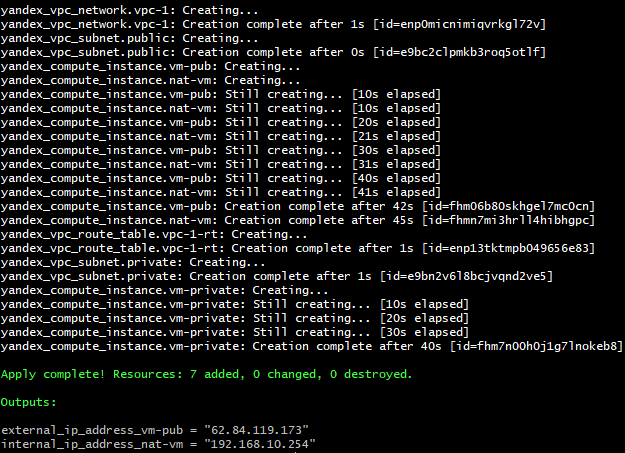
> 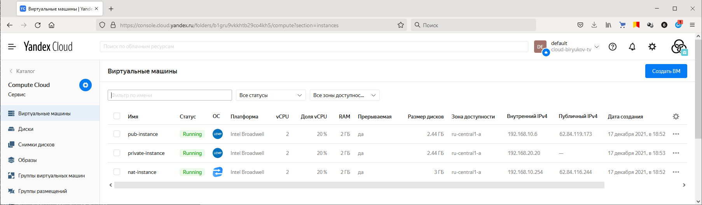    
> 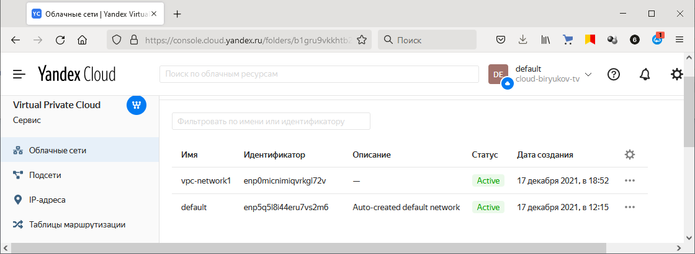    
> 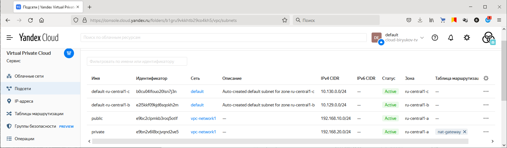    
> 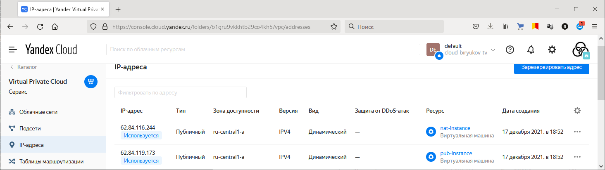    
> 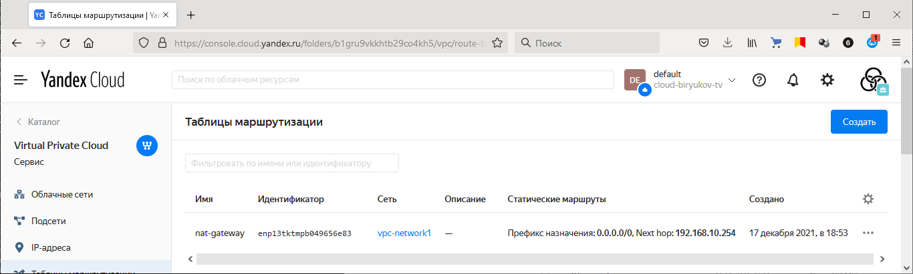    
>
> Проверим доступ из приватной подсети в интернет:
> ```console
> ubuntu@fhm06b80skhgel7mc0cn:~/.ssh$ vim ~/.ssh/id_rsa
> ubuntu@fhm06b80skhgel7mc0cn:~/.ssh$ vim ~/.ssh/id_rsa.pub
> ubuntu@fhm06b80skhgel7mc0cn:~/.ssh$ chmod 600 ~/.ssh/id_rsa
> ubuntu@fhm06b80skhgel7mc0cn:~/.ssh$ ssh ubuntu@192.168.20.20
> ```
> 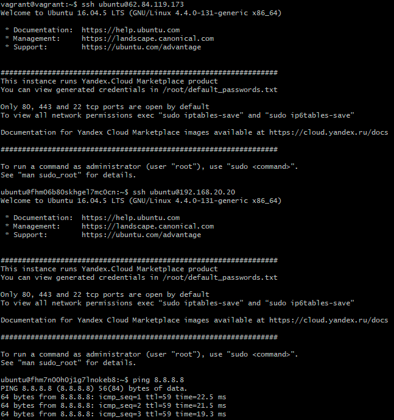    
>
> Удалим ресурсы:
> ```console
> vagrant@vagrant:~/yandex-cloud-terraform$ terraform destroy
> ```


---
## Вариант с  AWS. (Дополнительная часть)

1. Создать VPC.
- Cоздать пустую VPC с подсетью 10.10.0.0/16.
2. Публичная подсеть.
- Создать в vpc subnet с названием public, сетью 10.10.1.0/24
- Разрешить в данной subnet присвоение public IP по-умолчанию. 
- Создать Internet gateway 
- Добавить в таблицу маршрутизации маршрут, направляющий весь исходящий трафик в Internet gateway.
- Создать security group с разрешающими правилами на SSH и ICMP. Привязать данную security-group на все создаваемые в данном ДЗ виртуалки
- Создать в этой подсети виртуалку и убедиться, что инстанс имеет публичный IP. Подключиться к ней, убедиться что есть доступ к интернету.
- Добавить NAT gateway в public subnet.
3. Приватная подсеть.
- Создать в vpc subnet с названием private, сетью 10.10.2.0/24
- Создать отдельную таблицу маршрутизации и привязать ее к private-подсети
- Добавить Route, направляющий весь исходящий трафик private сети в NAT.
- Создать виртуалку в приватной сети.
- Подключиться к ней по SSH по приватному IP через виртуалку, созданную ранее в публичной подсети и убедиться, что с виртуалки есть выход в интернет.

Resource terraform
- [VPC](https://registry.terraform.io/providers/hashicorp/aws/latest/docs/resources/vpc)
- [Subnet](https://registry.terraform.io/providers/hashicorp/aws/latest/docs/resources/subnet)
- [Internet Gateway](https://registry.terraform.io/providers/hashicorp/aws/latest/docs/resources/internet_gateway)


> **Выполнение:**    
> 
> Подготовим конфигурацию для подключения к облаку AWS:
> ```console
> vagrant@vagrant:~$ mkdir aws-cloud-terraform
> vagrant@vagrant:~$ cd aws-cloud-terraform
> vagrant@vagrant:~/aws-cloud-terraform$  export AWS_ACCESS_KEY_ID="XXXXXXXXXXXXXXXX"
> vagrant@vagrant:~/aws-cloud-terraform$  export AWS_SECRET_ACCESS_KEY="XXXXXXXXXXXXXXXXXXXXXXXXXXXX"
> vagrant@vagrant:~/aws-cloud-terraform$ terraform init
> ```
> 
> Выгрузим пару ARS ключей сделанную в AWS и поменяем на нее права:
> ```console
> vagrant@vagrant:~$ chmod 600 .ssh/aws_key.pem
> ```
>
> Проверим подготовленную [конфигурацию Terraform](aws-cloud-terraform/main.tf) и применим ее:
> ```console
> vagrant@vagrant:~/aws-cloud-terraform$ terraform validate
> vagrant@vagrant:~/aws-cloud-terraform$ terraform fmt
> main.tf
> variables.tf
> vagrant@vagrant:~/aws-cloud-terraform$ terraform plan
> vagrant@vagrant:~/aws-cloud-terraform$ terraform apply
> ```
>
> Полученные ресурсы (на скриншотах только WebUI наиболее важные):    
> 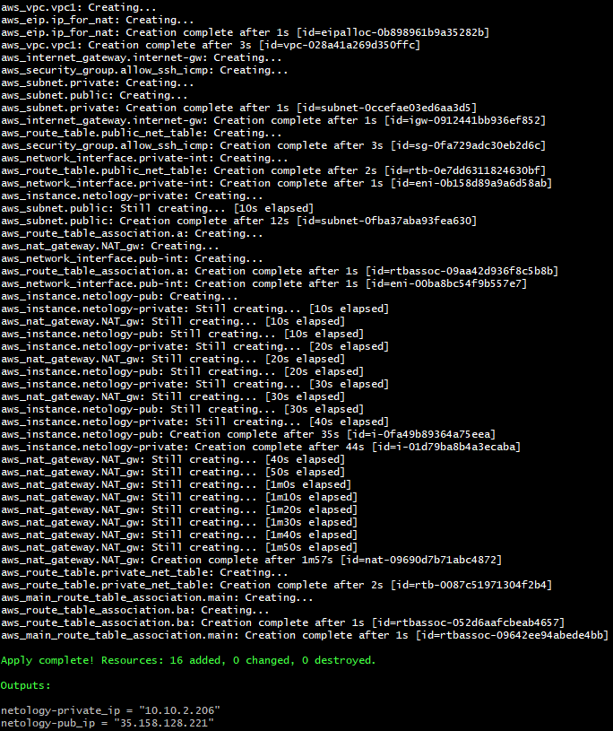    
> 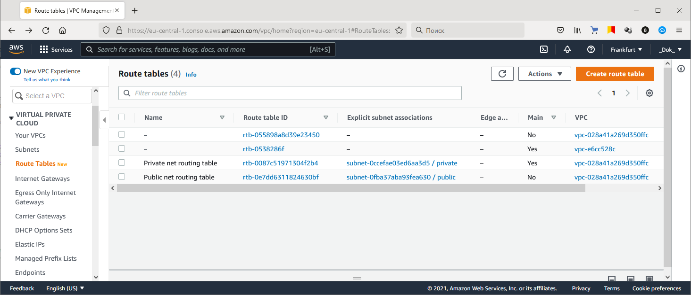    
> 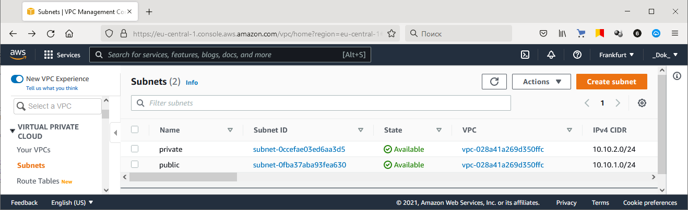    
> 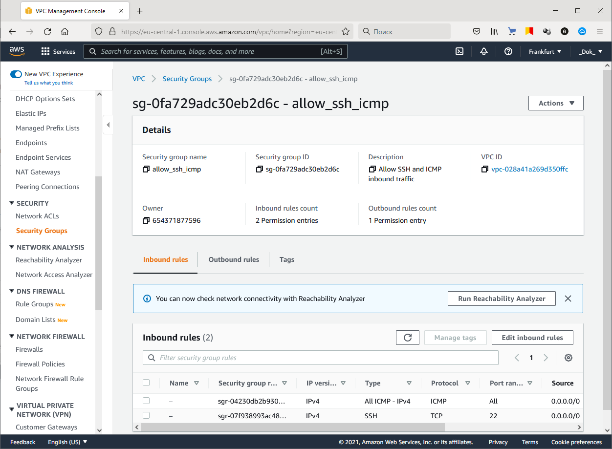    
> 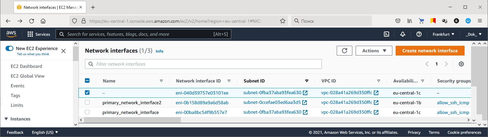    
> 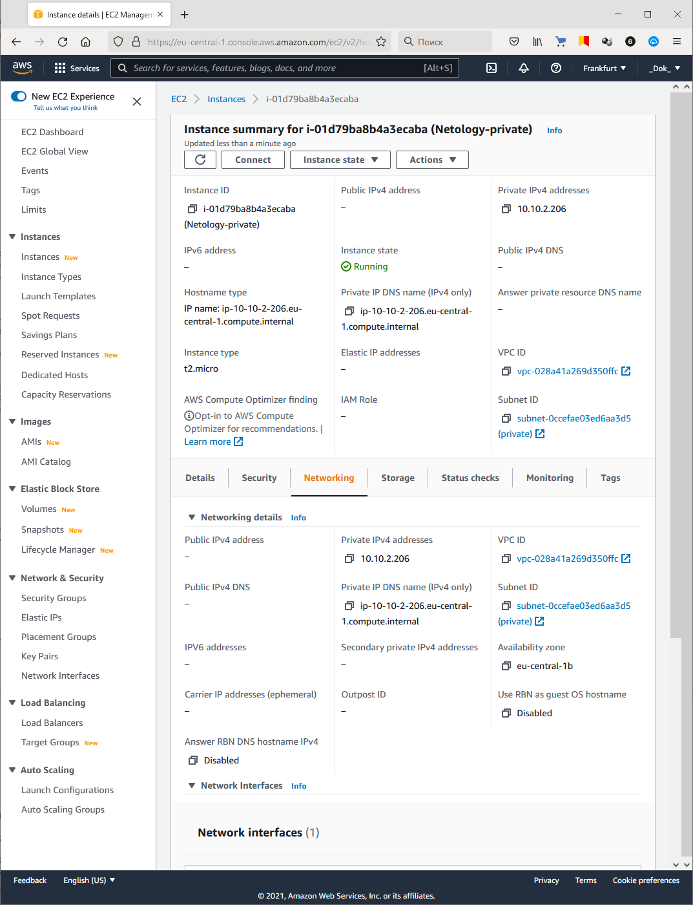    
> 
> Проверяем работу:    
> 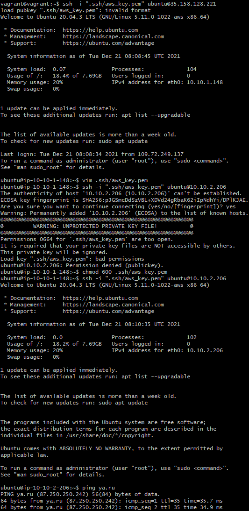   
>
> Удалим ресурсы:
> ```console
> vagrant@vagrant:~/aws-cloud-terraform$ terraform destroy
> ```

---

***Использованные материалы***

https://cloud.yandex.ru/docs/iam/concepts/authorization/oauth-token    
https://cloud.yandex.ru/docs/solutions/infrastructure-management/terraform-quickstart#configure-terraform    
https://cloud.yandex.ru/docs/solutions/routing/nat-instance    
https://www.ibm.com/docs/en/qsip/7.3.2?topic=applications-icmp-type-code-ids    
https://www.iana.org/assignments/icmp-parameters/icmp-parameters.xhtml    
https://www.globaldots.com/resources/blog/aws-nat-gateway-and-high-availability-nat-instances-with-auto-scaling/    
https://docs.aws.amazon.com/vpc/latest/userguide/vpc-nat-gateway.html#nat-gateway-creating    

---

Денис Альмухаметов (преподаватель)
21 декабря 2021 19:59

Добрый день

Все отлично! Отдельный респект за AWS!
Успехов в дальнейших работах!
