# Домашнее задание к занятию 15.2 "Вычислительные мощности. Балансировщики нагрузки".
Домашнее задание будет состоять из обязательной части, которую необходимо выполнить на провайдере Яндекс.Облако, и дополнительной части в AWS (можно выполнить по желанию). Все домашние задания в 15 блоке связаны друг с другом и в конце представляют пример законченной инфраструктуры.
Все задания требуется выполнить с помощью Terraform, результатом выполненного домашнего задания будет код в репозитории. Перед началом работ следует настроить доступ до облачных ресурсов из Terraform, используя материалы прошлых лекций и ДЗ.

---
## Задание 1. Яндекс.Облако (обязательное к выполнению)

1. Создать bucket Object Storage и разместить там файл с картинкой:
- Создать bucket в Object Storage с произвольным именем (например, _имя_студента_дата_);
- Положить в bucket файл с картинкой;
- Сделать файл доступным из Интернет.
2. Создать группу ВМ в public подсети фиксированного размера с шаблоном LAMP и web-страничкой, содержащей ссылку на картинку из bucket:
- Создать Instance Group с 3 ВМ и шаблоном LAMP. Для LAMP рекомендуется использовать `image_id = fd827b91d99psvq5fjit`;
- Для создания стартовой веб-страницы рекомендуется использовать раздел `user_data` в [meta_data](https://cloud.yandex.ru/docs/compute/concepts/vm-metadata);
- Разместить в стартовой веб-странице шаблонной ВМ ссылку на картинку из bucket;
- Настроить проверку состояния ВМ.
3. Подключить группу к сетевому балансировщику:
- Создать сетевой балансировщик;
- Проверить работоспособность, удалив одну или несколько ВМ.
4. *Создать Application Load Balancer с использованием Instance group и проверкой состояния.

Документация
- [Compute instance group](https://registry.terraform.io/providers/yandex-cloud/yandex/latest/docs/resources/compute_instance_group)
- [Network Load Balancer](https://registry.terraform.io/providers/yandex-cloud/yandex/latest/docs/resources/lb_network_load_balancer)
- [Группа ВМ с сетевым балансировщиком](https://cloud.yandex.ru/docs/compute/operations/instance-groups/create-with-balancer)


> **Выполнение:**    
> 
> Получились следующие блоки:    
> [Конфигурация Terraform](yandex-cloud-terraform/main.tf) с блоками задания.    
> [Конфигурация Terraform](yandex-cloud-terraform/network.tf) для сети.
>
> Полученные ресурсы после применения (на скриншотах только WebUI наиболее важные):    
> 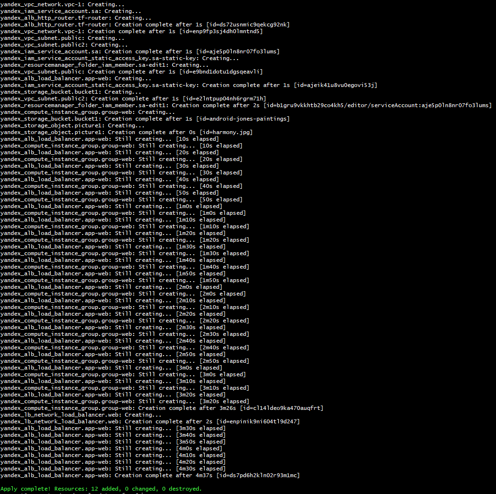    
>     
>     
> 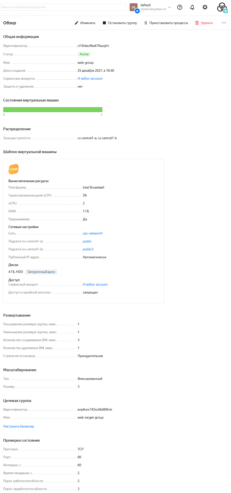    
> 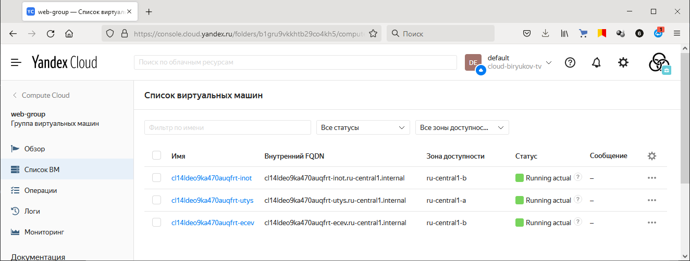    
> 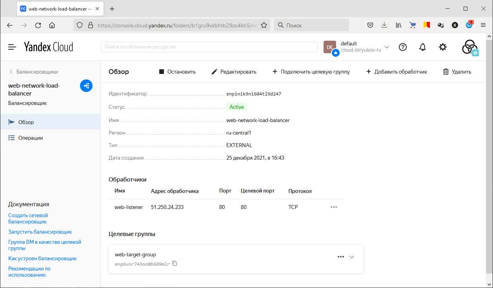    
> 
> Проверяем работу на балансировщике:    
> 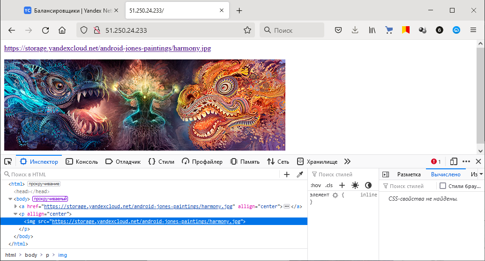   
>
> Application load balancer из тераформа получился кривой, с одной зоной доступности. И как добавить вторую непонятно. Документация очень слабая и сырая. Из WebUI получилось нормально. С "output" вообще беда в обоих случаях, не реализован даже вывод выдавемого ip. 
>
> ```console
> vagrant@vagrant:~/yandex-cloud-terraform$ terraform destroy
> ```

---
## Задание 2*. AWS (необязательное к выполнению)

Используя конфигурации, выполненные в рамках ДЗ на предыдущем занятии, добавить к Production like сети Autoscaling group из 3 EC2-инстансов с  автоматической установкой web-сервера в private домен.

1. Создать bucket S3 и разместить там файл с картинкой:
- Создать bucket в S3 с произвольным именем (например, _имя_студента_дата_);
- Положить в bucket файл с картинкой;
- Сделать доступным из Интернета.
2. Сделать Launch configurations с использованием bootstrap скрипта с созданием веб-странички на которой будет ссылка на картинку в S3. 
3. Загрузить 3 ЕС2-инстанса и настроить LB с помощью Autoscaling Group.

Resource terraform
- [S3 bucket](https://registry.terraform.io/providers/hashicorp/aws/latest/docs/resources/s3_bucket)
- [Launch Template](https://registry.terraform.io/providers/hashicorp/aws/latest/docs/resources/launch_template)
- [Autoscaling group](https://registry.terraform.io/providers/hashicorp/aws/latest/docs/resources/autoscaling_group)
- [Launch configuration](https://registry.terraform.io/providers/hashicorp/aws/latest/docs/resources/launch_configuration)

Пример bootstrap-скрипта:
```bash
#!/bin/bash
yum install httpd -y
service httpd start
chkconfig httpd on
cd /var/www/html
echo "<html><h1>My cool web-server</h1></html>" > index.html
```

> **Выполнение:**    
> 
> Схема для выполнения:    
> 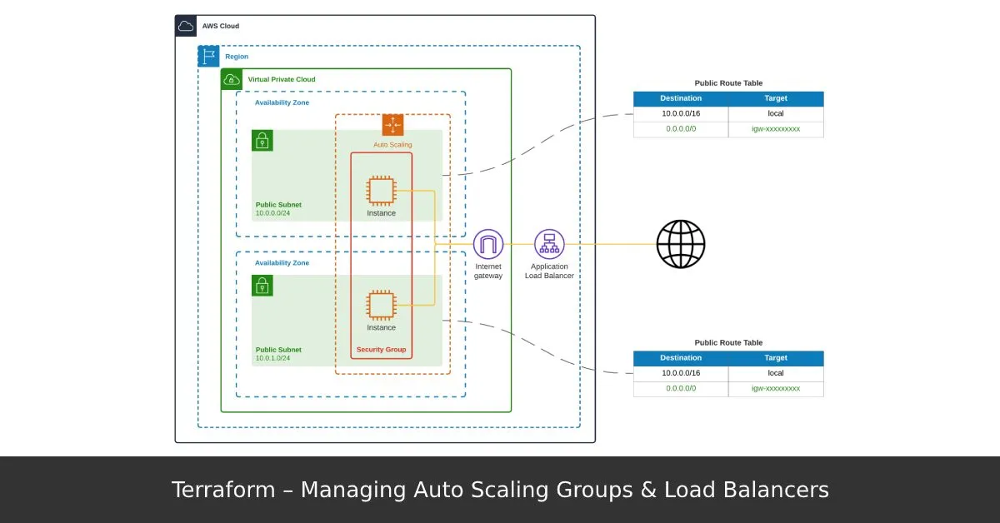   
>
> Получились следующие блоки:    
> [Конфигурация Terraform](aws-cloud-terraform/main.tf) с блоками задания.    
> [Конфигурация Terraform](aws-cloud-terraform/network.tf) для сети.
>
> Полученные ресурсы после применения (на скриншотах только WebUI наиболее важные):    
> 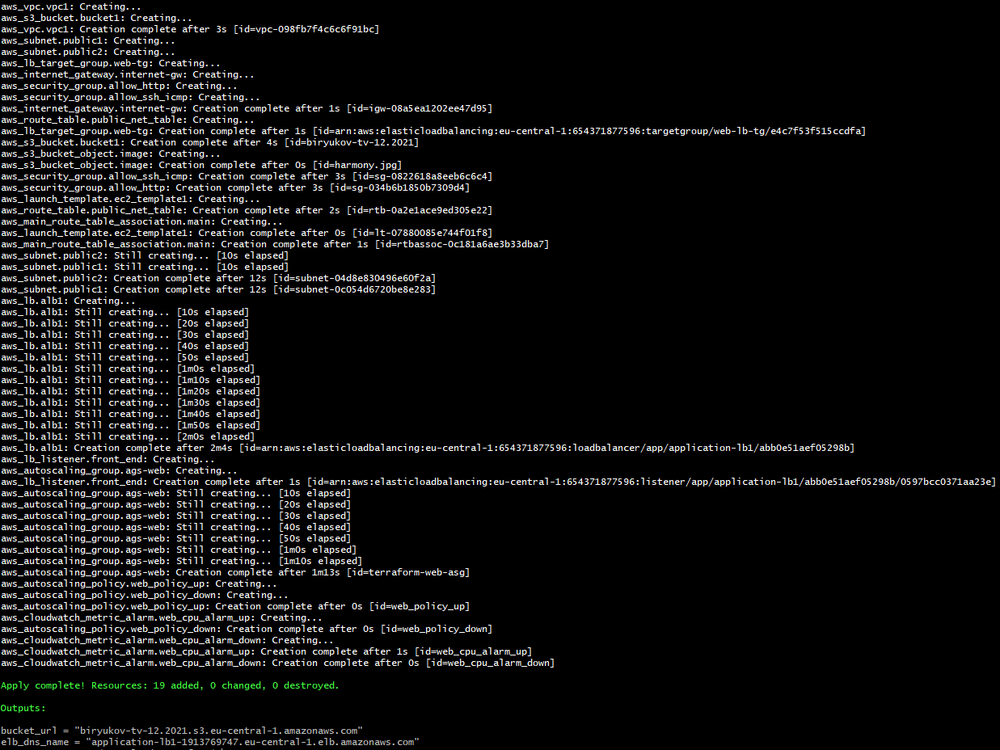    
> 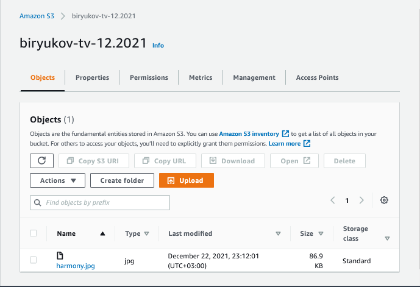    
> 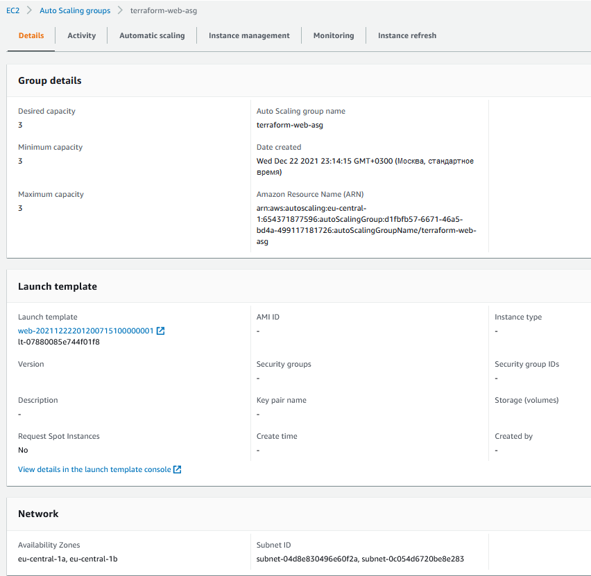    
> 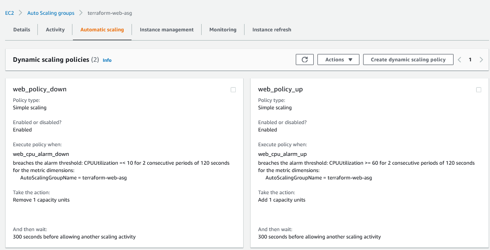    
>     
> 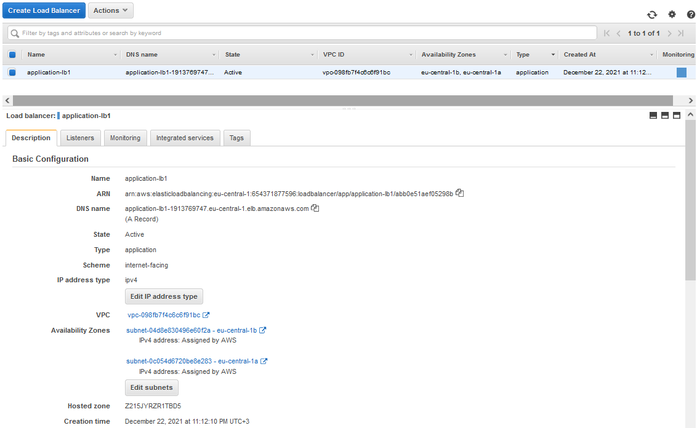    
> 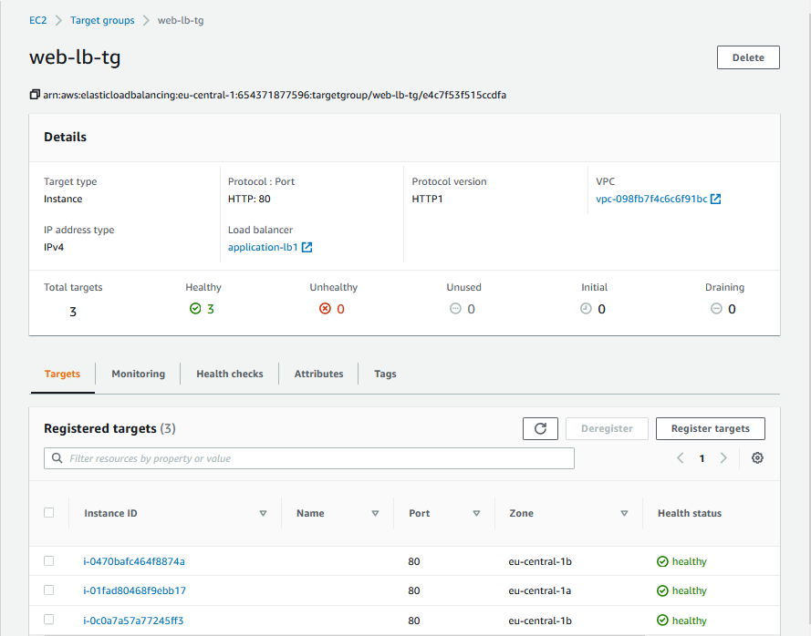  
> 
> Проверяем работу на балансировщике:    
> 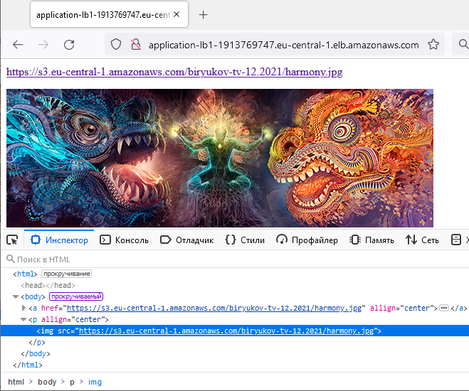   
>
> Удалим ресурсы:
> ```console
> vagrant@vagrant:~/aws-cloud-terraform$ terraform destroy
> ```

---

***Использованные материалы***

https://cloud.yandex.ru/docs/compute/concepts/vm-metadata#keys-processed-in-public-images    
https://cloud.yandex.com/en/docs/iam/concepts/access-control/roles    
https://docs.aws.amazon.com/AmazonS3/latest/userguide/bucketnamingrules.html    
https://registry.terraform.io/providers/hashicorp/aws/latest/docs/resources/s3_bucket_object    
https://hands-on.cloud/terraform-recipe-managing-auto-scaling-groups-and-load-balancers/    
https://github.com/terraform-aws-modules/terraform-aws-autoscaling/issues/16    
https://stackoverflow.com/questions/57538965/aws-lb-target-group-attachment-attaching-multiple-instances-to-per-target-group    
https://ramasankarmolleti.com/2021/02/18/configure-ec2-alb-using-terraform/    

---

Денис Альмухаметов (преподаватель)
26 декабря 2021 12:49

Добрый день

Все очень круто!
Некоторые вещи заберу себе в качестве примера оформления!
