# Домашнее задание к занятию 15.3 "Безопасность в облачных провайдерах"
Используя конфигурации, выполненные в рамках предыдущих домашних заданиях, нужно добавить возможность шифрования бакета.

---
## Задание 1. Яндекс.Облако (обязательное к выполнению)
1. С помощью ключа в KMS необходимо зашифровать содержимое бакета:
- Создать ключ в KMS,
- С помощью ключа зашифровать содержимое бакета, созданного ранее.

> **Выполнение:**    
> 
> [Конфигурация Terraform](yandex-cloud-terraform/main.tf) с блоками задания.
>
> Получаемые ресурсы:    
> 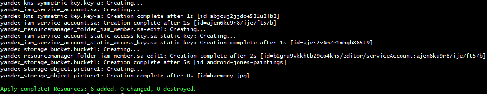   


2. (Выполняется НЕ в terraform) *Создать статический сайт в Object Storage c собственным публичным адресом и сделать доступным по HTTPS
- Создать сертификат,
- Создать статическую страницу в Object Storage и применить сертификат HTTPS,
- В качестве результата предоставить скриншот на страницу с сертификатом в заголовке ("замочек").

> **Выполнение:**    
> 
> 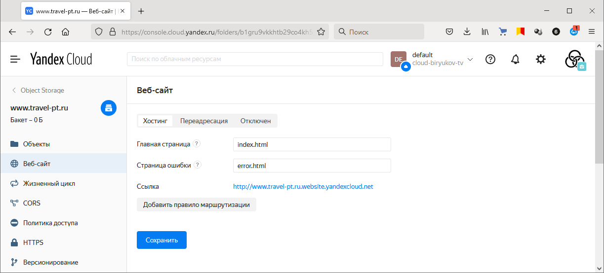    
> 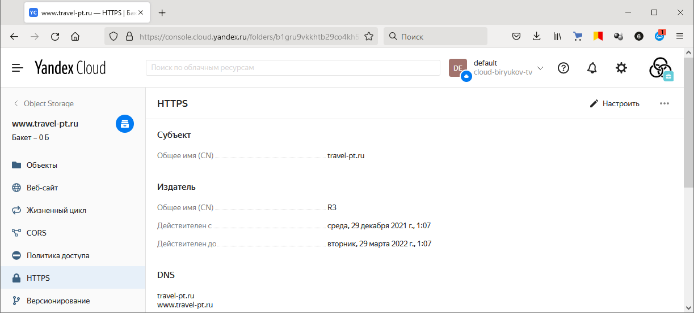    
> 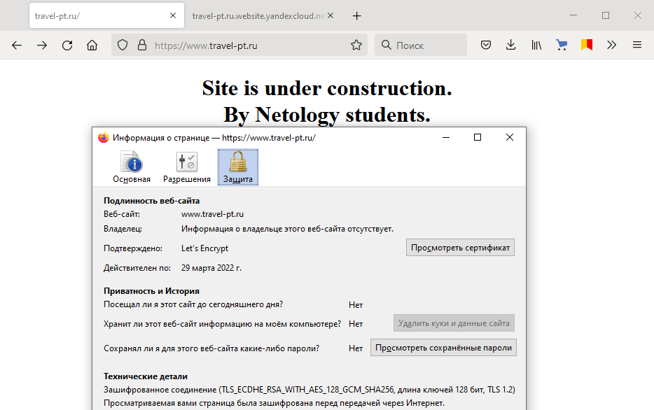    


Документация
- [Настройка HTTPS статичного сайта](https://cloud.yandex.ru/docs/storage/operations/hosting/certificate)
- [Object storage bucket](https://registry.terraform.io/providers/yandex-cloud/yandex/latest/docs/resources/storage_bucket)
- [KMS key](https://registry.terraform.io/providers/yandex-cloud/yandex/latest/docs/resources/kms_symmetric_key)


--- 
## Задание 2*. AWS (необязательное к выполнению)

1. С помощью роли IAM записать файлы ЕС2 в S3-бакет:
- Создать роль в IAM для возможности записи в S3 бакет;
- Применить роль к ЕС2-инстансу;
- С помощью бутстрап скрипта записать в бакет файл web-страницы.

> **Выполнение:**    
> 
> [Конфигурация Terraform](aws-cloud-terraform/) с блоками задания 1.
>
> Получаемые ресурсы:    
> 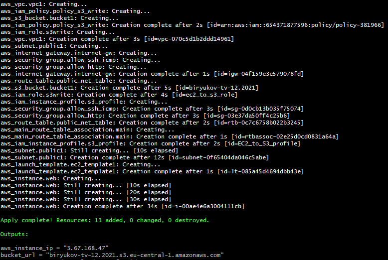  
> 
> Файл в бакете:    
> 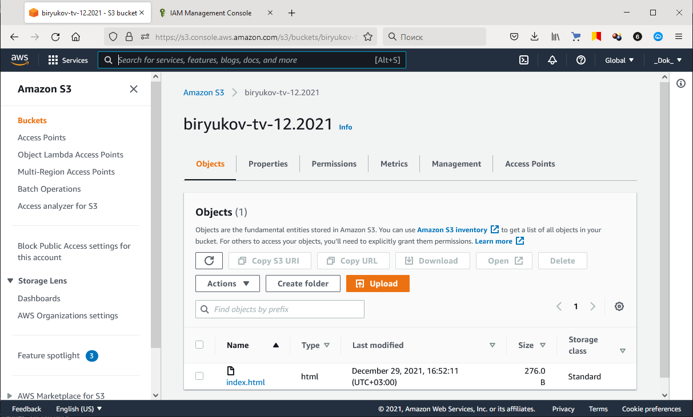  


2. Организация шифрования содержимого S3-бакета:
- Используя конфигурации, выполненные в рамках ДЗ на предыдущем занятии, добавить к созданному ранее bucket S3 возможность шифрования Server-Side, используя общий ключ;
- Включить шифрование SSE-S3 bucket S3 для шифрования всех вновь добавляемых объектов в данный bucket.

> **Выполнение:**    
>
> Нати ресурс для шифрования уже созданного bucket в AWS не удалось. Поэтому как вариант реализовал политику ограничивающую загрузку нешифрованных объектов в бакет.    
> [Конфигурация Terraform](aws-cloud-terraform2/main.tf) с блоками задания 2.
>
> Получаемые ресурсы:    
> 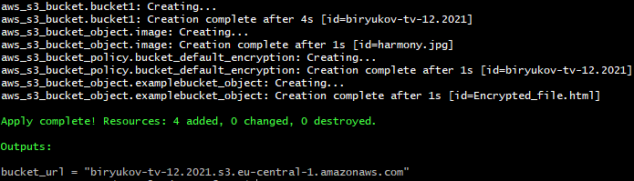  
> 
> Попробуем загрузить файл без шифрования:    
> 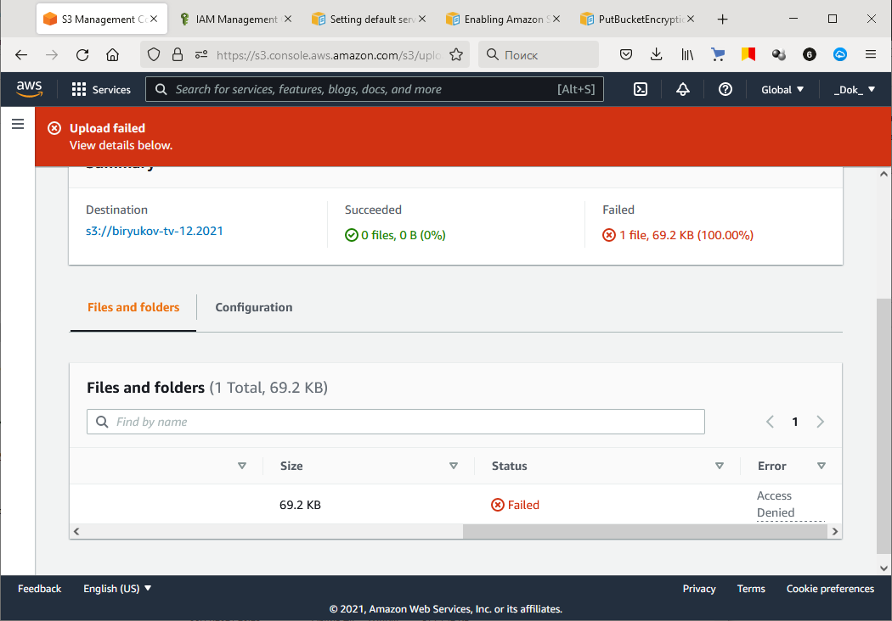  


3. *Создание сертификата SSL и применение его к ALB:
- Создать сертификат с подтверждением по email;
- Сделать запись в Route53 на собственный поддомен, указав адрес LB;
- Применить к HTTPS запросам на LB созданный ранее сертификат.

> **Выполнение:**    
> 
> Полученный сертификат:    
> 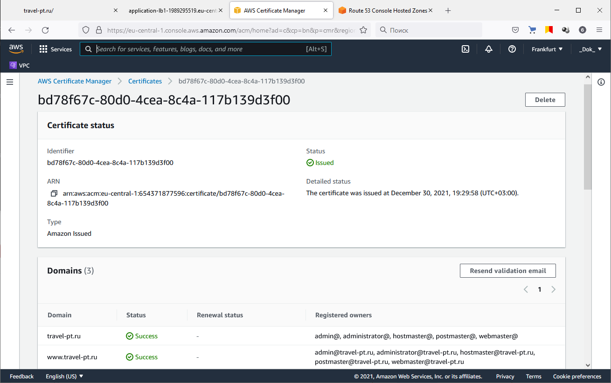    
>
> [Конфигурация Terraform](aws-cloud-terraform3/) с блоками задания 3.
>
> Получаемые ресурсы:    
> 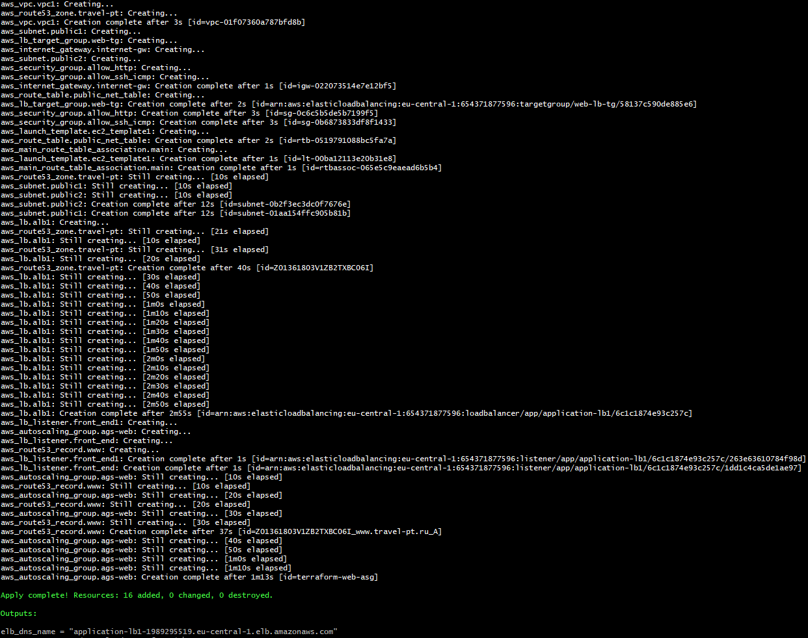  
> 
> Результаты:
> 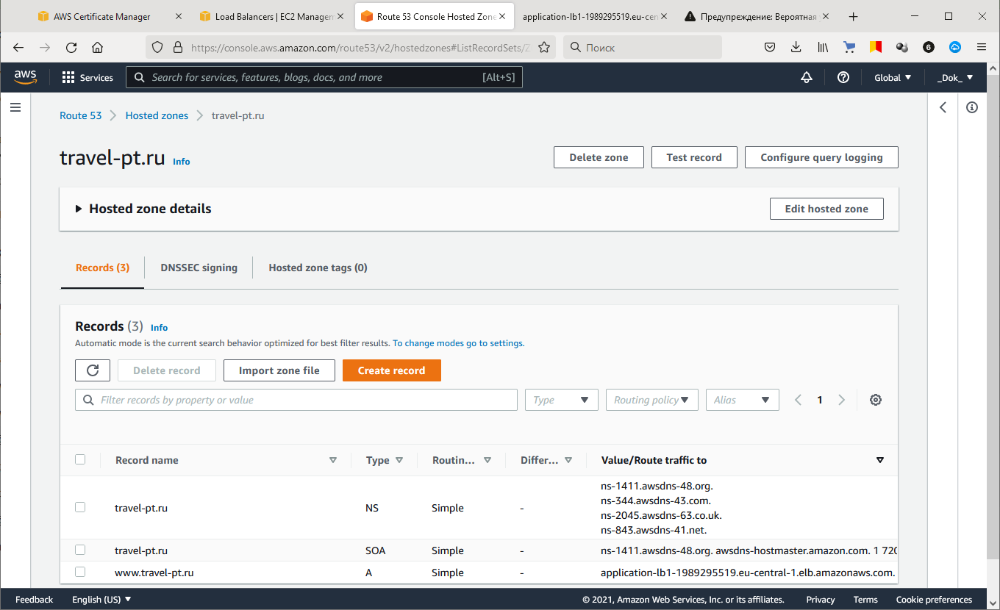    
> 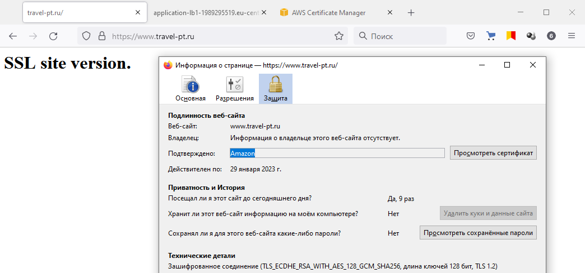    
> 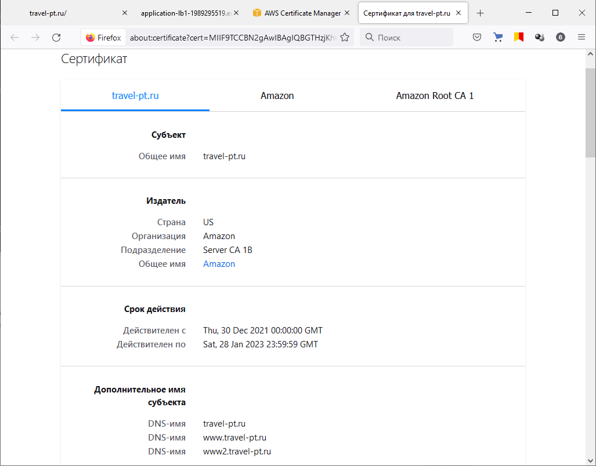    

  

Resource terraform
- [IAM Role](https://registry.terraform.io/providers/hashicorp/aws/latest/docs/resources/iam_role)
- [AWS KMS](https://registry.terraform.io/providers/hashicorp/aws/latest/docs/resources/kms_key)
- [S3 encrypt with KMS key](https://registry.terraform.io/providers/hashicorp/aws/latest/docs/resources/s3_bucket_object#encrypting-with-kms-key)

Пример bootstrap-скрипта:
```
#!/bin/bash
yum install httpd -y
service httpd start
chkconfig httpd on
cd /var/www/html
echo "<html><h1>My cool web-server</h1></html>" > index.html
aws s3 mb s3://mysuperbacketname2021
aws s3 cp index.html s3://mysuperbacketname2021
```

---

***Использованные материалы***

https://cloud.yandex.ru/docs/solutions/web/static    
https://cloud.yandex.ru/docs/certificate-manager/concepts/managed-certificate    
https://docs.aws.amazon.com/AmazonS3/latest/userguide/UsingServerSideEncryption.html    
https://habr.com/ru/company/iloveip/blog/339648/    
https://docs.aws.amazon.com/Route53/latest/DeveloperGuide/routing-to-elb-load-balancer.html    
https://registry.terraform.io/providers/hashicorp/aws/latest/docs/resources/route53_record    
https://registry.terraform.io/providers/hashicorp/aws/latest/docs/resources/route53_hosted_zone_dnssec    