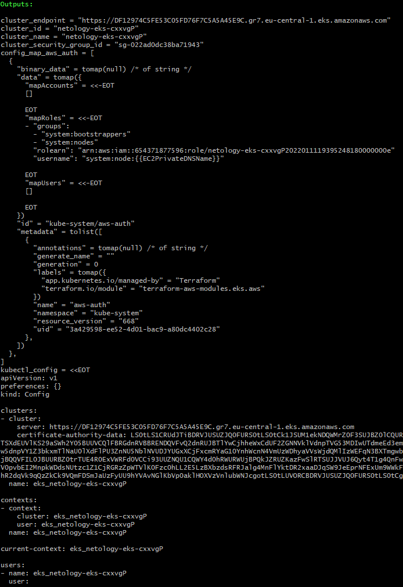

# Домашнее задание к занятию 15.4 "Кластеры. Ресурсы под управлением облачных провайдеров"

Организация кластера Kubernetes и кластера баз данных MySQL в отказоустойчивой архитектуре.
Размещение в private подсетях кластера БД, а в public - кластера Kubernetes.

---
## Задание 1. Яндекс.Облако (обязательное к выполнению)

1. Настроить с помощью Terraform кластер баз данных MySQL:
- Используя настройки VPC с предыдущих ДЗ, добавить дополнительно подсеть private в разных зонах, чтобы обеспечить отказоустойчивость 
- Разместить ноды кластера MySQL в разных подсетях
- Необходимо предусмотреть репликацию с произвольным временем технического обслуживания
- Использовать окружение PRESTABLE, платформу Intel Broadwell с производительностью 50% CPU и размером диска 20 Гб
- Задать время начала резервного копирования - 23:59
- Включить защиту кластера от непреднамеренного удаления
- Создать БД с именем `netology_db` c логином и паролем

2. Настроить с помощью Terraform кластер Kubernetes
- Используя настройки VPC с предыдущих ДЗ, добавить дополнительно 2 подсети public в разных зонах, чтобы обеспечить отказоустойчивость
- Создать отдельный сервис-аккаунт с необходимыми правами 
- Создать региональный мастер kubernetes с размещением нод в разных 3 подсетях
- Добавить возможность шифрования ключом из KMS, созданного в предыдущем ДЗ
- Создать группу узлов состояющую из 3 машин с автомасштабированием до 6
- Подключиться к кластеру с помощью `kubectl`
- *Запустить микросервис phpmyadmin и подключиться к БД, созданной ранее
- *Создать сервис типы Load Balancer и подключиться к phpmyadmin. Предоставить скриншот с публичным адресом и подключением к БД

Документация
- [MySQL cluster](https://registry.terraform.io/providers/yandex-cloud/yandex/latest/docs/resources/mdb_mysql_cluster)
- [Создание кластера kubernetes](https://cloud.yandex.ru/docs/managed-kubernetes/operations/kubernetes-cluster/kubernetes-cluster-create)
- [K8S Cluster](https://registry.terraform.io/providers/yandex-cloud/yandex/latest/docs/resources/kubernetes_cluster)
- [K8S node group](https://registry.terraform.io/providers/yandex-cloud/yandex/latest/docs/resources/kubernetes_node_group)

> **Выполнение:**    
> 
> [Конфигурация Terraform](yandex-cloud-terraform/) с блоками задания.
>
> Полученные ресурсы:    
>     
>     
>
>     
>     
>     
>     
>     
> 
> [Конфигурация для деплоймента](yandex-cloud-terraform/deployment/) в k8s.   
> 
> Ресурсы подключенного кластера после деплоя:    
>     
>
> Особенно нас интересует LoadBalancer-сервис, с подключеным автоматечески балансировщиком и ингресом Яндекса:    
>     
>
> Подключаемся браузером к балансировщику:    
>     


--- 


## Задание 2. Вариант с AWS (необязательное к выполнению)

1. Настроить с помощью terraform кластер EKS в 3 AZ региона, а также RDS на базе MySQL с поддержкой MultiAZ для репликации и создать 2 readreplica для работы:
- Создать кластер RDS на базе MySQL
- Разместить в Private subnet и обеспечить доступ из public-сети c помощью security-group
- Настроить backup в 7 дней и MultiAZ для обеспечения отказоустойчивости
- Настроить Read prelica в кол-ве 2 шт на 2 AZ.

2. Создать кластер EKS на базе EC2:
- С помощью terraform установить кластер EKS на 3 EC2-инстансах в VPC в public-сети
- Обеспечить доступ до БД RDS в private-сети
- С помощью kubectl установить и запустить контейнер с phpmyadmin (образ взять из docker hub) и проверить подключение к БД RDS
- Подключить ELB (на выбор) к приложению, предоставить скрин

Документация
- [Модуль EKS](https://learn.hashicorp.com/tutorials/terraform/eks)


> **Выполнение:**    
> 
> Для подключения к кластеру EKS нам понадобится "aws-iam-authenticator":
> ```bash
> vagrant@vagrant:~$ curl -o aws-iam-authenticator https://amazon-eks.s3.cn-north-1.amazonaws.com.cn/1.21.2/2021-07-05/bin/linux/amd64/aws-iam-authenticator
> vagrant@vagrant:~$ chmod +x ./aws-iam-authenticator
> vagrant@vagrant:~$ mkdir -p $HOME/bin && cp ./aws-iam-authenticator $HOME/bin/aws-iam-authenticator && export PATH=$PATH:$HOME/bin
> vagrant@vagrant:~$ echo 'export PATH=$PATH:$HOME/bin' >> ~/.bashrc
> ```
>
> [Конфигурация Terraform](aws-cloud-terraform/) с блоками задания.
>
> Полученные ресурсы:    
>     
>     
>     
>     
>     
>
>     
>     
>     
>     
> 
> [Конфигурация для деплоймента](aws-cloud-terraform/deployment/) в k8s.   
> 
> Ресурсы подключенного кластера после деплоя:    
>     
>
> Подключаемся браузером к балансировщику:    
>     


---

***Использованные материалы***

https://www.serverlab.ca/tutorials/containers/kubernetes/deploy-phpmyadmin-to-kubernetes-to-manage-mysql-pods/    
https://cloud.yandex.ru/docs/managed-kubernetes/operations/kubernetes-cluster/kubernetes-cluster-create    
https://cloud.yandex.ru/docs/cli/quickstart#install    
https://kubernetes.io/docs/reference/access-authn-authz/_print/    
https://kubernetes.io/docs/concepts/services-networking/ingress-controllers/    
https://serveradmin.ru/kubernetes-ingress/    
https://cloud.yandex.ru/docs/managed-kubernetes/operations/create-load-balancer !!!    
https://github.com/cloudposse/terraform-aws-rds-cluster    
https://medium.com/@molafisoye/creating-an-rds-db-cross-region-replica-in-aws-using-terraform-c15d480b5f9d    
https://learn.hashicorp.com/tutorials/terraform/aws-rds    
https://registry.terraform.io/modules/terraform-aws-modules/eks/aws/latest    
https://docs.amazonaws.cn/en_us/eks/latest/userguide/install-aws-iam-authenticator.html    
https://varlogdiego.com/eks-your-current-user-or-role-does-not-have-access-to-kubernetes    

---

Булат Замилов (преподаватель)    
15 января 2022 03:15

Здравствуйте, Тимофей.

Спасибо за хорошо выполненную работу, вы описали все подробно и понятно. Вы хорошо разобрались в материале.
